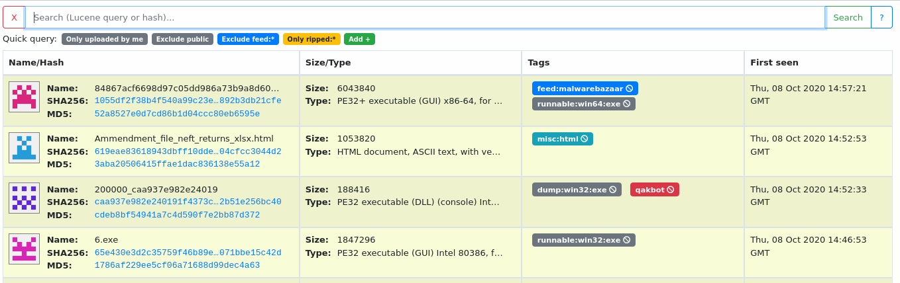
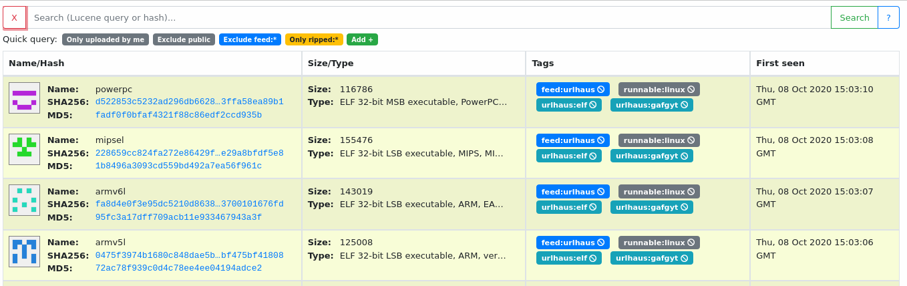
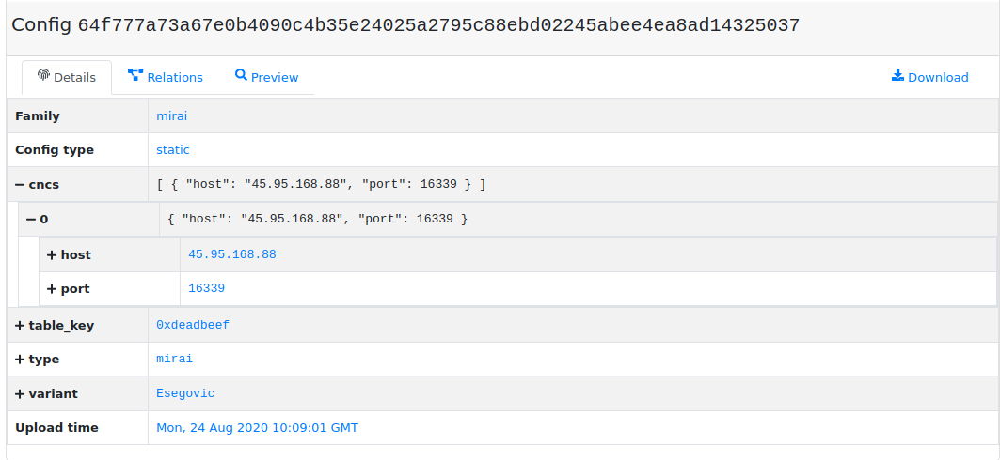
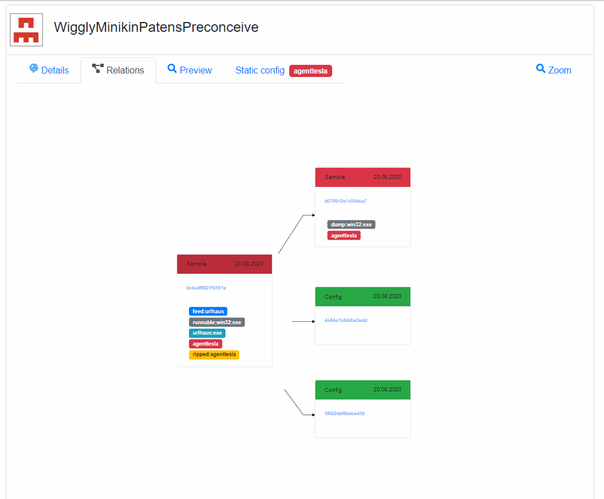

# MWDB Core

## [Installation ⚙️](https://mwdb.readthedocs.io/en/latest/setup-and-configuration.html) | [Docs 📚](https://mwdb.readthedocs.io/en/latest/) | [Guide 📕](https://mwdb.readthedocs.io/en/latest/user-guide/index.html)
---

Malware repository component for automated malware collection/analysis systems. 

Formerly known as Malwarecage.

Under the hood of [mwdb.cert.pl service](https://mwdb.cert.pl) hosted by CERT.pl.

## Setup & documentation

If you want to learn more about setting up your own mwdb-core instance or mwdb.cert.pl service: go to the [mwdb-core documentation](https://mwdb.readthedocs.io/en/latest/).

## Features

- Storage for malware binaries and static/dynamic malware configurations
- Tracking and visualizing relations between objects
- Quick search
- Data sharing and user management mechanism
- Integration capabilities via webhooks and plugin system

**Query your malware dataset with ease**

**Convenient interface for your own analysis backend**

**Store configurations in organized way**

**Visualize relationship between objects**

## Contact

If you have any problems, bugs or feature requests related to MWDB, you're encouraged to create a GitHub issue. If you have other questions, question is related strictly with mwdb.cert.pl service or you want to contact the current maintainers directly, you can email:

- Paweł Srokosz (psrok1@cert.pl)
- CERT.PL (info@cert.pl)

## License

This software is licensed under [GNU Affero General Public License version 3](http://www.gnu.org/licenses/agpl-3.0.html) except for plugins.

For more information, read [LICENSE](LICENSE) file.

In case of any questions regarding the license send an e-mail to info@cert.pl.

