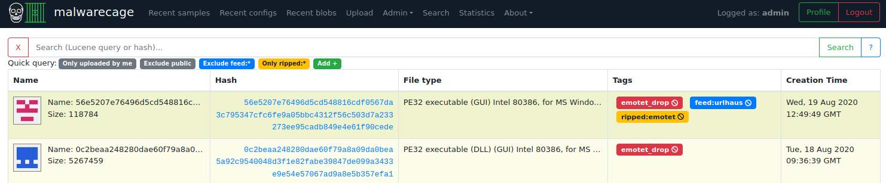
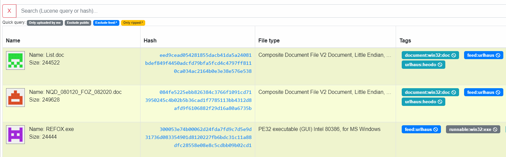
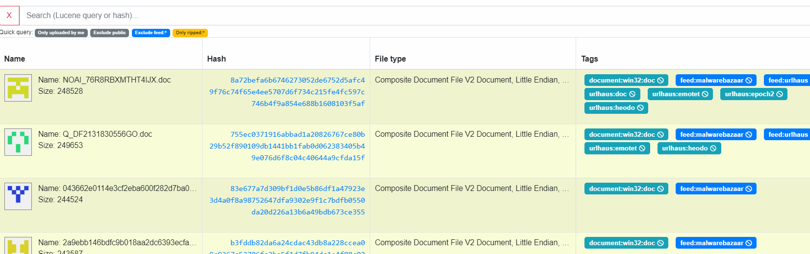
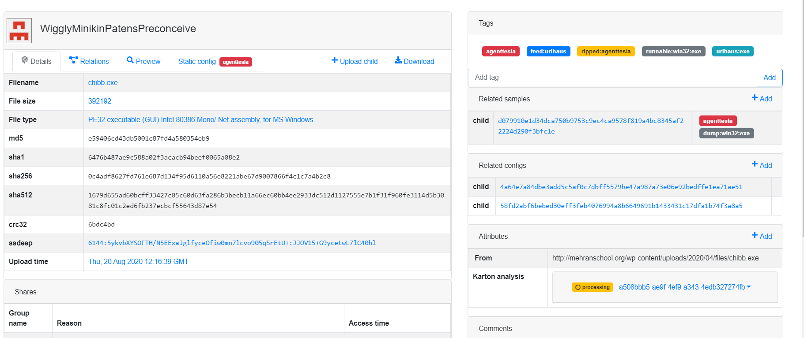
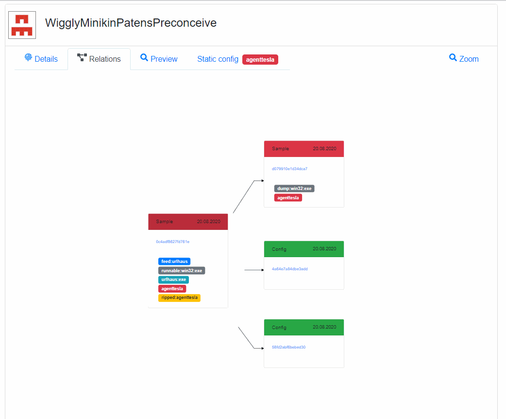
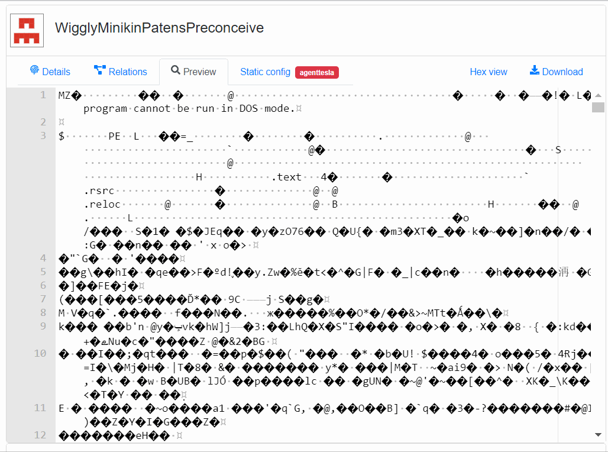

1. Introduction to Malwarecage
==============================

A brief history (Why do I need Malwarecage?)
--------------------------------------------

It's just a matter of time before researcher faces a problem of maintaining the constantly-increasing set of malware samples. It's not only about the binaries, but also all of the information that comes as a result of malware analysis like static configurations, associations between files and configs, metadata etc.

In CERT.pl we tried to bring the order in our dataset with VxCage project (https://github.com/botherder/vxcage) authored by Claudio "nex" Guarnieri. It was then heavily modified by Maciej "mak" Kotowicz and extended with simple web interface. That extension allowed to cooperate on building the MWDB (**M**\ al\ **w**\ are **D**\ ata\ **b**\ ase) with other colleagues and researchers.

Over time, we've decided to rewrite everything from scratch deriving lessons learned from the first version. The goal was to create a highly-efficient solution that could be shared with broad malware research community, available both as a service and open-source software.

Malwarecage is not just a simple database. It has several roles in mwdb.cert.pl service:

- Aggregates various feeds and malware collections.
- Comes up with a well-organized model that allows to discover relations between samples, families and campaigns.
- Provides unified interface for malware analysis pipeline.
- Allows to share our malware insights and makes them available for malware research community.

Main views
----------

Malwarecage UI is quite rich and can be intimidating at first glance. Most things can be reached directly from the navbar:

Let’s go through them shortly:

- **Recent samples**: list of recently uploaded files. The files are tagged and can be queried easily.
- **Recent configs**: configs are structured data (in a JSON format), usually statically extracted from the samples. You can store there things like encryption keys or C&C servers used by samples there.
- **Recent blobs**: blobs are unstructured text files, usually configuration or injects downloaded from C&C server (sometimes also plaintext data from the binary, like ransom notes).
- **Upload**: can be used to upload your own samples to the system
- **Admin**: accessible only for administrators, allows to manage your Malwarecage instance (e.g. create new users and groups)
- **Search**: untyped search, which returns all types of objects at once, but is hard-limited to 10.000 records. For most cases: we recommend Quick search field placed above Recent views.
- **Statistics**: a summary of the malware configurations that were uploaded recently. You can use this view in mwdb.cert.pl service to determine if we support the family or not, or when did we last see a speciemen of the family you’re interested in.
- **About**: various links about Malwarecage version and REST API documentation.

Recent objects
--------------

Malwarecage welcomes us with a list of recently uploaded samples.

**Recent views** allow to see basic information about latest objects in the repository and interactively explore the dataset using Lucene-based queries and clickable fields. If sample was uploaded within last 72 hours, it is additionally marked with yellowish background. Yellow color is a bit more intense if file was uploaded at least 24 hours ago.

If you simply want to find a sample with specific SHA256 hash: just paste this hash into a search box and press ENTER.

`sha256:` has been added automatically to your query.

Interactive search is even more powerful. For example: you can filter out samples with specific tags just by clicking on them. Reset your query and click on tag to include only these samples that are currently in your interest.

Sample view
-----------

Let's click on one of the hashes to navigate to the **detailed sample view**.

Here you can see all the details about file. Left side contains four tabs. The first one called **Details** presents basic file information like original file name, size, file type and hash values.

On the right side of view you can see tags, relations with other objects, attributes containing some extra information and finally: the comments section. All of these things will be described in details in further chapters of this guide.

Let's come back to the tabs. The second tab is **Relations** that shows graph representation of relations with other objects. You can expand next levels of graph by clicking on nodes.

The third tab is **Preview** where you can quickly view the file contents, both in text mode and hex view.

Finally you can download the sample file just by clicking **Download** button.

The fourth tab called **Static config** is optional and shows only if there are some configurations related with sample.

This is only an overview of the most basic Malwarecage functions. Follow this guide to learn in details how to effectively navigate in repository, upload new objects and define relationships between them.
