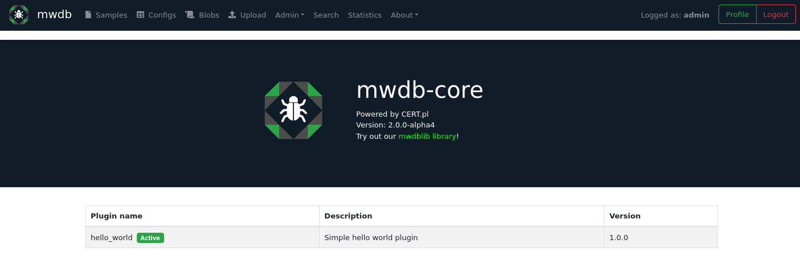

Integration guide
=================

MWDB comes with advanced plugin engine, which allows to add new API features, integrate MWDB with other systems using webhooks and extend MWDB UI functionality.

Plugins are used by mwdb.cert.pl to:

- integrate MWDB with malware analysis backend and reporting systems
- provide new features like mquery search
- customize mwdb.cert.pl instance

.. note::

    This chapter describes only the most basic features of plugin system, allowing to write simple integrations. More plugin system features will be documented in the near future.

Getting started with local plugins
----------------------------------

Backend plugins are just Python packages imported by MWDB from specified location. Let's check the plugin settings in `mwdb.ini`:

.. code-block::

    ### Plugin settings

    # Set enable_plugins to 0 to turn off plugins (default: 1)
    # enable_plugins = 0

    # List of plugin module names to be loaded, separated by commas
    # plugins = 

    # Directory that will be added to sys.path for plugin imports
    # Allows to load local plugins without installing them in site-packages
    # local_plugins_folder = ./plugins

    # Autodiscover plugins contained in local_plugins_folder (default: 0)
    # local_plugins_autodiscover = 1

Plugins can be loaded from installed packages or imported from ``local_plugins_folder``. 

Let's create a simple, local ``hello_world`` plugin:

.. code-block::

    plugins
    └── hello_world
        └── __init__.py

and put short description in ``__init__.py`` file:

.. code-block:: python
 
    __author__ = "just me"
    __version__ = "1.0.0"
    __doc__ = "Simple hello world plugin"

Then, set ``mwdb.ini`` file to load your ``hello_world`` plugin. If you configured mwdb-core to use current directory, you should find that file there. If not, you can still overwrite the ``mwdb.ini`` settings by creating another ``mwdb.ini`` file in the current working directory, where ``mwdb-core run`` is invoked.

.. code-block::

    [mwdb]
    ...

    plugins = hello_world
    local_plugins_folder = ./plugins

Let's run the mwdb-core:

.. code-block:: console

    $ mwdb-core run
    * Environment: production
    WARNING: This is a development server. Do not use it in a production deployment.
    Use a production WSGI server instead.
    * Debug mode: off
    [INFO] MainThread - plugins.load_plugins:141 - Loaded plugin 'hello_world'
    * Running on http://127.0.0.1:5000/ (Press CTRL+C to quit)

As you can see in logs, your plugin has been loaded successfully. You can additionally check that using ``/about`` endpoint in UI.

Adding webhook
--------------

Now, let's make it a bit more useful and add the actual webhook. When plugin module is loaded by MWDB, it calls the entrypoint function named ``__plugin_entrypoint__``.

Modify the ``__init__.py`` file to implement simple entrypoint saying "Hello world!".

.. code-block:: python

    import logging

    from mwdb.core.plugins import PluginAppContext

    __author__ = "just me"
    __version__ = "1.0.0"
    __doc__ = "Simple hello world plugin"

    logger = logging.getLogger("mwdb.plugin.hello_world")

    def entrypoint(app_context: PluginAppContext):
        logger.info("Hello world!")

    __plugin_entrypoint__ = entrypoint

The expected result is:

.. code-block:: console

    $ mwdb-core run
    * Environment: production
    WARNING: This is a development server. Do not use it in a production deployment.
    Use a production WSGI server instead.
    * Debug mode: off
    [INFO] MainThread - __init__.entrypoint:14 - Hello world!
    [INFO] MainThread - plugins.load_plugins:141 - Loaded plugin 'hello_world'
    * Running on http://127.0.0.1:5000/ (Press CTRL+C to quit)

``PluginAppContext`` object allows to provide extension for MWDB like adding webhook handler and extending the API.

Webhook handler is implemented by providing a new class that inherits from ``PluginHookHandler``. New handler class can be then registered using ``app_context.register_hook_handler`` method.

.. code-block:: python

    import logging

    from mwdb.core.plugins import PluginAppContext, PluginHookHandler
    from mwdb.model import File

    __author__ = "just me"
    __version__ = "1.0.0"
    __doc__ = "Simple hello world plugin"

    logger = logging.getLogger("mwdb.plugin.hello_world")

    class HelloHookHandler(PluginHookHandler):
        def on_created_file(self, file: File):
            logger.info("Nice to meet you %s", file.file_name)

        def on_reuploaded_file(self, file: File):
            logger.info("Hello again %s", file.file_name)

    def entrypoint(app_context: PluginAppContext):
        logger.info("Hello world!")
        app_context.register_hook_handler(HelloHookHandler)

    __plugin_entrypoint__ = entrypoint

After applying above modifications to ``__init__.py``, let's restart ``mwdb-core`` and add a new to file and check if it works.

.. code-block:: console

    [INFO] Thread-3 - __init__.on_created_file:16 - Nice to meet you evil.exe
    [INFO] Thread-3 - object.create_object:88 - File added - dhash:9e302844386835ef50bec3017e2c60705ab6bf33e4849e58e3af19a605b46d00 - is_new:True
    ...
    [INFO] Thread-12 - __init__.on_reuploaded_file:19 - Hello again evil.exe
    [INFO] Thread-12 - object.create_object:88 - File added - dhash:9e302844386835ef50bec3017e2c60705ab6bf33e4849e58e3af19a605b46d00 - is_new:False

Webhooks can be used to automatically analyze the uploaded file in sandbox. The good example is `mwdb-plugin-drakvuf <https://github.com/CERT-Polska/mwdb-plugin-drakvuf>`_ which implements webhook that sends all uploaded files to the `Drakvuf Sandbox <https://github.com/CERT-Polska/drakvuf-sandbox>`_ for analysis.

Check out `mwdb-plugin-drakvuf <https://github.com/CERT-Polska/mwdb-plugin-drakvuf>`_ on Github!

Available hooks
---------------

A lot of hooks have been implemented in MWDB. Each of these hooks is triggered when particular event occurs in system.

List of available hooks and events triggering these hooks.

* ``on_created_object(self, object: Object)``  - object was uploaded (file, blob or config) or pulled from remoted resource
* ``on_reuploaded_object(self, object: Object)``  - object was again uploaded or pulled from remote resource
* ``on_removed_object(self, object: Object)`` - object was deleted
* ``on_created_file(self, file: File)`` - file was uploaded or pulled from remoted resource
* ``on_reuploaded_file(self, file: File):`` - file was again uploaded or pulled from remote resource
* ``on_removed_file(self, file: File)`` - file was deleted
* ``on_created_config(self, config: Config)`` - config was uploaded or pulled from remoted resource
* ``on_reuploaded_config(self, config: Config)`` - config was again uploaded or pulled from remote resource
* ``on_removed_config(self, config: Config)`` - config was deleted
* ``on_created_text_blob(self, blob: TextBlob)`` - text blob was uploaded or pulled from remoted resource
* ``on_reuploaded_text_blob(self, blob: TextBlob)`` - text blob was again uploaded or pulled from remote resource
* ``on_removed_text_blob(self, blob: TextBlob)`` - text blob was deleted
* ``on_created_tag(self, object: Object, tag: Tag)`` - a new tag was created and assigned to object
* ``on_reuploaded_tag(self, object: Object, tag: Tag)`` - tag was again assigned to object
* ``on_removed_tag(self, object: Object, tag: Tag)`` - tag was removed from object
* ``on_created_comment(self, object: Object, comment: Comment)`` - a new comment was created and assigned to object
* ``on_removed_comment(self, object: Object, comment: Comment)`` - comment was removed from object
* ``on_created_relation(self, parent: Object, child: Object)`` - relation between parent and child objects was added
* ``on_removed_relation(self, parent: Object, child: Object)`` - relation between parent and child objects was removed
* ``on_created_attribute_key(self, attribute_def: AttributeDefinition)`` - attribute definition was created
* ``on_updated_attribute_key(self, attribute_def: AttributeDefinition)`` - attribute definition was updated
* ``on_removed_attribute_key(self, attribute_def: AttributeDefinition)`` - attribute definition was removed
* ``on_created_attribute(self, object: Object, attribute: Attribute)`` - attribute was assigned to object
* ``on_removed_attribute(self, object: Object, attribute: Attribute)`` - attribute was removed from object
* ``on_created_user(self, user: User)`` - a new user account was created (also using OpenID Provider)
* ``on_removed_user(self, user: User)`` - user account was removed
* ``on_updated_user(self, user: User)`` - user account was updated
* ``on_created_group(self, group: Group)`` - a new group was created. Also when a new user is registered and his private group is created
* ``on_removed_group(self, group: Group)`` - group was removed. Also when a user is deleted and his private group is removed
* ``on_updated_group(self, group: Group)`` - group attributes where updated
* ``on_created_membership(self, group: Group, user: User)`` - user was added to the group
* ``on_removed_membership(self, group: Group, user: User)`` - user was removed from the group
* ``on_updated_membership(self, group: Group, user: User)`` - membership was updated
* ``on_changed_object(self, object: Object)`` - this hook is triggered when one of the undermentioned events takes place:

  * a new tag was created and assigned to object
  * tag was removed from object
  * a new comment was created and assigned to object
  * comment was removed from object
  * relation between parent and child objects was added
  * relation between parent and child objects was removed
  * attribute was assigned to object
  * attribute was removed from object

Creating web plugins
--------------------

MWDB Core comes with powerful web plugin engine which allows to extend almost any component within MWDB UI. For a long
time it was an undocumented feature used mainly by mwdb.cert.pl service and built on top of Create React App hacks and
overrides.

Starting from v2.9.0 release, we're using joined powers of `Vite <https://vitejs.dev/>`_ and `Rollup <https://rollupjs.org/>`_ to make it a real thing.

Web plugins: getting started
~~~~~~~~~~~~~~~~~~~~~~~~~~~~

Frontend plugins are a very different animal from Python backend plugins and you may need a bit more knowledge
about build-time mechanisms.

Let's go to the ``docker/plugins`` directory within ``mwdb-core`` repository and extend our ``hello_world`` plugin:

.. code-block::

    docker
    └── plugins
        └── hello_world
            └── __init__.py
   +        └── index.jsx
   +        └── package.json

First is ``package.json`` that contains short specification of our plugin. Name must contain ``@mwdb-web/plugin-`` prefix.

.. code-block:: json

   {
       "name": "@mwdb-web/plugin-hello-world",
       "version": "0.0.1",
       "main": "./index.jsx"
   }

Finally we can write simple plugin that adds new ``Hello world`` page. Let's check ``index.jsx` contents:

.. code-block:: jsx

    // Imports from React and Font Awesome libraries
    import React from 'react';
    import { Route, Link } from 'react-router-dom';
    import { FontAwesomeIcon } from "@fortawesome/react-fontawesome";
    import { faHandHoldingHeart } from "@fortawesome/free-solid-svg-icons";

    // Import from MWDB Core commons and components
    import { View } from "@mwdb-web/commons/ui";
    import { AboutView } from "@mwdb-web/components/Views/AboutView";

    function HelloWorld() {
        return (
            <View>
                <h1>Hello world!</h1>
                Nice to see you!
                

                <About/>
            </View>
        )
    }

    export default () => ({
        routes: [
            <Route path='hello' element={<HelloWorld />} />
        ],
        navbarAfter: [
            () => (
                <li className="nav-item">
                    <Link className="nav-link" to={"/hello"}>
                        <FontAwesomeIcon
                            className="navbar-icon"
                            icon={faHandHoldingHeart}
                        />
                        Hello there!
                    </Link>
                </li>
            )
        ],
    })

After setting up all of the things, run ``docker-compose -f docker-compose-dev.yml build`` and ``docker-compose -f docker-compose-dev.yml up``
to run the application. If everything is OK, you should see the results like below:

<show the result>

But what actually happened in that ``index.jsx`` file? there are lots of things going there!

Let's focus on most important ones:

* Line starting with ``export default`` is actually an entrypoint of our plugin. It exports callback that is called
  after plugin is loaded.

* Entrypoint callback is expected to return an object that contains specification of extensions provided by plugin.

* Our plugin contains two extensions:
  * ``routes`` that implement React Router routes to be included in web application
  * ``navbarAfter`` being a list of React component functions that will be rendered after ``navbar``

* Plugins adds new navbar button ``Hello there!`` and ``/hello`` route rendering ``HelloWorld`` component.
  Our new component uses ``View`` from ``@mwdb-web/commons/ui`` which is common wrapper for main views used
  within application. In addition, it renders ``About`` view imported from ``@mwdb-web/components`` just under our gretting.

But where is actual list of possible extensions defined? They're defined in core application code and can be found
by references to few methods and wrappers from ``common/plugins`` :

* ``fromPlugins`` collects specific type of extension from all loaded plugins and returns a list of them. For example: new ``routes``
  to be added.
* ``Extension`` does the same but treats all collected objects as components and renders them.
* ``Extendable`` wraps object with ``<name>Before``, ``<name>Replace`` and ``<name>After`` extensions, so we can add extra things
  within main views.

So ``navbar`` is one of ``Extendable`` wrappers that can be found within application and that's why we can add extra navbar item.

Web plugins: how it works internally?
~~~~~~~~~~~~~~~~~~~~~~~~~~~~~~~~~~~~~

There are two requirements to be fulfilled by plugin engine:

* Plugin code needs to be loaded and executed along with core application
* Plugin must be allowed to reuse and extend core application parts

MWDB uses Rollup import aliases and Vite virtual modules to make a link between plugin code and the core.

1. Vite build runtime looks for ``@mwdb-web/plugin-*`` packages that are installed in ``node_modules``

   They can be regular packages or just links (see also `npm-link <https://docs.npmjs.com/cli/v9/commands/npm-link>`_)

2. ``@mwdb-web/plugins`` virtual module defines dynamic imports that are further resolved by Vite to create separate bundles
   for plugins that can be asynchronically loaded.

   Virtual module code looks like below:

   .. code-block:: javascript

     export default {
         "plugin-example": import("@mwdb-web/plugin-example"),
         ...
     }

3. ``@mwdb-web/plugins`` package is then resolved at runtime by ``commons/plugins`` loader that resolves dynamic imports
   and collects hook specification. Plugins are loaded before first render occurs.

When plugin loader finishes its job, initial render kicks in and plugin is finally able to extend the application.
MWDB uses Rollup capabilities to make plugins able to use components from web source root (``mwdb/web/src``) and expose them
as ``@mwdb-web/*`` aliases:

* ``@mwdb-web/commons`` contains core parts of application that are expected to be used by plugins as well. Main packages are:
    - ``api`` module serving backend REST API bindings built on top of Axios
    - ``auth`` module serving ``AuthContext`` with information about currently authenticated user
    - ``config`` module with current server configuration and useful globals
    - ``helpers`` with useful helper methods
    - ``ui`` with UI components and utilities

* ``@mwdb-web/components`` contains implementation of all application views and there is higher chance that something will
  break across the versions if you use them directly.

Building customized images
--------------------------

If you want to extend MWDB with new features using plugin system, it's always useful to be able to build your own customized Docker images.

There are two ways to do that:

1. Simple way: clone https://github.com/CERT-Polska/mwdb-core repository. Then place your plugins
   in ``docker/plugins`` and use Dockerfiles from ``deploy/docker`` to build everything from scratch.
2. More extensible way: use ``certpl/mwdb`` and ``certpl/mwdb-web-source`` as base images and make your own Dockerfiles. This method
   enables you to install additional dependencies and provide custom plugin-specific overrides.

Building custom backend image is simple as in `Dockerfile` below:

.. code-block:: Dockerfile

    # It's recommended to pin to specific version
    ARG MWDB_VERSION=v2.9.0
    FROM certpl/mwdb:$MWDB_VERSION

    # Install any Alpine dependencies you need
    RUN apk add p7zip
    # Install any Python dependencies you need (certpl/mwdb image uses venv internally)
    RUN /app/venv/bin/pip install malduck

    # Copy arbitrary backend plugins and mail templates
    COPY mail_templates /app/mail_templates
    COPY plugins /app/plugins

Backend plugins are linked in runtime, so that part is pretty easy to extend. A bit more complicated thing is frontend part:

.. code-block:: Dockerfile
    ARG MWDB_VERSION=v2.9.0
    FROM certpl/mwdb-web-source:$MWDB_VERSION AS build

    # Copy web plugins code
    COPY plugins /app/plugins

    # Set workdir to /app, install plugins to ``/app/node_modules`` and rebuild everything
    WORKDIR /app
    RUN npm install --unsafe-perm $(find /app/plugins -name 'package.json' -exec dirname {} \; | sort -u) \
        && CI=true npm run build

    # Then next stage is copied from https://github.com/CERT-Polska/mwdb-core/blob/master/deploy/docker/Dockerfile-web
    # You need to copy start-web.sh and ngnix.conf.template as well, or adapt them according to your needs
    FROM nginx:stable

    LABEL maintainer="admin@example.org"

    ENV PROXY_BACKEND_URL http://mwdb.:8080

    COPY nginx.conf.template /etc/nginx/conf.d/default.conf.template
    COPY start-web.sh /start-web.sh
    COPY --from=build /app/dist /usr/share/nginx/html

    # Give +r to everything in /usr/share/nginx/html and +x for directories
    RUN chmod u=rX,go= -R /usr/share/nginx/html

    # By default everything is owned by root - change owner to nginx
    RUN chown nginx:nginx -R /usr/share/nginx/html

    CMD ["/bin/sh", "/start-web.sh"]

Room for improvement
--------------------

Plugin system was created mainly for mwdb.cert.pl, so not everything may fit your needs. Also things may break from time to time,
but as we maintain our internal plugins ourselves, most important changes will be noted in changelog. You can also find broader explanation and
migration recipes in :ref:`What's changed` chapter.

So if you need another ``Extendable`` place within UI or yet another hook within backend: feel free to `create issue <https://github.com/CERT-Polska/mwdb-core/issues>`_ on
our GitHub repository.
