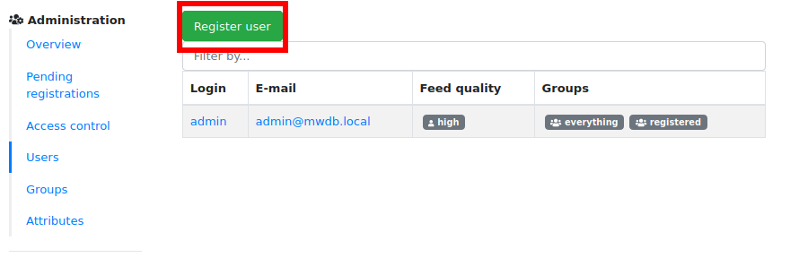
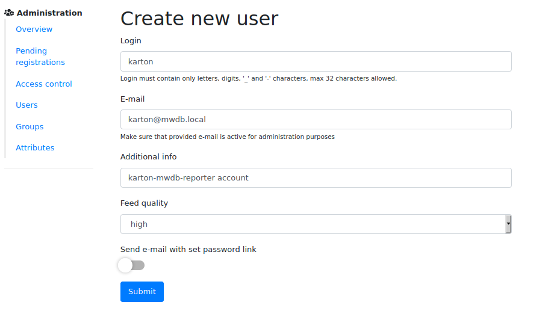
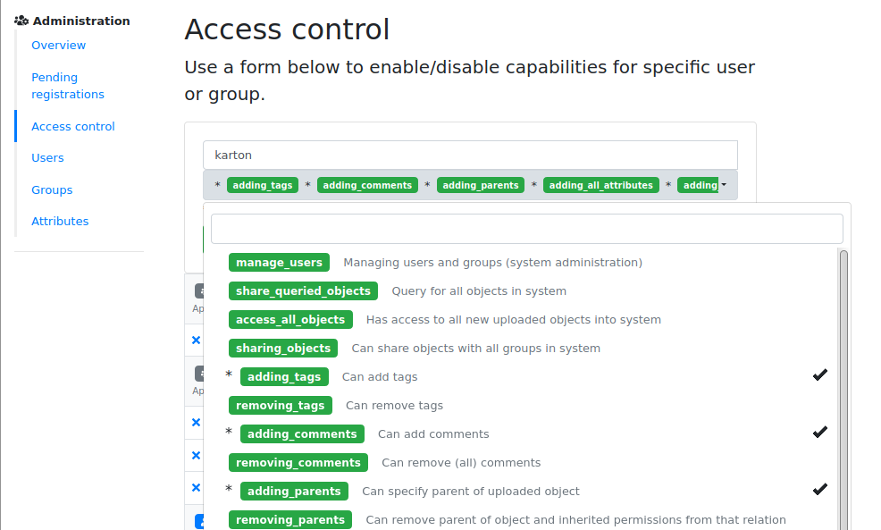
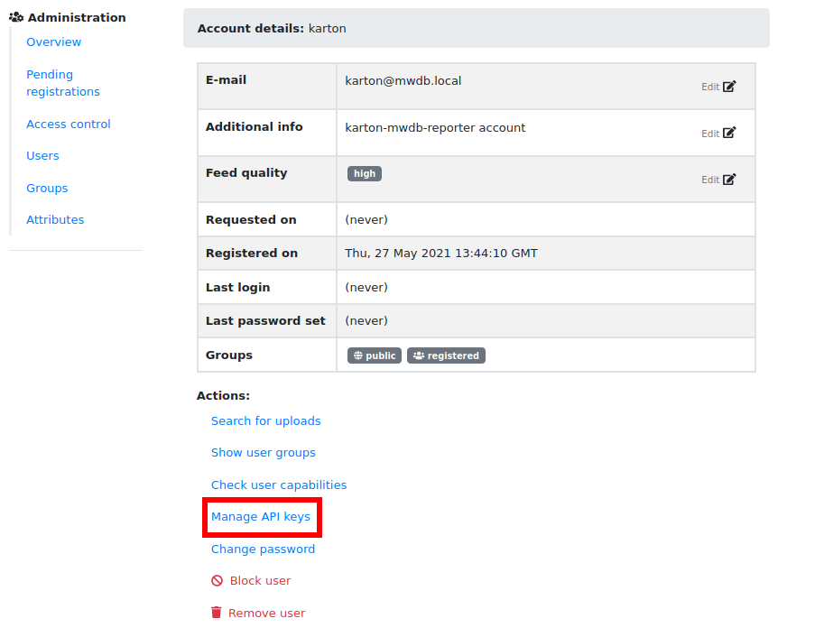
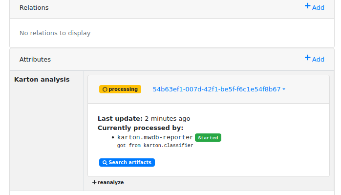

Karton integration guide
========================

.. versionadded:: 2.3.0

Karton is distributed malware processing framework, that integrates all malware analysis services behind the mwdb.cert.pl. 
It's ready to use straight out of the box, so you can use it to easily introduce some background tasks into your MWDB Core setup.

If you are looking for quick integration example to play with MWDB+Karton setup, look at our `Karton-Playground project <https://github.com/CERT-Polska/karton-playground/>`_. 
Using playground you can easily experiment with Karton pipeline before making a production-grade setup.

See also our `Karton Gems series of blogposts <https://www.cert.pl/en/posts/2021/04/karton-gems-1-getting-started/>`_ to learn more about Karton.

.. warning::
    If you already use Karton plugin, check out :ref:`Migration from unofficial plugin setup`.
    Plugin is not fully compatible with built-in implementation.

How does it work?
-----------------

Karton integration does the following things:

- Automatically spawns Karton tasks for all **new** files, configurations and blobs to analyze them;
- Allows user to track the Karton analysis status and manually trigger an reanalysis from UI;
- Aggregates all analyzed artifacts under the common analysis identifier;

MWDB Core itself just produces the initial tasks and provides a repository for data from analysis. For effective processing of these tasks
and sending artifacts back to MWDB, you need to incorporate few essential Karton services into your pipeline:

- `karton-classifier <https://github.com/CERT-Polska/karton-classifier>`_ (entry-point) that labels the type of sample for further routing
- `karton-mwdb-reporter <https://github.com/CERT-Polska/karton-mwdb-reporter>`_ (exit-point) that uploads all the artifacts back to MWDB under the common identifier

How to setup MWDB with Karton?
------------------------------

Before you start reading this chapter, setup the Karton. Instructions can be found in `Karton documentation <https://karton-core.readthedocs.io/en/latest/getting_started.html>`_.

The integration itself is easy to enable:

1. Enable MWDB integration by setting ``enable_karton = 1`` option in ``mwdb.ini`` or ``MWDB_ENABLE_KARTON=1`` environment variable.

2. Provide a ``karton.ini`` file in known location e.g. `/etc/karton/karton.ini` or mwdb-core application root.

If you are using alternative location for Karton configuration file, use additional section in ``mwdb.ini`` to configure it:

.. code-block:: ini

    [mwdb]
    ...
    enable_karton = 1

    [karton]
    config_path = /opt/karton/karton.ini

Then you should setup the ``karton-classifier`` and ``karton-mwdb-reporter`` Karton services. The important thing here is
that ``karton-mwdb-reporter`` requires API credentials to upload artifacts back to MWDB. Just for experiments you can
use default ``admin`` account, but we encourage you to create the separate account for Karton like below.

First, create ``karton`` account in ``Settings`` tab:

Then go to the ``Access control`` to give ``karton`` all the required capabilities:

- ``adding_tags``
- ``adding_comments``
- ``adding_parents``
- ``adding_all_attributes`` (if you don't mind to setup separate ACLs for each attribute Karton manages)
- ``adding_files``
- ``adding_configs``
- ``adding_blobs``
- ``unlimited_requests`` (if you have rate limits enabled)
- ``karton_assign``

If you just use ``admin`` account, make sure that ``karton_assign`` is enabled for admin as well.

Finally go to the ``karton`` account details and click on ``Manage API keys`` action to create an API key
for this account. Click ``Issue new API key`` to create the key.

Include the following lines in ``karton.ini`` file used by ``karton-mwdb-reporter``:

.. code-block:: ini

    [mwdb]
    api_url = http://<mwdb host here>/api/
    api_key = ey...

After getting done with the steps above, run mwdb-core and upload a new file to check if Karton integration works correctly:

Resubmitting analysis
---------------------

Let's say that you have recently improved your pipeline. You probably want to resubmit some files for analysis to check if you
get better results. Everything you need is ``+ reanalyze`` button

If you don't see it, you probably need to turn on ``karton_reanalyze`` capability. Use ``Admin`` -> ``Access control``
panel to give appropriate permission for your account.

Migration from unofficial plugin setup
--------------------------------------

This section is dedicated for users who built MWDB+Karton setup using pre-2.3.0 plugin from https://github.com/CERT-Polska/karton-playground/

MWDB-Core 2.3.0 includes automatic migration spawned on ``mwdb-core configure`` which:

- automatically converts ``karton`` attributes to built-in analysis associations
- removes the ``karton`` attribute key definition

**Before upgrade to 2.3.0**:

- remove ``mwdb-plugin-karton`` from plugins directory.

**After upgrade**:

- enable ``enable_karton = 1`` setting in MWDB configuration as described in this chapter.
- enable ``karton_assign`` capability for account used by ``karton-mwdb-reporter``.
- enable ``karton_reanalyze`` for all groups having ``karton_manage`` capability before.

Built-in integration emulates the original ``karton`` attribute behavior and still exposes and accepts the values provided that way.
