OpenID Connect authentication (Single Sign-On)
==============================================

.. versionadded:: 2.6.0

MWDB Core supports authentication using an external identity provider. This functionality is implemented using the OpenID Connect (OIDC) protocol,
which is integrated with the MWDB authentication system.

To enable OIDC authentication, configure MWDB using one of the following methods:

* Set the environment variable: ``MWDB_ENABLE_OIDC=1``
* or enable it in the ``mwdb.ini`` configuration file:

  .. code-block:: ini

    [mwdb]
    ...
    enable_oidc=1

If you want to test this functionality, the easiest way is to set up the environment with a ``docker-compose-oidc-dev.yml`` file.
It deploys an external identity provider based on `Keycloak <https://www.keycloak.org/>`_

Development environment can be configured automatically using script described in ``dev/oidc/README.md``.

Step-by-step configuration
--------------------------

In this section we will configure authentication via Keycloak using ``docker-compose-oidc-dev.yml`` environment as an example. In principle, it should work with any other OIDC-capable system.

.. note::
    Using the OpenID Connect protocol requires correct ``base_url`` to be set in configuration.
    This value is used for generating ``redirect_uri`` therefore it is essential to build a correct URI. Validate your configuration whether ``base_url`` actually points to the URI used by users.

Step 1: Configure MWDB client in Keycloak
~~~~~~~~~~~~~~~~~~~~~~~~~~~~~~~~~~~~~~~~~

Go to the Keycloak's admin console (http://127.0.0.1:8080/admin/master/console/ - default credentials ``user:bitnami``) and create new realm ``mwdb``

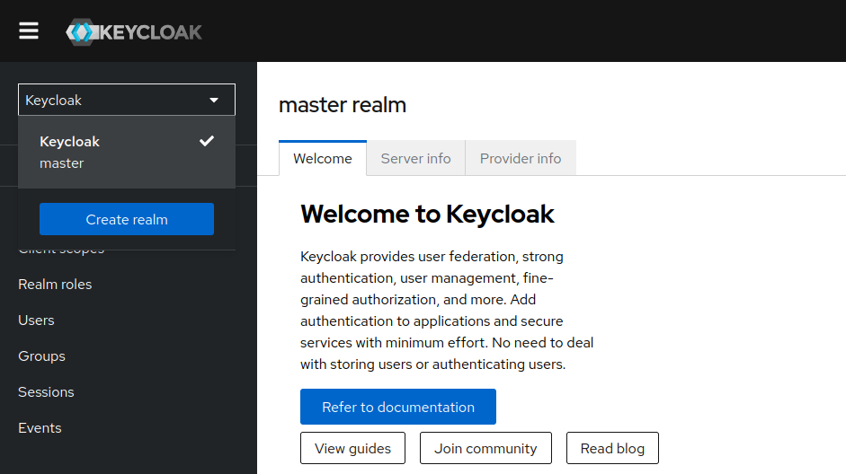

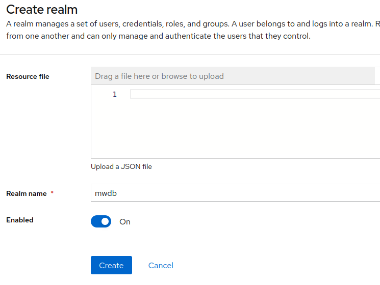

Then in ``mwdb`` realm go to ``Client`` and click ``Create client``. Set proper ``Client ID`` that will be used by MWDB for authentication.

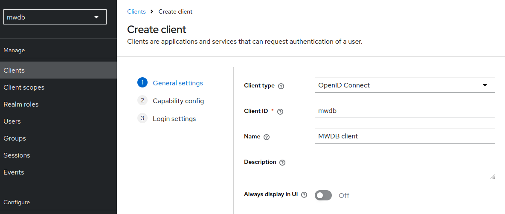

In capability config enable ``Client authentication`` and enable ``Standard flow`` as Authorization Code Flow is the only OpenID Connect flow supported by MWDB.

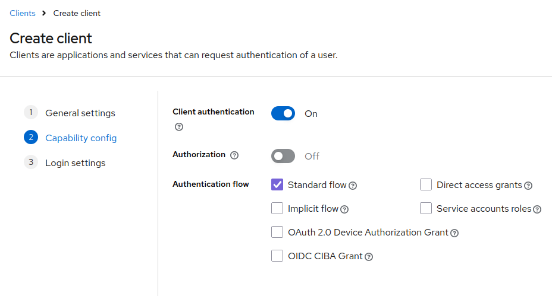

Finally set MWDB URLs. Correct redirect URL for MWDB is ``http://<mwdb url>/oauth/callback``.

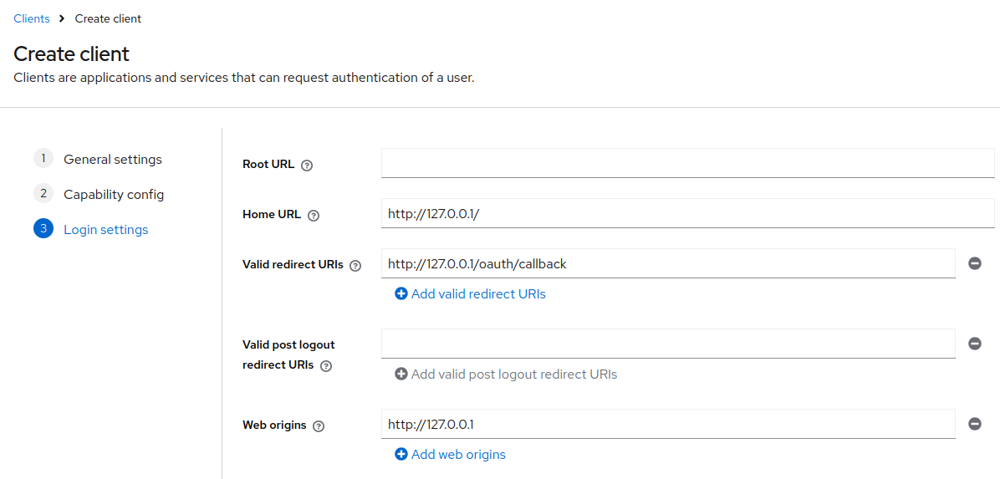

Step 2: Create OpenID Provider in MWDB
~~~~~~~~~~~~~~~~~~~~~~~~~~~~~~~~~~~~~~

Then go to the MWDB, log in as admin, navigate to ``Settings`` and click on ``OpenID Connect`` tab (``http://127.0.0.1/settings/oauth``).

Click on ``Register new external identity provider``

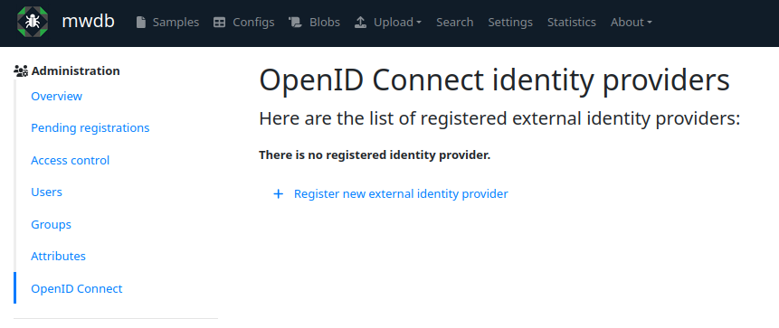

Then fill up form with OpenID provider settings:

* ``Provider name`` will identify the name of provider for your users
* ``Client ID`` should be set to the same ID as in Keycloak during creating client (in our case ``mwdb``)
* ``Client secret`` can be retrieved from Keycloak. Go to client settings in Keycloak and you'll find Client Secret in ``Credentials`` tab.
* Endpoints can be found in ``http://127.0.0.1:8080/realms/mwdb/.well-known/openid-configuration``.  ``userinfo_endpoint``, ``token_endpoint`` and ``jwks_endpoint`` should be set from the point of view of the MWDB server as they'll be called server-side, so you need to fix the host part in to ``http://keycloak.:8080/`` for our Docker Compose environment. ``authorization_endpoint`` and ``logout_endpoint`` URLs should point at ``127.0.0.1:8080`` - they'll be visited by user's browser.

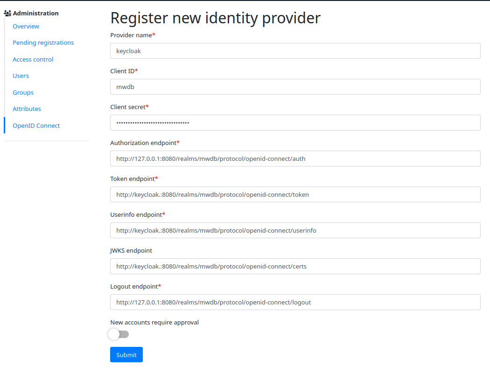

On Login page, you should see a new option:

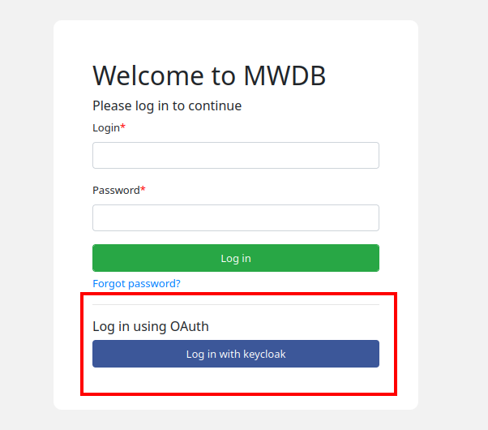

Step 3: Binding account to OpenID identity
~~~~~~~~~~~~~~~~~~~~~~~~~~~~~~~~~~~~~~~~~~

This step will show you how to bind existing account to allow login via OIDC. Let's try it with 'admin'.

First, we need to create a new user in 'mwdb' realm on the Keycloak side. Go to ``Keycloak``, then ``Users`` and click on ``Create new user``.

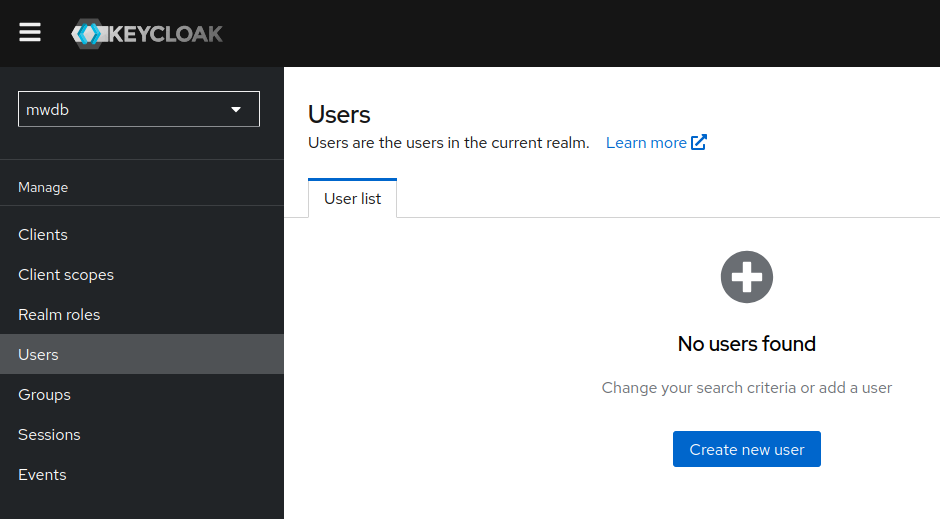

Let's create an ``mwdb-admin``.

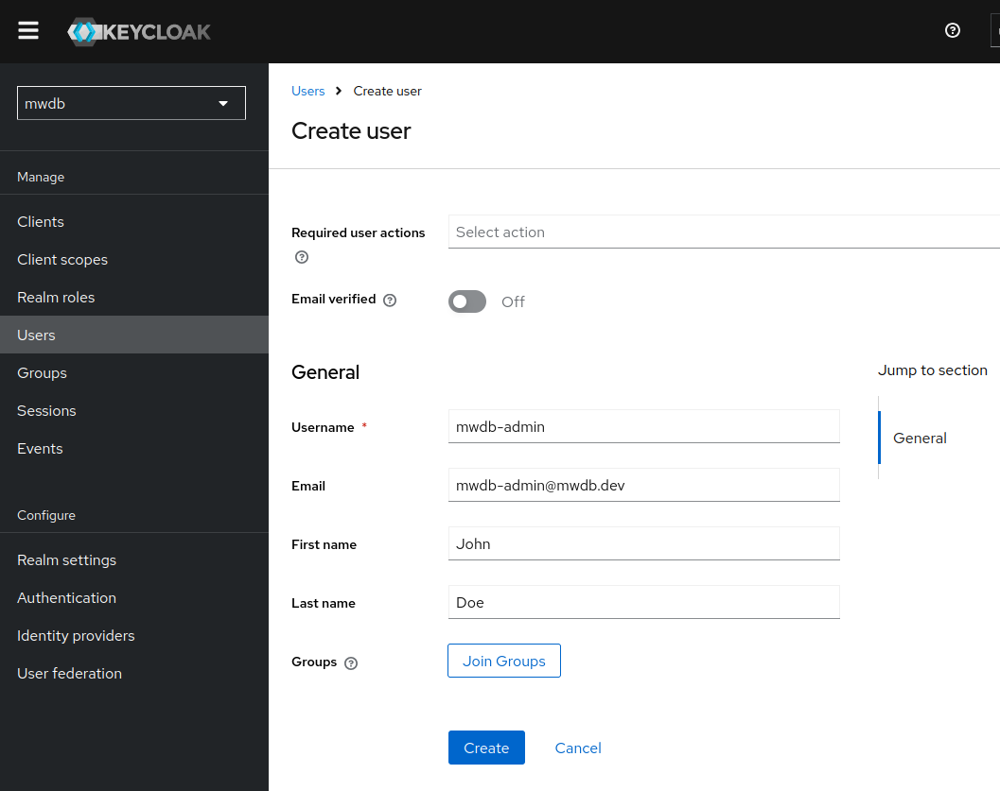

Then go to ``Credentials`` tab and ``Set password`` for that user. This time we will uncheck the ``Temporary`` option as we're doing it only for demonstration.

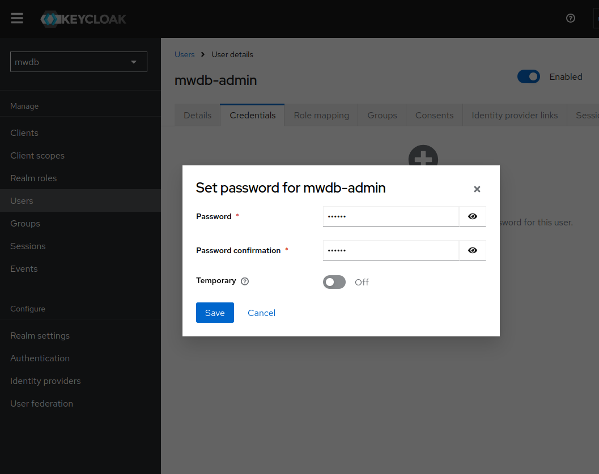

Now, let's try to bind the MWDB 'admin' account with 'mwdb-admin' user in Keycloak.

Go to the profile settings by clicking on ``admin`` button next to ``Logout`` and go to ``OpenID Connect`` tab. Then click on ``Connect with external identity`` and pick ``keycloak`` provider.

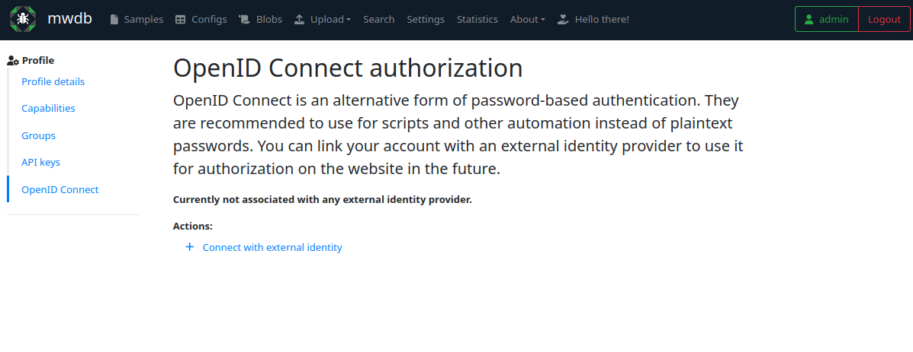

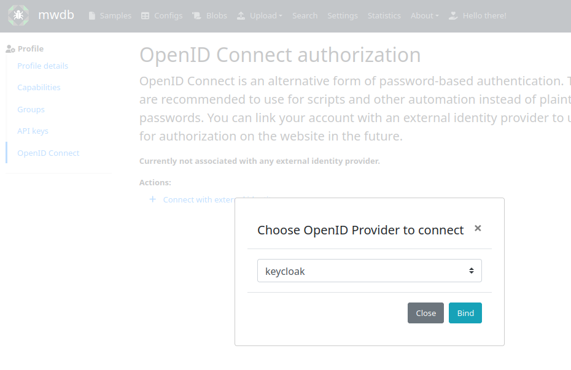

You'll be asked for credentials by Keycloak. Provide ``mwdb-admin`` credentials. After logging in, you should be redirected back to MWDB and see ``keycloak`` as a connected identity provider.

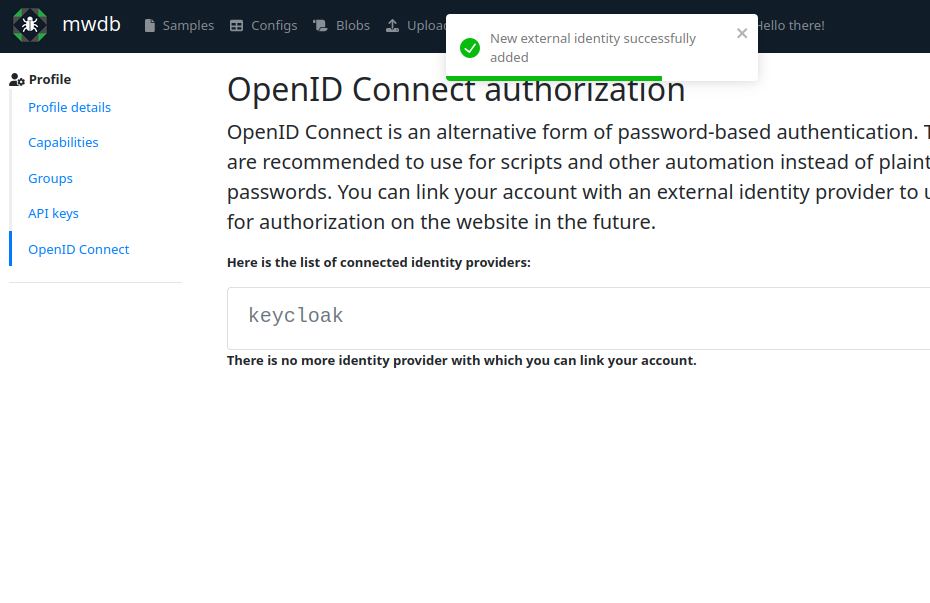

Then you may try to logout and login back to ``admin`` by clicking on ``Log in with keycloak``.

Step 4: Creating new MWDB account by logging in via Keycloak
~~~~~~~~~~~~~~~~~~~~~~~~~~~~~~~~~~~~~~~~~~~~~~~~~~~~~~~~~~~~

.. versionchanged:: 2.17.0

If OpenID user doesn't have bound account in MWDB yet, MWDB can
automatically create a user. This option is not enabled by default and
can be turned on by setting:

* ``enable_oidc_registration=1`` (``MWDB_ENABLE_OIDC_REGISTRATION=1`` env var)

* or ``enable_registration=1`` (``MWDB_ENABLE_REGISTRATION=1`` env var) but this option also enables regular account registration form.

.. note::

   Enabled ``enable_registration`` implies enabled ``enable_oidc_registration`` for compatibility reasons, as separate option for OIDC was added in v2.17.0.

    ``enable_oidc_registration`` is already enabled in ``docker-compose-oidc-dev.yml`` so you don't have to set anything in demonstration environment.

Then we may try to create user ``foo`` in keycloak (just like ``mwdb-admin`` user before) and try to login.

After trying to login as ``foo``, you'll set the following prompt:

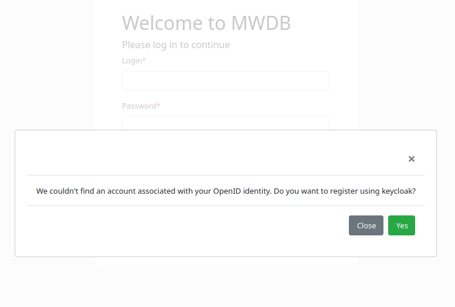

and account ``foo`` will be created in MWDB.

.. note::

    Access management in this feature is pretty limited and created accounts are treated by MWDB just like regular accounts. If password-based authentication is enabled and correct e-mail address is set, OIDC users are able to set up password and log in to MWDB directly. Even if you limit the access by password, remember that user may create an API key and stay directly authorized by MWDB.

    You may also limit this by removing ``manage_profile`` capability from ``registered`` group, so users can't create API keys and initiate password reset. You can then create your own group, disable its ``Workgroup`` property and give that capability manually to the chosen users.

    If you're blocking access to the MWDB realm for a user on OIDC provider side, remember to also block the associated account in MWDB itself.

Access control for OIDC users
-----------------------------

Users associated with OIDC provider are automatically added to ``OpenID_<provider name>``. You can use this group to identify bound accounts and set capabilities solely for users authorized this way.

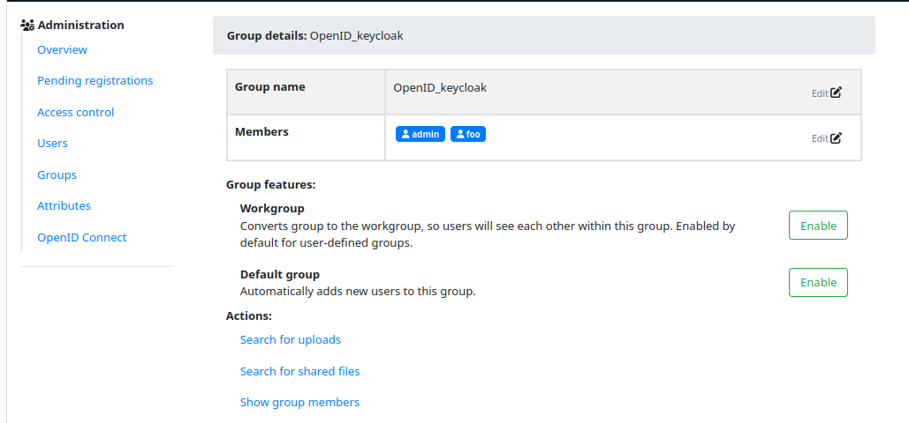

Approval requirement for accounts registered via OIDC
-----------------------------------------------------

.. versionadded:: 2.17.0

OpenID Provider may be set to require administrator approval
before registering a new account, just like in the case of
registration form.

Go to the ``Settings``, then ``OpenID Connect`` and click on
identity provider. Then switch on the ``New accounts require approval`` option and click ``Save``.

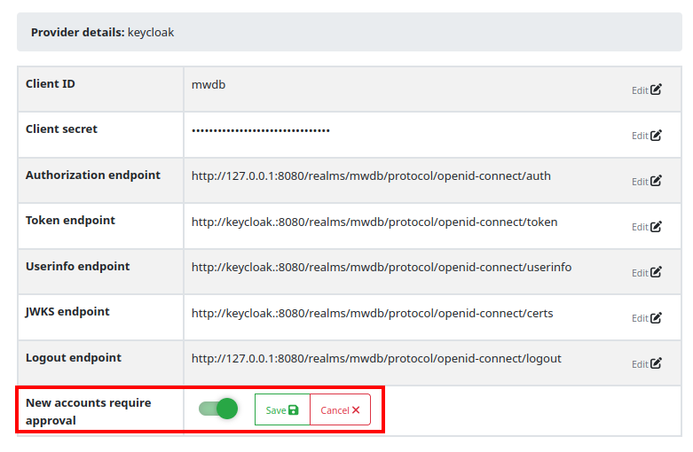

If you're following this guide, then you may remove the ``foo`` account and try to login using Keycloak. Instead of direct logging in, MWDB will notify user that account is waiting for approval.

Then log in as an 'admin' and check ``Pending registration`` tab in
``Settings``:

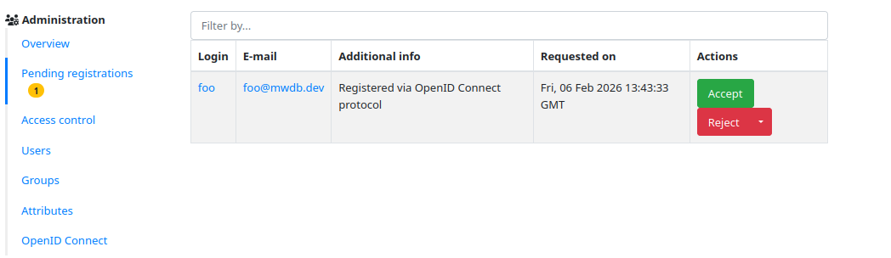

Then you can accept the request for an account, so ``foo`` will be able to log in.

.. warning::

    "Pending registration" feature is designed for vetting requests
    coming from public registration form, so accepting account involves sending an e-mail notification with set password link and requires mail server to be configured.

    You may workaround this issue by changing ``register.txt`` mail template and removing credentials part. To set up your own templates, change ``mail_templates_dir`` in configuration to point at your folder, copy templates from https://github.com/CERT-Polska/mwdb-core/tree/master/mwdb/templates/mail and modify them accordingly.

Disable password-based authentication
-------------------------------------

.. versionadded:: 2.16.0

If you want to use only OpenID Connect for authentication and disable
regular password-based login, set ``enable_password_auth`` option in MWDB configuration to ``0``.
