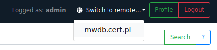
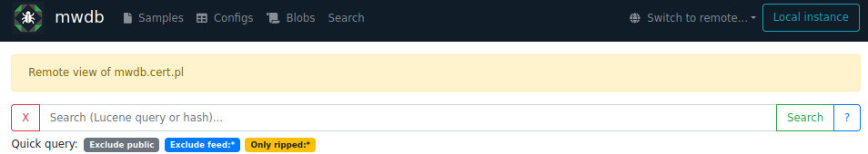
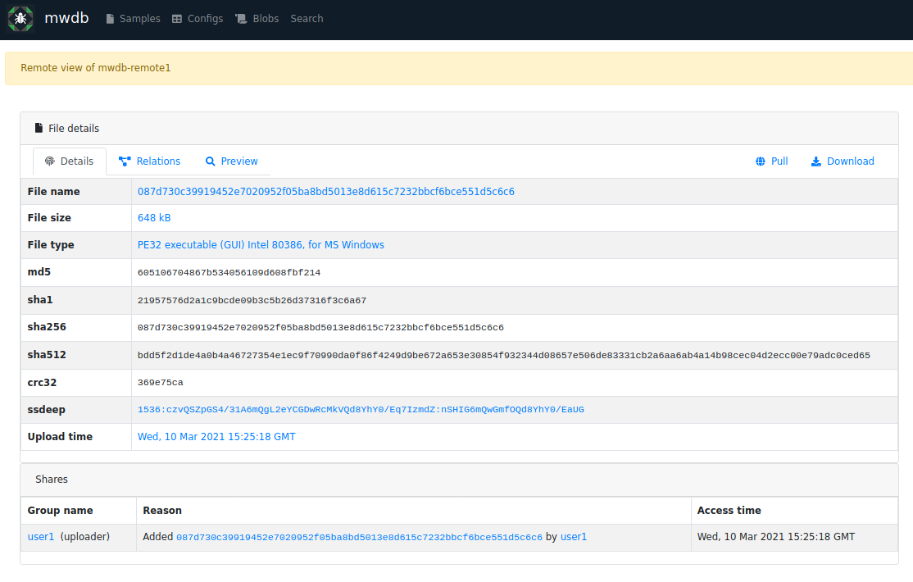
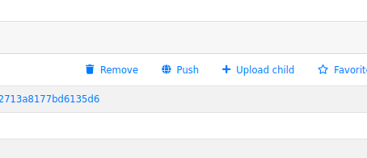

Remote instances guide
======================

.. versionadded:: 2.2.0

.. warning::
    This is **experimental** feature and it may significantly change in the future versions.

Remote instance feature allows us to connect our local repository with other, external MWDB servers.
This gives us the ability to view samples located in the remote instance, as well as exchange the objects
between the remote and the local instance in both directions.

Using that feature, you can easily synchronize samples between your local MWDB Core repository and our mwdb.cert.pl
service.

Depending on the given permissions on the remote instance, the following things can be performed:

* viewing samples, configs and blobs
* pulling an object from a remote instance
* performing a push action to send a local object to the remote instance

Remote instance UI is read-only and currently limited to the basic MWDB views.

Remote instance features
------------------------

We can switch to the remote MWDB instance using the new dropdown in the right side of the navigation bar.
After clicking on it, a list of defined remotes will appear. Selecting a given instance will take you to its remote view.

To go back to your local instance, just click on the button ``Local instance``. You can also change the current remote instance
by selecting a different one from the list under ``Switch to remote...``.

Remote instance view allows you to view remote samples, configs and blobs along with the detailed information about them.

By going to the view of a specific object on a remote instance, we can read detailed information about this object
and we're able to perform two possible actions on it:

* ``Download`` to download the object from a remote instance directly to our computer
* ``Pull`` to pull the object into the local MWDB database

Although remote view is almost identical with the local one, it's limited only to the read-only actions.

Similar to the pull object action in remote instance, we can also push an object to the remote instance by clicking the ``Push`` button in the local object view.

After clicking on that button, a window will appear where you can select the remote instance to which you want to push the object.

.. image:: ./_static/remote-push-modal.png
   :target: ./_static/remote-push-modal.png
   :alt: remote object view push modal

Setting up remote instance
--------------------------

In order to use the remote instance views, you need the API key associated with the authorized account on the remote instance.
If you don't have the API key generated or don't know how to get it, check :ref:`How to use API keys?` for more information.

After setting up API key, open configuration file ``mwdb.ini``. In this file you should add the URL of the remote
instance along with the API key. Example below shows how to enable Remote instances to connect our repository
with mwdb.cert.pl service.

.. code-block:: docker

    ...
    remotes = mwdb.cert.pl

    [remote:mwdb.cert.pl]
    url = https://mwdb.cert.pl
    api_key=ey...

The ``remotes`` variable is comma-separated list of MWDB remote instance names. Parameters for each instance can be set
in separate ``[remote:<remote name>]`` sections.

.. code-block:: docker

    remotes = mwdb.cert.pl, other-remote

    [remote:mwdb.cert.pl]
    url = https://mwdb.cert.pl
    api_key=ey...

    [remote:other-remote]
    url = http://other-remote.example.com
    api_key=ey...

This way you can access multiple MWDB Core instances to synchronize objects with your own repository

.. warning::

   All users on the local instance have the same identity and rights as the remote user associated with the
   API key that has been used to setup the remote instance.

Known issues and limitations
----------------------------

Remote instances are just a proof-of-concept, that enables us to implement more complex synchronization mechanism in the future.
That's why it comes with few significant limitations:

* Automatic synchronization of tags, attributes, relationships is not implemented yet. Push/pull feature is limited to the object itself.

* Automatic pull of dependent objects is not implemented yet. That's why you can't pull config with embedded blob if the related blob was not pulled before.

