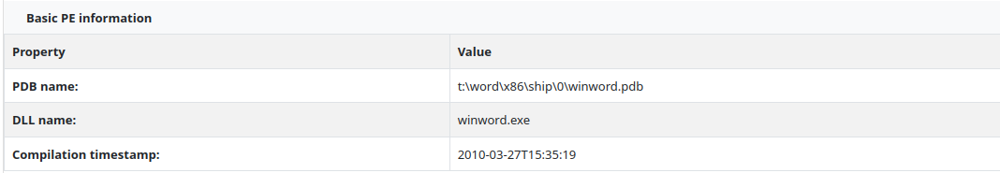
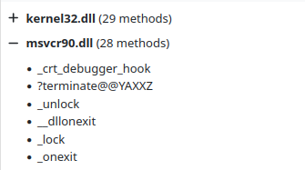
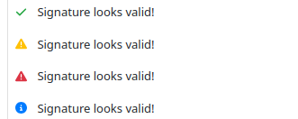
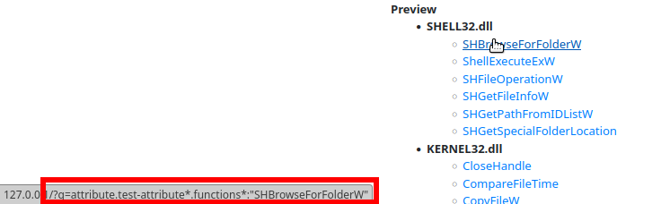

Rich attributes guide
=====================

.. versionadded:: 2.8.0

.. versionchanged:: 2.15.0

    Added Lambdas feature

.. warning::
    This feature is still **in development** and it may significantly change in the future versions.

Attributes can be used to store complex information in JSON format. In addition, values can be queried just like
configurations with the use of ``attribute.<key>:<value>`` syntax.

Rich attribute templates combine forces of Mustache and Markdown languages that give you the next level of flexibility in rendering
attribute values in UI without the need of writing additional plugins. Templates allow you to render value objects as custom
links, lists, tables or combinations of them. You can also combine your representation with other context values like
sample name or hash.

Rich attributes enable us to produce similar reports like the Details section in VirusTotal
(e.g. https://www.virustotal.com/gui/file/32fae9922417d6405bf60144d819d5e02b44060fa8f07e5e71c824725f44307f/details)
based on data contained in attribute objects. All templates are rendered client-side.

Getting started
---------------

Go to ``Settings`` -> ``Attributes`` and choose the attribute key for editing.

.. image:: ./_static/rich-template-attribute-details.png
   :target: ./_static/rich-template-attribute-details.png
   :alt: Attribute details

Then click on the ``Edit`` button next to the ``Rich template`` field to open the interactive template editor.

The view consists of two edit fields. The first one is **Template** that can be filled with Mustache&Markdown
template used for rendering attribute value. The second one is **Example value** which contains an example attribute value
appropriate for the attribute key in JSON format.

**Preview** field shows the rendered representation based on template and example value.

.. image:: ./_static/rich-template-edit.png
   :target: ./_static/rich-template-edit.png
   :alt: Rich template edit view

After filling fields with the appropriate template, use ``Store`` to save the template or ``Cancel`` to leave it unchanged.
If you want to clear the template and show only raw representation of attribute value, click on ``Clear``.

The interactive editor contains few sample templates that can be used for making its own definitions.

Mustache basics
---------------

Mustache is a basic logic-less template language. Mustache substitution is the first stage of template processing.

The most basic Mustache tag is ``{{value}}`` which will be substituted by Markdown-escaped attribute value.

If the value is represented by a JSON object, we can reference the appropriate subkey with the use of a dot as a key separator.
For example: ``{{value.id}}`` will be substituted by value under ``id`` key in JSON object

Another type of tag is **section**. Sections render blocks of text one or more times and are mostly used for iterating
over lists. The template inside a section is relative to the current object. If we want to reference a value in iterated list, we
need to use a single dot ``{{.}}``.

.. code-block:: markdown

    {{#value.functions}}
    - {{name}}
      **Offsets:**
      {{#offsets}}
      - {{.}}
      {{/offsets}}
    {{/value.functions}}

Sections can be also used for conditional rendering: false values or empty lists won't be rendered.

Substituted values are Markdown-escaped by default. If somehow escaping interferes with your template, you can turn it off
by using triple-mustache tag ``{{{value}}}`` or ``{{&value}}`` syntax.

Read more about supported Mustache syntax in Mustache.js project README (https://github.com/janl/mustache.js/)

Markdown basics
---------------

Markdown is a popular, lightweight markup language for creating formatted text. Markdown processor is used as a second stage
of template processing when Markdown markups are converted to React objects.

MWDB Core uses client-side markedjs project (https://github.com/markedjs/marked) that was customized to emit React objects
instead of HTML.

Supported Markdown markups are:

- ``**bold text**``
- ``*italics*``
- ``~~strikethrough~~``
- ``[links](http://example.com)``
- ``> blockquotes``
- ```inline```

- lists

  .. code-block:: markdown

    - element 1
    - element 2
    - element 3

- tables

  .. code-block:: markdown

    |Name|Virtual Address|Virtual Size|Raw Size|MD5|
    |----|---------------|------------|--------|---|
    {{#value.pe-sections}}
    |{{name}}|`{{vaddr}}`|`{{vsize}}`|`{{psize}}`|{{md5}}|
    {{/value.pe-sections}}

Lambdas
-------

.. versionadded:: 2.15.0

Lambdas are an extension to the Rich attribute engine that give much more flexibility in visualizing attributes.

They are simple functions that may be called on an attribute or a part of a template. There are two types of them: transformers and renderers.

Transformers
~~~~~~~~~~~~

Transformer gets attribute as an argument and returns transformed value of that attribute. To call the transformer, we use a pipeline operator ``|`` within a mustache tag.

Built-in transformers:

count
^^^^^

Returns the number of elements in an array.

**Template:**

.. code-block:: mustache

    {{value.items|count}}

**Object:**

.. code-block:: json

    {
        "value": {
            "items": ["a", "b", "c"]
        }
    }

**Render:**

.. code-block:: text

    3

sort
^^^^^

Sorts elements lexicographically in an array.

**Template:**

.. code-block:: mustache

    {{#value.items|sort}}
    - {{.}}
    {{/value.items|sort}}

**Object:**

.. code-block:: json

    {
        "value": {
            "items": ["c", "b", "a"]
        }
    }

**Render:**

.. code-block:: text

    - a
    - b
    - c


first
^^^^^

Returns an array with only the first element, e.g. ``[1,2,3]`` is transformed into ``[1]``.

**Template:**

.. code-block:: mustache

    {{#value.items|first}}
    - {{.}}
    {{/value.items|first}}

**Object:**

.. code-block:: json

    {
        "value": {
            "items": ["c", "b", "a"]
        }
    }

**Render:**

.. code-block:: text

    - c

last
^^^^^

Returns an array with only the last element, e.g. ``[1,2,3]`` is transformed into ``[3]``.

**Template:**

.. code-block:: mustache

    {{#value.items|last}}
    - {{.}}
    {{/value.items|last}}

**Object:**

.. code-block:: json

    {
        "value": {
            "items": ["c", "b", "a"]
        }
    }

**Render:**

.. code-block:: text

    - a

group
^^^^^

This parametrized transformer takes an array of dictionaries as input and aggregates them using a provided key.

For example, if we have an attribute value like the one provided below:

.. code-block:: json

   {
       "imports": [
            {
                "dll": "kernel32.dll",
                "name": "GetModuleHandleA"
            },
            {
                "dll": "kernel32.dll",
                "name": "GetModuleHandleW"
            },
            {
                "dll": "kernel32.dll",
                "name": "GetProcAddress"
            },
            {
                "dll": "ntdll.dll",
                "name": "NtSetInformationProcess"
            },
       ]
   }

and we use this template:

.. code-block:: mustache

    {{#group.by}}dll{{/group.by}}
    {{value.imports|group}}
    - {{.|jsonify}}
    {{/value.imports|group}}

``group`` will transform ``imports`` array into a form:

.. code-block:: json

   {
       "kernel32.dll": [
            {
                "dll": "kernel32.dll",
                "name": "GetModuleHandleA"
            },
            {
                "dll": "kernel32.dll",
                "name": "GetModuleHandleW"
            },
            {
                "dll": "kernel32.dll",
                "name": "GetProcAddress"
            }
      ],
      "ntdll.dll": [
            {
                "dll": "ntdll.dll",
                "name": "NtSetInformationProcess"
            }
       ]
   }

This form isn't directly usable as we don't have a good way in Mustache to iterate over dictionaries, but
we can transform it back to an array using ``keys``, ``values`` or ``entries``.

keys
^^^^

Transforms dictionary into an array of keys. 

If we use further transform object from ``group`` example and apply it to the following template:

.. code-block:: mustache

    {{#group.by}}dll{{/group.by}}
    {{value.imports|group|keys}}
    - {{.}}
    {{/value.imports|group|keys}}

Mustache will render:

.. code-block:: text

    - kernel32.dll
    - ntdll.dll

values
^^^^^^

Transforms dictionary into an array of values. 

If we use further transform object from ``group`` example and apply it to the following template:

.. code-block:: mustache

    {{#group.by}}dll{{/group.by}}
    {{value.imports|group|values}}
    - {{name}}
    {{/value.imports|group|values}}

Mustache will render:

.. code-block:: text

    - GetModuleHandleA
    - GetModuleHandleW
    - GetProcAddress
    - NtSetInformationProcess

entries
^^^^^^^

Transforms dictionary into an array of ``{"key": <key>, "value": <value>}`` objects. If we use further transform object from ``group`` example and apply it to the following template:

.. code-block:: mustache

    {{#group.by}}dll{{/group.by}}
    {{value.imports|group|entries}}
    - {{key}}
      {{#value}}
          - {{name}}
      {{/value}}
    {{/value.imports|group|entries}}

Mustache will render:

.. code-block:: text

    - kernel32.dll
        - GetModuleHandleA
        - GetModuleHandleW
        - GetProcAddress
    - ntdll.dll
        - NtSetInformationProcess

jsonify
^^^^^^^

Simply passes an object to ``JSON.stringify`` and produces JSON representation of an object. This transformer is useful
especially for debugging your templates if you're not sure what keys are available in the current view.

Renderers
~~~~~~~~~

These are usually a special sections that allows you to conditionally render a section or make a custom React or Markdown widget.

if-then-else
^^^^^^^^^^^^

Mustache is a logicless template language and if we want to render something conditionally, sections ``{{#name}}{{/name}}`` and
inverted sections ``{{^name}}{{/name}}`` are usually the elements of choice. Unfortunately, sections themselves are pretty limited:

- sections can be used for conditional rendering, but if you pass an array, it will be rendered *n* times for each element
- sections are moving scope into the object, so you can't refer anymore to outer attributes

That's why MWDB provides a lambda that allows you to build a conditional clause:

.. code-block:: mustache

    {{#if}}{{list}}{{/if}}
    {{#then}}

    This is list of elements:
    {{#list}}
    - {{.}}
    {{/list}}

    {{/then}}
    {{#else}}
    {{/else}}

If ``{{#if}}`` section renders into anything that is non-empty and not a "0", subsequent ``{{#then}}` section is rendered.
``{{#else}}`` section is rendered otherwise.

section
^^^^^^^

This widget allows you to render a nicely looking section with a header and a body.

``{{#section.header}}`` is a section that is rendered within a header.
``{{#section}}`` is an actual body of a section.

A code example:

.. code-block:: mustache

    {{#section.header}}Basic PE information{{/section.header}}
    {{#section}}

    |Property|Value|
    |--------|-----|
    {{#pdb}}
    |**PDB name:**|{{.}}|
    {{/pdb}}
    {{#dll_name}}
    |**DLL name:**|{{.}}|
    {{/dll_name}}
    {{#compilation_timestamp}}
    |**Compilation timestamp:**|{{.}}|
    {{/compilation_timestamp}}
    {{/section}}

which renders to:



collapse
^^^^^^^^

Renders a collapsible element.

``{{#collapse.header}}`` represents a collapsible element header.
``{{#collapse}}`` is an actual body of a collapsible element.

A code example:

.. code-block:: mustache

    {{#imports|group|entries}}
    {{#collapse.header}}**{{key}}** ({{value|count}} methods){{/collapse.header}}
    {{#collapse}}
    {{#value}}
    - {{name}}
    {{/value}}
    {{/collapse}}
    {{/imports|group|entries}}

which renders to:



indicator
^^^^^^^^^

Renders an indicator. There are four possible types: 

- success, 
- warning, 
- danger, 
- info (the default).

A code example:


.. code-block::

    {{#indicator.type}}success{{/indicator.type}}
    {{#indicator}}Signature looks valid!{{/indicator}}

    {{#indicator.type}}warning{{/indicator.type}}
    {{#indicator}}Signature looks valid!{{/indicator}}

    {{#indicator.type}}danger{{/indicator.type}}
    {{#indicator}}Signature looks valid!{{/indicator}}

    {{#indicator.type}}info{{/indicator.type}}
    {{#indicator}}Signature looks valid!{{/indicator}}

which renders to:



Extensibility using plugins
~~~~~~~~~~~~~~~~~~~~~~~~~~~

Frontend plugins can provide own set of lambdas using ``mustacheExtensions`` extension point.

See the code of ``@mwdb-web/components/RichAttribute/builtinLambdas`` and ``@mwdb-web/components/RichAttribute/MarkedMustache`` for details.

Other features
--------------

Interactive search links
~~~~~~~~~~~~~~~~~~~~~~~~

There is a special ``@`` markup that allows you to easily generate an interactive search link for an attribute.

.. code-block::

    {{#value}}
    - **{{dllname}}**
        {{#functions}}
        - {{@.}}
        {{/functions}}
    {{/value}}



These usually work well for untransformed and simple templates so we can track the object path in the Mustache context.

It may not work if you apply a lambda. In that case, you can use a Markdown syntax for links with ``search#`` URI to generate query link directly.

.. code-block::

    {{#value}}
    - **{{dllname}}**
        {{#functions}}
        - [{{.}}](search#attribute.test-attribute*.functions*:{{.|jsonify}})
        {{/functions}}
    {{/value}}

If you worry about proper escaping, ``jsonify`` is enough because your value will be properly encoded into final URI by Markdown renderer.

Known issues
------------

- Current implementation is based on libraries that output HTML target instead of Markdown/React.
  Missing essential Markdown support and improper escaping (e.g. HTML entities) may happen. If you notice
  any problems like that: `create an issue <https://github.com/CERT-Polska/mwdb-core/issues>`_.
- Some features for plain values are still missing for rich templates e.g. interactive searching. Work is in progress.
