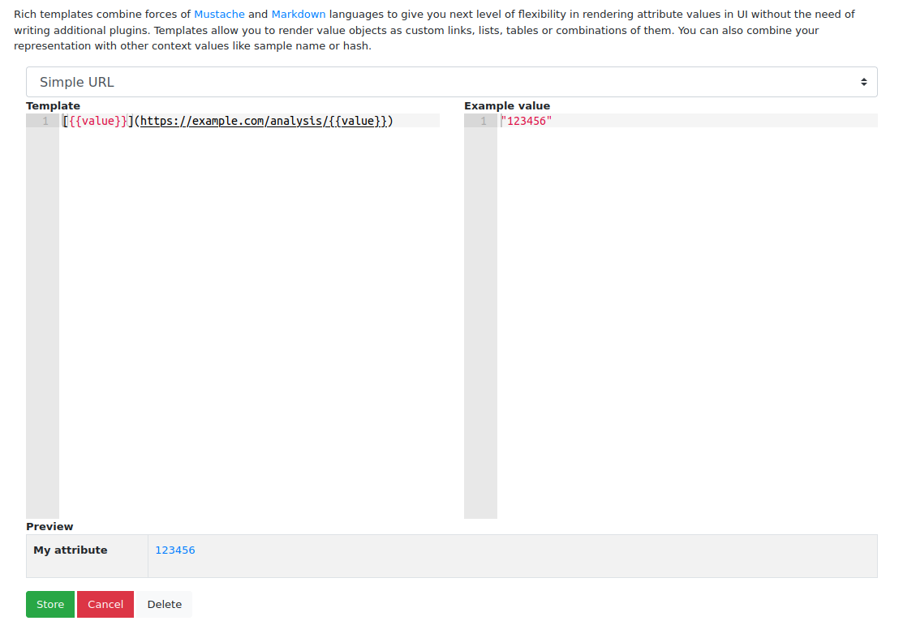

Rich attributes guide
=====================

.. versionadded:: 2.8.0

.. warning::
    This feature is still **in development** and it may significantly change in the future versions.

Attributes can be used to store complex information in JSON format. In addition, values can be queried just like
configurations with the use of ``attribute.<key>:<value>`` syntax.

Rich attribute templates combine forces of Mustache and Markdown languages that give you the next level of flexibility in rendering
attribute values in UI without the need of writing additional plugins. Templates allow you to render value objects as custom
links, lists, tables or combinations of them. You can also combine your representation with other context values like
sample name or hash.

Rich attributes enable us to produce similar reports like the Details section in VirusTotal
(e.g. https://www.virustotal.com/gui/file/32fae9922417d6405bf60144d819d5e02b44060fa8f07e5e71c824725f44307f/details)
based on data contained in attribute objects. All templates are rendered client-side.

Getting started
---------------

Go to ``Settings`` -> ``Attributes`` and choose the attribute key for editing.

.. image:: ./_static/rich-template-attribute-details.png
   :target: ./_static/rich-template-attribute-details.png
   :alt: Attribute details

Then click on the ``Edit`` button next to the ``Rich template`` field to open the interactive template editor.

The view consists of two edit fields. The first one is **Template** that can be filled with Mustache&Markdown
template used for rendering attribute value. The second one is **Example value** which contains an example attribute value
appropriate for the attribute key in JSON format.

**Preview** field shows the rendered representation based on template and example value.



After filling fields with the appropriate template, use ``Store`` to save the template or ``Cancel`` to leave it unchanged.
If you want to clear the template and show only raw representation of attribute value, click on ``Clear``.

The interactive editor contains few sample templates that can be used for making its own definitions.

Mustache basics
---------------

Mustache is a basic logic-less template language. Mustache substitution is the first stage of template processing.

The most basic Mustache tag is ``{{value}}`` which will be substituted by Markdown-escaped attribute value.

If the value is represented by a JSON object, we can reference the appropriate subkey with the use of a dot as a key separator.
For example: ``{{value.id}}`` will be substituted by value under ``id`` key in JSON object

Another type of tag is **section**. Sections render blocks of text one or more times and are mostly used for iterating
over lists. The template inside a section is relative to the current object. If we want to reference a value in iterated list, we
need to use a single dot ``{{.}}``.

.. code-block:: markdown

    {{#value.functions}}
    - {{name}}
      **Offsets:**
      {{#offsets}}
      - {{.}}
      {{/offsets}}
    {{/value.functions}}

Sections can be also used for conditional rendering: false values or empty lists won't be rendered.

Substituted values are Markdown-escaped by default. If somehow escaping interferes with your template, you can turn it off
by using triple-mustache tag ``{{{value}}}`` or ``{{&value}}`` syntax.

Read more about supported Mustache syntax in Mustache.js project README (https://github.com/janl/mustache.js/)

Markdown basics
---------------

Markdown is a popular, lightweight markup language for creating formatted text. Markdown processor is used as a second stage
of template processing when Markdown markups are converted to React objects.

MWDB Core uses client-side markedjs project (https://github.com/markedjs/marked) that was customized to emit React objects
instead of HTML.

Supported Markdown markups are:

- ``**bold text**``
- ``*italics*``
- ``~~strikethrough~~``
- ``[links](http://example.com)``
- ``> blockquotes``
- ```inline```

- lists

  .. code-block:: markdown

    - element 1
    - element 2
    - element 3

- tables

  .. code-block:: markdown

    |Name|Virtual Address|Virtual Size|Raw Size|MD5|
    |----|---------------|------------|--------|---|
    {{#value.pe-sections}}
    |{{name}}|`{{vaddr}}`|`{{vsize}}`|`{{psize}}`|{{md5}}|
    {{/value.pe-sections}}


Known issues
------------

- Current implementation is based on libraries that output HTML target instead of Markdown/React.
  Missing essential Markdown support and improper escaping (e.g. HTML entities) may happen. If you notice
  any problems like that: `create an issue <https://github.com/CERT-Polska/mwdb-core/issues>`_.
- Some features for plain values are still missing for rich templates e.g. interactive searching. Work is in progress.
