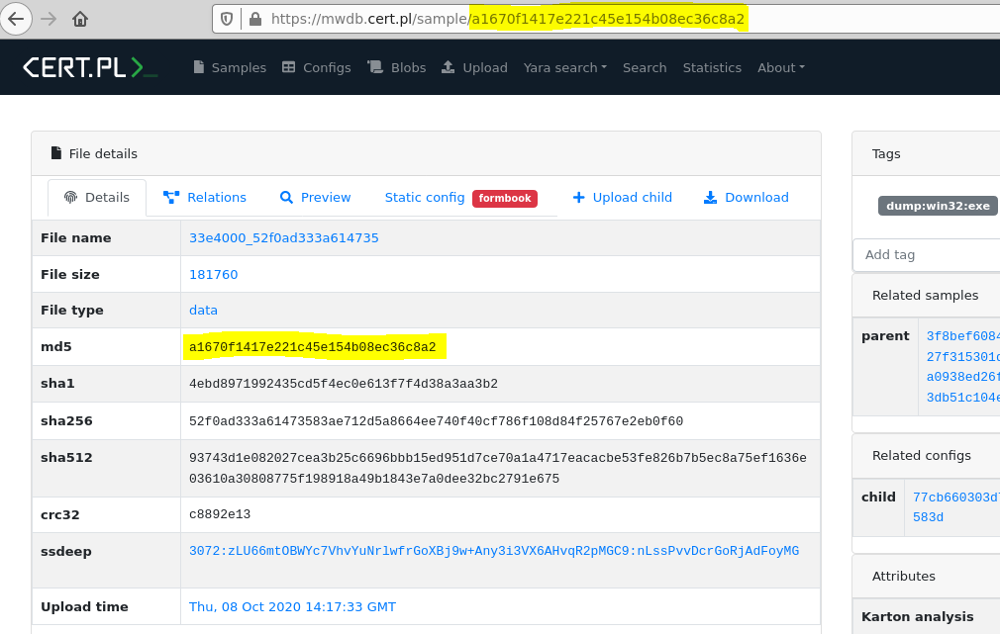
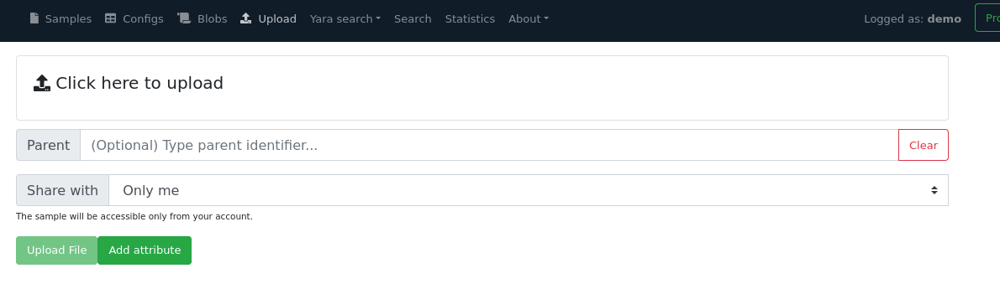
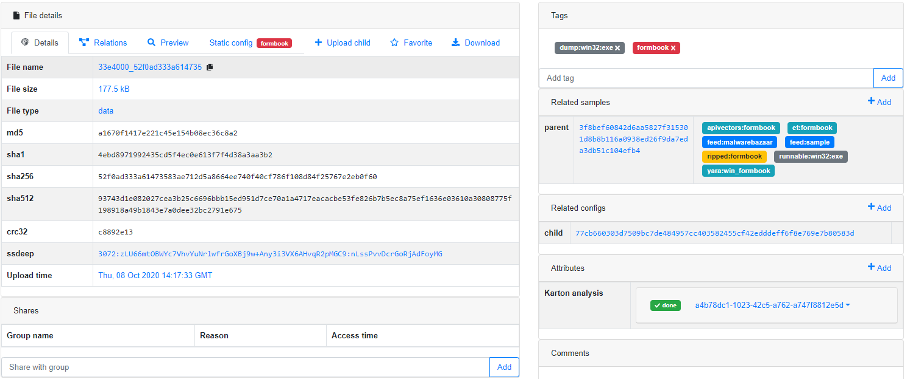
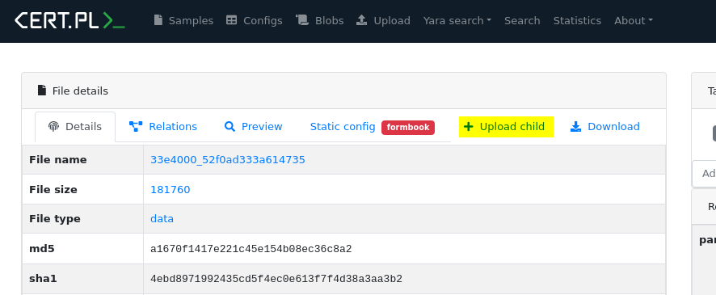
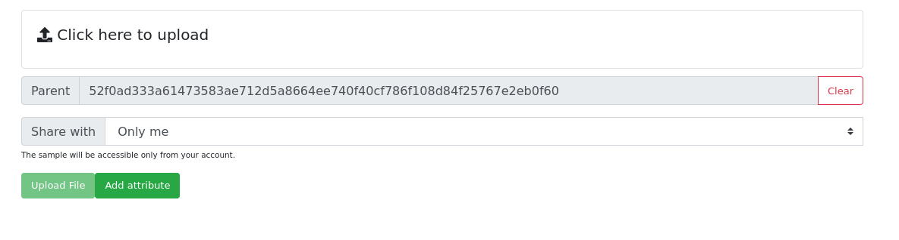
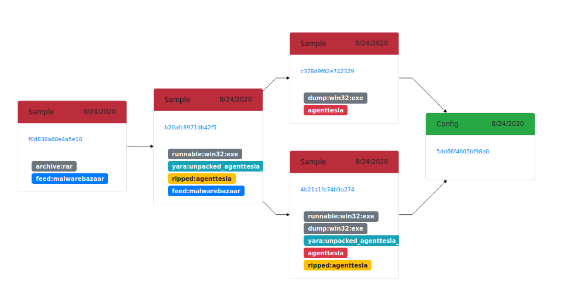

2. Storing malware samples
==========================

Objects in MWDB are divided into three types: files, configurations and blobs.

File is the primary object type in MWDB, used for storing malware samples and artifacts in various forms e.g. binaries, memory dumps, archives, scripts, .eml/.msg mail files etc.

File attributes
---------------

Files are described by the following attributes:

* **File name**\ : original sample name
* **Variant file names**\ : other names that sample was uploaded with
* **File size**\ : file size in bytes
* **File type**\ : file type returned by Unix ``file`` command
* **MD5**\ , **SHA1**\ , **SHA256**\ , **SHA512** - hash digest from file contents that can be used as object reference
* **CRC32** - CRC32 file checksum
* **ssdeep** - ssdeep fuzzy hash value
* **Upload time** - timestamp of first file upload

Objects in MWDB are mostly identified by SHA256 hash. The special case are files that can be referenced by other hashes like MD5, SHA1 and SHA512.

.. warning::

   The main hash used for identifying objects in MWDB is **SHA256**. MD5 works only for files and may not work in all contexts.
   
Uploading a file
----------------

The simplest way to upload new file to MWDB is to use the **Upload** view accessible from the navbar.

The above view shows how to upload file along with additional options:

* **Parent**\ : SHA256 parent identifier
* **Share with**\ : Groups that we can share our object and all decendants with

  * **All my groups** - default option, share objects with all our groups
  * **Single group...** - shares objects with specified group by name
  * **Everybody** - adds objects to public feed (sharing with ``public`` group)
  * **Only me** - shares objects only with user's private group

* **Add attributes**\ : Additional attributes that will be added to the uploaded sample

All of these parameters are optional and will be described in further chapters. If you are already intrigued what are attributes and how sharing model works, you can jump to :ref:`6. Object attributes` and :ref:`9. Sharing objects with other collaborators`.

After upload, we're redirected to the detailed file view. It can be already filled up with data if the uploaded sample was already present in the database.

Uploading child file
--------------------

Sometimes we want to add the file that is related to the object added previously e.g. after adding .eml file we want to add the attachment contained there. In that case, we can **Upload child** button.

The **Upload child** button navigates to the **Upload** page. Notice that the **Parent** field is already filled with an object identifier, which become a parent of the uploaded object.

After uploading a sample as a child, we're redirected to the uploaded sample view. Our parent has been added to ``Related samples`` section.

Using that feature we can chain together various files extracted during the analysis. The example above shows the relationships between three objects:

- the original archive
- executable file contained there (``agenttesla`` malicious binary)
- two memory dumps with unpacked code 

Finally, from both of these dumps we got a malware configuration.
