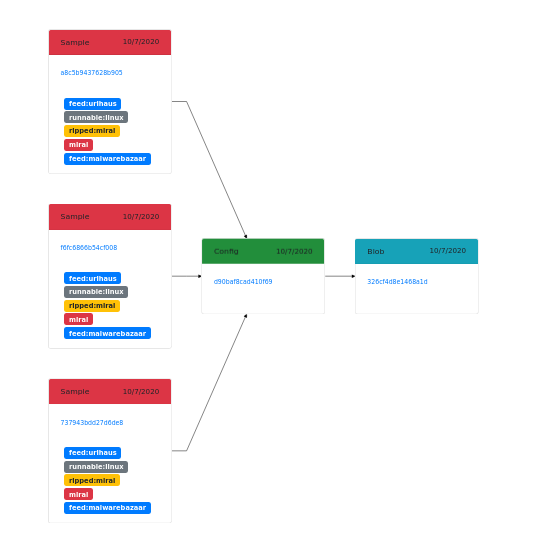
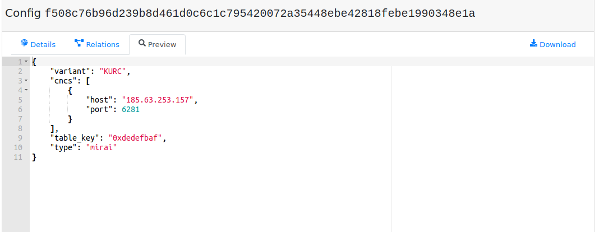
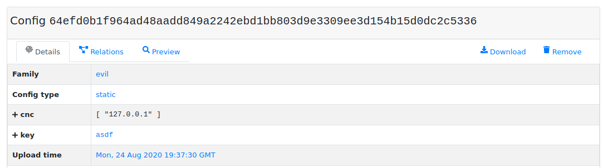
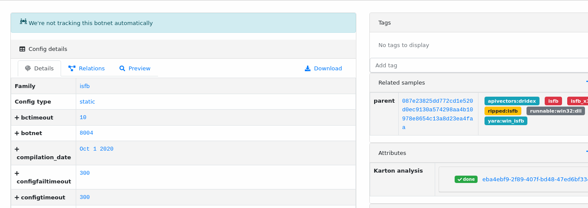
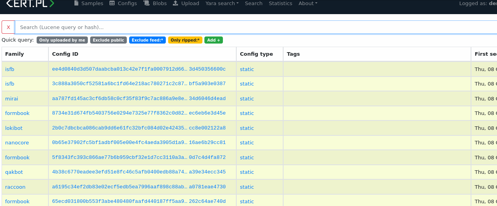
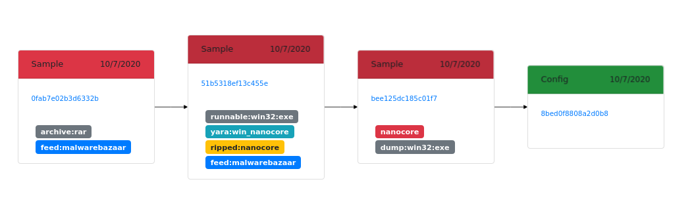
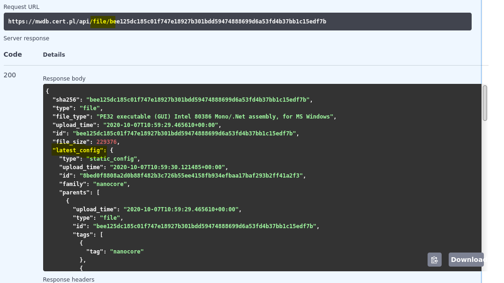
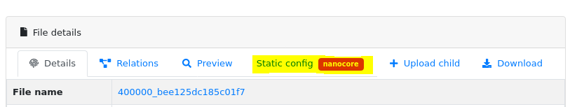

3. Storing malware configurations
=================================

Configuration objects are intended to hold malware static configuration extracted from binaries or dynamic configuration fetched from C&C.

.. image:: ../_static/eMmEaQo.png
   :target: ../_static/eMmEaQo.png
   :alt: 

What is malware configuration (or what we think it is)?
-------------------------------------------------------

In general, configurations are structured data represented in MWDB by JSON objects. Malware samples usually contain embedded "configuration" that determines the:

* malware family
* addresses of C&C servers or initial peers
* DGA seeds
* encryption keys used for communication
* malware version
* botnet/campaign ID
* module type etc.

It means that **static configuration** determines what malware sample is and how it is parametrized. Various samples unpacking to the same configuration usually have the same, but differently packed core, which allows us to determine the similarity between these files. 

Format of configuration is depending on malware family, usually determined by extraction module author or resulting from the structure “proposed” by malware author.

On the other hand: malware operations are parametrized externally by data fetched from Command & Control servers like:

* commands to be executed
* injects
* new C&C IP addresses / peer IP addresses
* mail templates etc.

These data are called **dynamic configuration** and can be parsed as well into the structured form.

Configuration attributes
------------------------

Configurations are described using the following attributes:

* **Family**\ : describes the malware family related with configuration
* **Config type**\ : configuration type. Default is ``static`` but you can use any string you want. In mwdb.cert.pl we're using ``static`` and ``dynamic`` to distinguish between static and dynamic configurations.
* **Contents** (\ ``cfg``\ ): dictionary with configuration contents
* **Upload time** - timestamp of first configuration upload

Configuration contents are stored as JSON object:

.. note::

   It's a good practice to keep the same configuration structure per malware family including keys schema and value types.

How to upload configuration?
----------------------------

Configurations are intended to be uploaded by automated systems or scripts, so they can't be added directly from MWDB UI. Nevertheless, it's still possible to add configuration using ``mwdblib`` CLI or REST API.

.. warning::

   Configurations in mwdb.cert.pl service are treated with high confidence and can be removed only by administrator. Make sure that commands listed below are executed on your own instance. Don't upload any test objects or other configurations to MWDB that doesn't follow the family schema.

To upload the configuration, first install the ``mwdblib`` library including CLI extra dependencies

.. code-block::

   $ pip install mwdblib[cli]

Then, you can upload new configuration using ``mwdb upload config`` command

.. code-block::

   $ mwdb --api-url http://127.0.0.1:3000/api/ login
   Username: admin
   Password:

   $ mwdb --api-url http://127.0.0.1:3000/api/ upload config evil -
   {"cnc": ["127.0.0.1"], "key": "asdf"} <CTRL+D>
   Uploaded config 64efd0b1f964ad48aadd849a2242ebd1bb803d9e3309ee3d154b15d0dc2c5336

Then you can find a new configuration in MWDB instance

New configuration can be also uploaded using Python script:

.. code-block:: python

   from mwdblib import MWDB

   mwdb = MWDB(api_key=...)
   config = {
       "cnc": [
           "127.0.0.1"
       ],
       "key": "asdf"
   }
   config_object = mwdb.upload_config("evil", config)
   # <mwdblib.config.MWDBConfig>

More information about automating things are described in chapter :ref:`8. Automating things using REST API and mwdblib`.

How configurations are deduplicated?
------------------------------------

MWDB generates unique SHA256-alike hash value for all objects in repository, including configurations. For files and blobs, we just use SHA256 to hash the contents. For structured data like configurations, the hashing algorithm is a bit more complicated.

The main idea is to avoid duplications occuring due to slightly different order of IoCs grouped into list or changed order of dictionary keys in uploaded JSON.

To avoid duplications, our hashing function follows few assumptions:

* Keys in dictionaries are hashed non-orderwise
* 
  Values can have all types supported by JSON, but they're are stringified during hashing e.g. False and "False" are the same. It's not a big deal if you avoid mixing value types under the same key:

  .. code-block:: python

     from mwdblib import config_dhash

     config_dhash({"value": "1"})
     # 141767ab98a062fcd5bbfb48ddd5d5c2bb3556d64006d774372f15d045d0ba89

     config_dhash({"value": 1})
     # 141767ab98a062fcd5bbfb48ddd5d5c2bb3556d64006d774372f15d045d0ba89

* 
  Lists are treated more like multisets. They're stored orderwise, but hashed non-orderwise.

  .. code-block:: python

     from mwdblib import config_dhash

     config_dhash({"domains": ["google.com", "spamhaus.com"]})
     # '93b6befcc25bb339eb449d6aa7db47bc3a661f20026e4cb4124388b539336d81'

     config_dhash({"domains": ["spamhaus.com", "google.com"]})
     # '93b6befcc25bb339eb449d6aa7db47bc3a661f20026e4cb4124388b539336d81'

Configuration dictionaries are hashed recursively:

* simple values are stringified and UTF-8-encoded and then hashed using SHA256
* lists are evaluated into the lists of hashes, then sorted and hashed in stringified form
* dictionaries are converted into the list of tuples ``(key, hash(value))``\ , sorted by first element (key) and then hashed in stringified form

If you want to experiment with that and pre-evaluate hash for configuration, you can use ``config_dhash`` function in `mwdblib <http://github.com/CERT-Polska/mwdblib>`_.

Searching configuration parts
-----------------------------

The most simple way to search for similar configurations is to generate the appropriate query interactively by clicking on the config fields:

Configurations can be also queried manually using following syntax:

.. code-block::

   config.cfg.field_1.field_2:value

which would find configs that contain structure below:

.. code-block:: json

   {
       "field_1": {
           "field_2": "value"
      }
   }

.. note::

   You can search for configurations only in ``Recent configs`` or ``Search``.
   In ``Recent configs`` view: ``config.`` prefix is optional, because it already assumes that you're
   looking for configurations.

Sometimes you may want to find specific configuration contents independently of their position in configuration e.g. looking for IP address. In that case, you can use wildcards and search like it's stringified JSON:

.. code-block::

   config.cfg:*127.0.0.1*

or if you want to be more strict

.. code-block::

   config.cfg:*"127.0.0.1"*

For more information see :ref:`7. Advanced search based on Lucene queries`.

Relationships with files
------------------------

Configuration semantics is defined not only by the dictionary itself, but also by the relations with other objects. In mwdb.cert.pl service we're following few specific conventions that have special support in mwdb-core.

File → Config relations
^^^^^^^^^^^^^^^^^^^^^^^

These relations are determining the association between malware sample and static configuration. Configuration parents are the direct source of configuration, which means that configuration is contained in these files and we should be able to extract the configuration directly from them.

That's why the common relationship pattern in MWDB is ``Executable (packed) → Dump (with unpacked code) → Static configuration``.

In addition, the original sample is tagged as ``ripped:<family name>`` and dump is tagged as ``<family name>``.

MWDB has special support for ``File → Config`` relationship and presents **the latest configuration** along with file information. Relations returned by API are ordered from the latest one, hash of the most recent configuration is the first element in list.

Latest configuration is also presented in the UI by separate ``Static config`` tab, appearing in the detailed file view.

Config → File relations
^^^^^^^^^^^^^^^^^^^^^^^

The reversed relationship, where config is a parent and file is a child, means that file was fetched based on data contained in static configuration. Because configuration can be treated as **unique malware sample representation**\ , we can **group the next stages by config** instead of all the files from the same campaign.

This is common use-case for:

* 
  configurations for droppers containing distribution URLs

* 
  modular malware dynamically fetching plugins/modules or dropping other malware from the C&C

  .. image:: ../_static/RX0R68z.png
     :target: ../_static/RX0R68z.png
     :alt: 

* 
  botnet malware supporting automatic updates

  .. image:: ../_static/KuMX7ys.png
     :target: ../_static/KuMX7ys.png
     :alt: 

