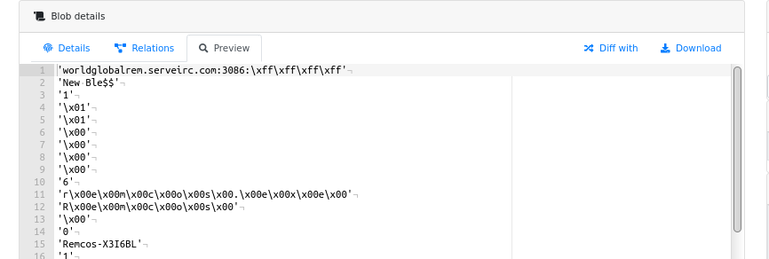
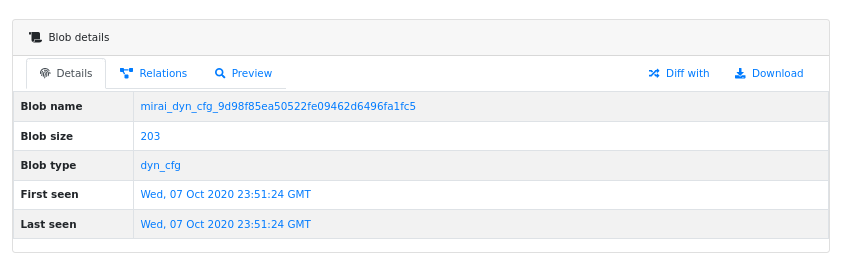
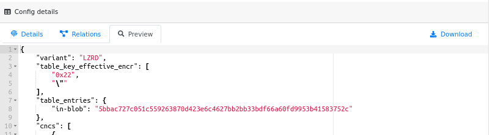
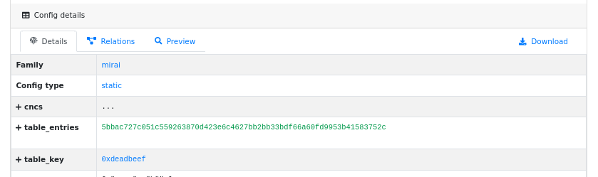
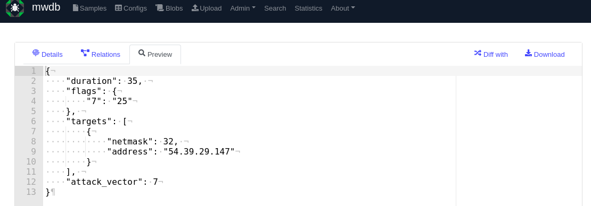
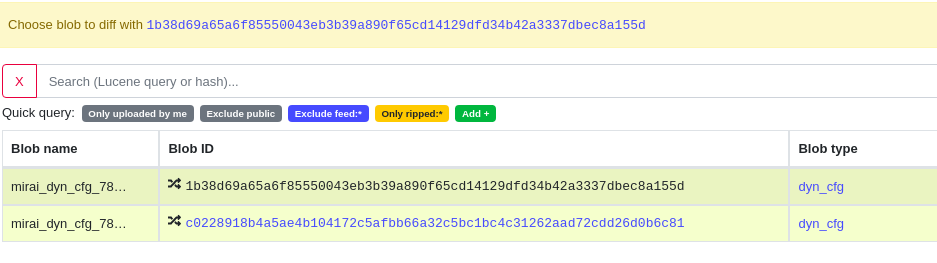
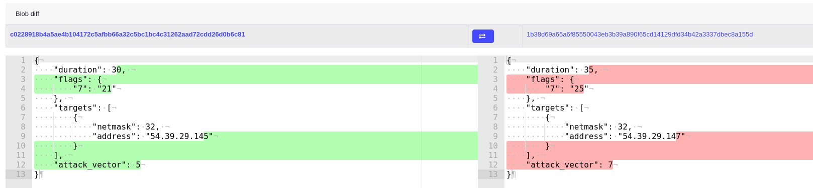

4. Storing human-readable data (blobs)
======================================

Blob object is a represantation of unstructured, human-readable (text) data. Simply everything that is non-binary and unparsed.

What is blob in MWDB?
---------------------

Usually "Blob" stands for "Binary Large Object", but in MWDB the meaning is different. Blob represents **various data stored in unstructured form** that are only simply formatted to be human-readable.

Blobs can also store data that are part of configuration, but are **too big to be conveniently represented** by JSON value.

The good examples are:

* bunch of extracted strings
* injects fetched from C&C for banking malware
* mail templates for spam bots
* lists of peers fetched from C&C for P2P botnets
* raw static configurations if malware keeps them structured (e.g. in XML format)

.. note::

   Before storing a blob, filter out things that are originating from specific execution in sandbox and are not specific for malware operations themselves e.g. **random nonces, memory pointers and other noise**. This will help you to avoid duplications.

Blob attributes
---------------

Blobs are described using the following attributes:

* **Blob name**\ : name of blob file
* **Blob size**\ : size of blob contents
* **Blob type**\ : blob type, classifying type of data (e.g. ``peers``\ , ``raw_cfg``\ , ``strings`` etc.)
* **Contents**\ : blob contents
* **First seen** - timestamp of first blob upload
* **Last seen** - timestamp of last blob upload

How to upload blobs?
--------------------

Just like configurations, blobs are intended to be uploaded by automated systems or scripts, so they can't be added directly from MWDB UI. Similarly to the configuration upload described in previous chapter (:ref:`How to upload configuration?`), you can push them using ``mwdb upload blob`` command or `MWDB.upload_blob <https://mwdblib.readthedocs.io/en/latest/mwdblib.html#mwdblib.MWDB.upload_blob>`_ function or via REST API.

More information about mwdblib can be found in chapter :ref:`8. Automating things using REST API and mwdblib`.

Embedded blobs
--------------

Blobs can be embedded as a part of configuration using ``in-blob`` key. This feature is especially useful for config values that are too big to be nicely stored in JSON.

.. warning::

   ``in-blob`` keys are supported only at the top level keys and can't be used for values in nested dictionaries.

Embedding new blob
^^^^^^^^^^^^^^^^^^

Let's assume we have a key called ``raw_cfg`` that contains long string with whole malware configuration.

.. code-block:: json

   {
       "family": "malwarex",
       "...": "...",
       "raw_cfg": "<really long string with contents>"
   }

If you want to upload the ``raw_cfg`` contents as a blob object, wrap contents with ``in-blob`` structure like below. Blob reference will be placed under the original (``raw_cfg``) key.

.. code-block:: json

   {
       "family": "malwarex",
       "...": "...",
       "raw_cfg": {
           "in-blob": {
               "blob_name": "malwarex-raw-configuration",
               "blob_type": "raw_cfg",
               "content": "<really long string with contents>"
           }
       }
   }

``in-blob`` objects are processed as follows:

* MWDB creates blob objects for all ``in-blob`` objects
* ``in-blob`` values are transformed into blob object references. MWDB puts string with object identifier in place of dictionary with blob specification
* Transformed configuration object is added to MWDB repository.
* Relationships are added, where uploaded configuration is parent and blobs are children.

All upload ``options`` passed to the upload request (excluding ``parent``\ ) apply to the added blobs. If you want to set attribute along with configuration upload, attribute will be added to all blob objects as well.

Embedding already uploaded blob
^^^^^^^^^^^^^^^^^^^^^^^^^^^^^^^

If you want to embed already uploaded blob in the configuration, you can upload configuration with already transformed ``in-blob`` objects into references:

.. code-block:: json

   {
       "family": "malwarex",
       "...": "...",
       "raw_cfg": {
           "in-blob": "<blob identifier>"
       }
   }

Searching blob files
--------------------

The best way to search blob contents is to use `blob.content` field with wildcards e.g.:

.. code-block::

   blob.content:*<gtag>kas33</gtag>*

For more information see :ref:`7. Advanced search based on Lucene queries`.

Blob diffing
------------

Sometimes you may want to visualize content differences between two blobs.

To show blob diff, go to the ``Blob details`` and click "Diff with".

Then you have to choose a blob you want to compare:

After that you will see the difference between two blobs:

Relationships with configurations
---------------------------------

Just like configurations, relationships between blobs and other object types have special meaning:

Config → Blob relations
^^^^^^^^^^^^^^^^^^^^^^^

Config → Blob relationship usually represent data that are:

* dynamically fetched based on static configuration
* part of static configuration (previously described in "Embedded blobs" section)

Bankers are parametrized by dynamic configuration containing injects. Spam botnets fetch spam templates. All of these text-like things can be stored as text blobs bound to related static configuration.

Blob → Config relations
^^^^^^^^^^^^^^^^^^^^^^^

Sometimes we are able to parse the dynamically fetched content from C&C, but the process is lossy and we want to store it in both forms: 

* unstructured, but more complete blobs
* easier to process (structured), but limited configurations

In that case we can upload configuration that represents parsed blob as a child of that blob.

Just like File → Config relations, MWDB has special support for that type of relationship and presents **the latest configuration** for a given blob along with other blob information.
