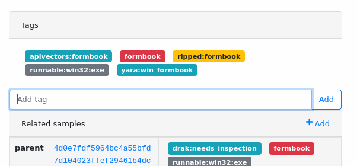
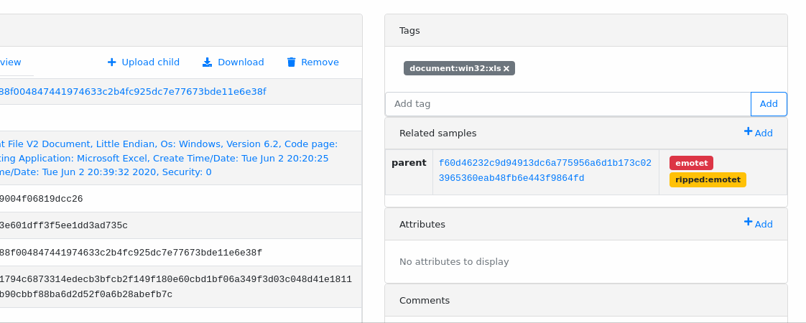

5. Tagging objects
==================

Tags are used for basic object classification, allowing to quickly search for interesting samples in malware feed.

How to use tags?
----------------

You can add new tag to the object using ``Add tag`` field on the right side of detailed view. Click ``Add`` to submit a new tag. Autocompletion will help you explore existing tags to avoid typos or other misspelled duplications.

If you want to remove a tag - click on the ``x`` placed on the right side of the tag you want to remove.

To explore other objects with the same tag, just click on the tag to navigate to the search page. There you can filter in/out other tags to make your search more specific for what you are looking for.

Tags can be added as well using ``mwdblib`` library.

.. code-block:: python

   from mwdblib import MWDB

   FILE_SHA256 = "f60d462..."

   mwdb = MWDB(api_url=..., api_key=...)
   file_object = mwdb.query_file(FILE_SHA256)
   file_object.add_tag("chthonic")

   print(file_object.tags)
   # ["chthonic"]

Built-in tag conventions
------------------------

Probably you have already noticed that tags are differently colored depending on the prefix. That's because MWDB has few tag conventions built-in to highlight certain groups of tags.

Simple tags are **red**. In mwdb.cert.pl they're mostly used for marking identified malware name.

Tags describing the source are **blue** (\ ``src:``\ , ``uploader:``\ , ``feed:``\ ). ``feed:`` tags are most special, because you can easily filter out all external feed by choosing built-in ``Exclude feed:*`` option in Quick query bar.

Tags indicating matched malware are **yellow** (\ ``ripped:``\ , ``contains:``\ ). In mwdb.cert.pl we mark the original sample with ``ripped:<family>`` tag. Unpacked samples or dumps originating from ``ripped`` samples are added as a child and tagged red with malware family name. 

.. note::

   If you want to get only samples that are marked as malicious with high confidence - use ``Only ripped:*`` button in Quick query bar.

File type can be additionally classified with another group of **gray** tags (\ ``runnable:``\ , ``archive:``\ , ``dump:``\ , ``script:``\ ).

.. image:: ../_static/4jYM0Kq.png
   :target: ../_static/4jYM0Kq.png
   :alt: 

Generic tags containing ``:`` are **cyan**. We use them to add some secondary tags fetched from feed or indicating classification result by other systems (e.g. ``yara:``\ , ``et:``\ )

