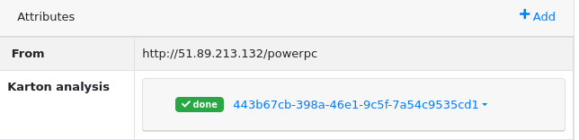
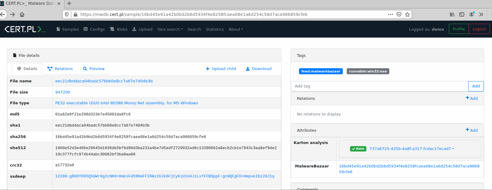
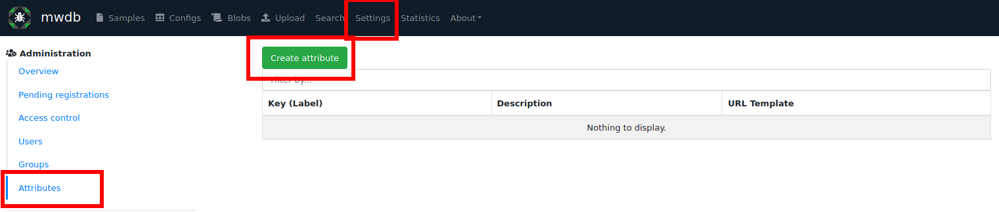
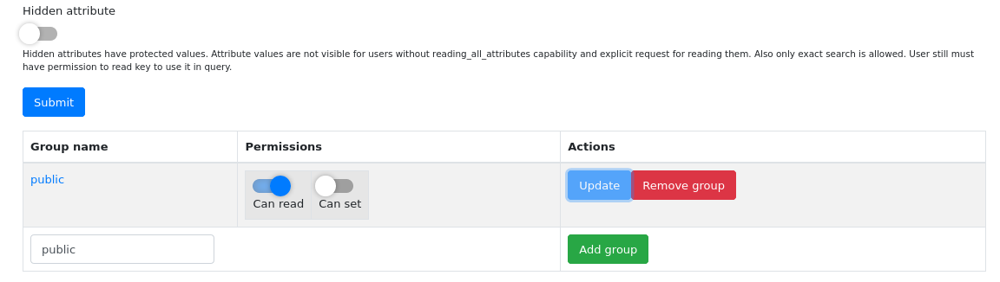
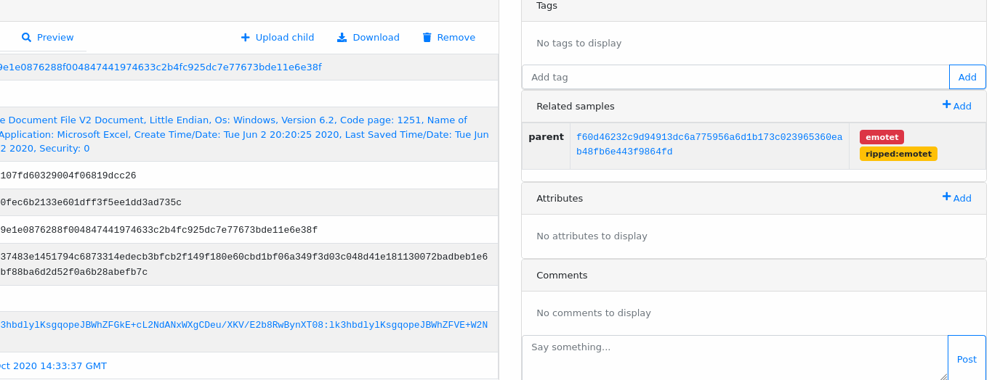
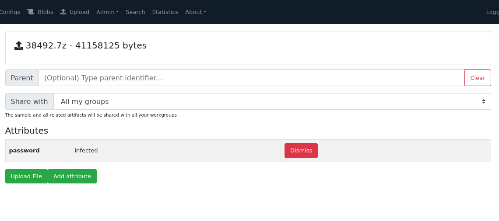
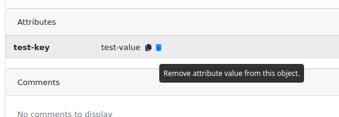

6. Object attributes
====================

Attributes (formerly called "metakeys") are used to store associations with external systems and other extra information about an object.

List of object attributes can be found in detailed object view in the ``Attributes`` box.

How attributes can be used?
---------------------------

Attributes are set of unique key-value pairs, ordered from the earliest added. Keys are not arbitrary and **must be defined first** in attribute configuration. Each attribute key can have special properties depending on the key semantics.

Attribute feature was initially designed to store the analysis identifier. Attribute values **can be rendered as URLs** to the external webpage with analysis details.

Plugins can apply custom rendering of attribute values to include additional information from external systems. Good example is Karton plugin that uses custom component to show information about analysis status.

Declaring new attribute
-----------------------

Attributes must be declared first by administrator (having ``manage_users`` capability). To declare a new attribute, go to the ``Settings`` → ``Attributes`` view using navigation bar.

Then, click on ``Create attribute`` button.

Attribute key has few basic properties described below:

* **Key** - the main attribute key name. Identifies the key and is used in API. Must contain only lowercase letters and digits and maximum 32 characters are allowed.
* **Label** (optional) - user-friendly label for attribute, visible for MWDB users instead of key. Can be changed any time you want.
* **Description** (optional) -  description to explain users the semantics of attribute, visible in MWDB UI.
* **URL template** (optional) - URL template used to map the values to the URLs. Template can contain ``$value`` placeholder, where MWDB UI will put the attribute value and make clickable link.
* **Hidden attribute** (optional) - Actually it should be called "protected attribute". These attributes have special purpose and are described further.

After defining new attribute, click ``Submit``. The most important thing at this step is to choose good attribute key. Don't worry much about the optional fields, they can be changed any time you want.

When attribute is added, you will be redirected to the attribute key settings page. It looks almost the same, but have additional box at the bottom with ACL (access control list) settings for groups.

Attributes without ACLs are accessible only for administrators or users with special capabilities like ``Has access to all attributes of object`` and ``Can add all attributes to object``. Regular users can't see and set the attributes without explicit permission.

If you want to give permission to the specific group or user, type the group name (or user login) and click ``Add group``. Then you can use ``Can read`` and ``Can set`` switches to set the permissions. Apply changes for group using ``Update`` button.

If attribute should be available to all users in MWDB instance, add ``public`` group with ``Can read`` permission. If you want all users to add new values with defined attribute key - additionally enable ``Can set`` permission.

Adding attributes to objects
----------------------------

If you have permission to set the attribute key, you can add a new attribute value using ``Add +`` button placed in ``Attributes`` box header.

Attributes can be added during object upload. It's really useful if you want to use attributes as plugin arguments e.g. to provide password to the encrypted file/archive. Attributes passed that way will be set just before the plugin hook fires.

Another use case is passing source feed identifier with the uploaded file.

The same operations can be performed using mwdblib. Let's explore the attributes in mwdb.cert.pl:

.. code-block:: python

   from mwdblib import MWDB

   mwdb = MWDB(api_key=..., api_url=...)
   file_object = mwdb.query_file("d9f00cc51e1c107881ebeaa0fd4f022a")
   print(file_object.attributes)

   # {'from': ['http://45.95.168.97/bins/sora.x86'],
   #  'karton': ['da83d95a-0564-4d32-8fea-ff61ac7396d1']}

To add a new attribute to the existing object, use `MWDBObject.add_attribute <https://mwdblib.readthedocs.io/en/latest/mwdbtypes.html#mwdblib.MWDBObject.add_attribute>`_ function. Example below will fail in mwdb.cert.pl because attribute ``test-key`` is probably undefined, but you can try it on your own instance!

.. code-block:: python

   file_object.add_attribute("test-key", "test-value")
   print(file_object.attributes)
   # {'from': ['http://45.95.168.97/bins/sora.x86'],
   #  'karton': ['da83d95a-0564-4d32-8fea-ff61ac7396d1'],
   #  'test-key': ['test-value']}

To pass an attribute value during upload, you can set it via ``attributes`` argument using `MWDB.upload_file <https://mwdblib.readthedocs.io/en/latest/mwdblib.html#mwdblib.MWDB.upload_file>`_ routine.

.. code-block:: python

   mwdb.upload_file("infected.zip", 
                    zip_contents, 
                    attributes={
                        "test-key": "test-value"
                    })

JSON-like attribute values
--------------------------

Starting from 2.6.0, MWDB Core attribute values are not limited to be plain strings, but also JSON-like objects.

.. image:: ../_static/json-attribute-add.png
   :target: ../_static/json-attribute-add.png
   :alt: Adding JSON attribute

.. image:: ../_static/json-attribute.png
   :target: ../_static/json-attribute.png
   :alt: JSON attribute

Using JSON attributes, you can easily store complex data like:

- enrichments from other services
- file static analysis information like code signing, sections, list of resources
- information about produced dumps from sandbox

.. code-block:: python

   file_object.add_attribute(
       "dumps", {
           "fffb0000_1908f226280751a1": {
               "apivector": "A45oA36CA7BA15iAgA6gA3CABQAEA3IAAQQA5CAGBkACA4QA6JIAAICISIMhY]Us",
               "families": [
                   "isfb"
               ],
               "similarity": 0.35330578512396693
           },
           "fffa0000_568d29558bebb4d8": {
               "apivector": "A119CABQAEACA4QAAgA4BEA21QwMEhYQUM",
               "families": [
                   "isfb"
               ],
               "similarity": 0.3490675028882654
           }
       }
   )

You can also search for parts of object value using JSON queries, like for configuration contents:

.. code-block::

    attribute.dumps.fffb0000_1908f226280751a1.families*:isfb

Removing attributes from objects
--------------------------------

To remove attribute value, hover over that value and click the remove button.

Attribute can be removed only if user has permission to ``set`` the attribute key and has ``removing_attributes`` capability turned on.

Hidden (protected) attributes
-----------------------------

Attributes marked as "hidden" can be only queried using exact search (without wildcards). They can't be directly read in object view, unless you have special capability (``reading_all_attributes``).

Hidden attributes can be used if you want to share the job identifier and allow to search associated objects without giving access to other job references for these objects.

A good example is the mquery plugin. In case of mquery, we want to ensure that user will have access only to the results of jobs runned by themselves or shared by other users. Unfortunately, attribute key permissions are "all or nothing" and we can't define ACLs on the value level.

Rich templates
--------------

Starting from v2.8.0, MWDB Core supports rich attribute value rendering. For more information, see :ref:`Rich attributes guide`.
