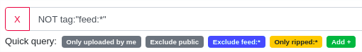
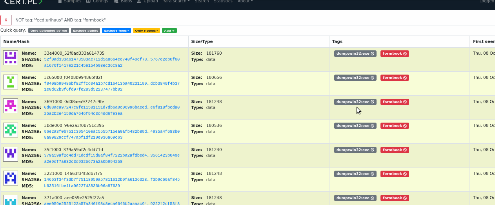
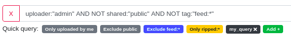

7. Advanced search based on Lucene queries
==========================================

MWDB comes with a powerful search engine based on Lucene query syntax subset.

Query syntax: fields
--------------------

A query is broken up into fields and operators.

You can search any field by typing the field name followed by ":" and then the term value you are looking for.

.. code-block::

   tag:emotet

Multi-word terms separated by spaces or containing a special character (e.g. colon or parentheses) are called "phrases" and must be surrounded by double quotes

.. code-block::

   type:"PE32 executable (GUI) Intel 80386, for MS Windows"

Most fields support **wildcard search**. Symbol "?" represents a single character wildcard and "*" represents multiple characters (0 or more). If you want to include all PE executables in your results - use:

.. code-block::

   type:PE32*

Query syntax support escaping if you want to include '*' as a character. Query presented below looks for all type values that are containing asterisk:

.. code-block::

   type:"*\**"

Query syntax: operators
-----------------------

MWDB supports three boolean operators: ``AND``\ , ``OR`` and ``NOT``.

.. warning::
   
   Boolean operators must be UPPERCASE.

If you want to search all samples that are tagged with anything that contains "emotet" word (e.g ``emotet_drop``\ , ``ripped:emotet`` or just ``emotet``\ ) and exclude samples tagged as ``feed:spam`` - use:

.. code-block::

   tag:*emotet* AND NOT tag:"feed:spam"

Query syntax supports using parentheses to group logic expressions:

.. code-block::

   name:emotet* OR (tag:*emotet* AND NOT tag:"feed:spam")

Query syntax: ranges
--------------------

Integer and date fields support range search. Range queries can be inclusive or exclusive of the upper and lower bounds.

.. warning::

   ``TO`` operator must be UPPERCASE.

Query written below will find all files that have size between 50 and 50000 bytes inclusive:

.. code-block::

   size:[50 TO 50000]

If you want to exclude one of the range sides, replace "[" character with "{".

.. code-block::

   size:{50 TO 50000]

This will find files between 51 and 50000 bytes in size. Inclusive range queries are denoted by square brackets. Exclusive are denoted by curly brackets.

In most cases we want to search for that are only one-side bounded e.g. all files bigger than 50000 bytes. In that case, we can use single wildcard character to denote the infinity:

.. code-block::

   size:[50000 TO *]

This syntax is still not very convenient, so we have introduced shorter syntax incorporating ``>``\ , ``<``\ , ``>=`` and ``<=`` operators. To use them, just add appropriate operator to the beginning of a term.

.. code-block::

   size:>=500000
   size:">=500000"

MWDB-Core supports human-readable file size so instead of specifying the number of bytes, we can refer to larger units like kB, MB and GB.

.. code-block::

   size:>=500kB
   size:>=0.5MB

.. warning::

   Remember that converting a file size from bytes to human-readable form does not always match with the conversion the other way around.

   For example 1 kB equals 1024 bytes, rounding 1026 bytes to the second decimal number 1026 bytes will also give 1 kB (1.002 kB).

   So do not be surprised if you enter ``size:1kB`` in the search engine and a sample of this size is not found, because in bytes this size may differ slightly.

   For this reason, searching for a size from an object view always redirects to the query in bytes.

Query syntax: timestamps
------------------------

With timestamps you can search for objects within certain time range.

If you want to find objects that were uploaded from the beginning of September till the 28th:

.. code-block::

   upload_time:[2020-09-01 TO 2020-09-28]

If you want to find objects that were uploaded from the beginning of September:

.. code-block::

   upload_time:[2020-09-01 TO *]

Alternatively:

.. code-block::

   upload_time:>=2020-09-01

If you want to search for objects within time certain range:

.. code-block::

   upload_time:["2020-09-28 08:00" TO "2020-09-28 09:00"]

If you want to search for objects uploaded after certain hour:

.. code-block::

   upload_time:">=2020-09-28 08:00"

If you want to search for objects uploaded at certain minute:

.. code-block::

   upload_time:"2020-09-28 15:32"

Remember that exclusive range is not allowed for date-time field so this is not allowed:

.. code-block::

   upload_time:{2020-09-01 TO *]

   upload_time:>2020-09-01

Query syntax: relative timestamps
---------------------------------

.. versionadded:: 2.7.0

It is also possible to use upload_time in relation to current time.
For example, if you want to search for objects uploaded during last 2 hours:

.. code-block::

   upload_time:>=2h or upload_time:[2h TO *]

This way of time definition contains value and relative time format.

Below are listed acceptable relative time symbols:

* **y** or **Y** : years
* **m** : months
* **w** or **W** : weeks
* **d** or **D** : days
* **h** or **H** : hours
* **M** : minutes
* **s** or **S** : seconds

.. warning::

   Bring awareness to symbols **m** and **M**. They means quite different period time. Other symbols can be used as uppercase or lowercase letters.

During defining relative time you can combine different time symbols.
For example, if you want to search for objects uploaded earlier then 1 mounths and 5 days ago:

.. code-block::

   upload_time:<=1m5d or upload_time:[* TO 1m5d]

It is possible to use relative timestamps and timestamps. 

.. code-block::

   upload_time:[2022-02-01 TO 1m10d]

Basic search fields
-------------------

Fields represent the object properties and can be **typed** (specific for object type) or **untyped** (generic, used by all object types).

Usage depends on the search context. If you're querying ``Recent files`` tab, query engine assumes that object type is ``file``. If you're using ``Search`` tab, you need to add appropriate type prefix to the typed fields.

In simple words: `name:` field in `Recent files\ ``must be replaced by``\ file.name:\ ``field in``\ Search`.

Untyped fields
^^^^^^^^^^^^^^

* ``dhash:<string>`` - Object identifier (SHA256)
* ``tag:<string>`` - Object tag
* ``comment:<string>`` - Object comment contents
* ``meta.<attribute>:<string>`` - Object attribute value
* ``upload_time:<datetime>`` - Object first upload timestamp
* ``karton:<uuid>`` - Karton analysis artifacts

Typed fields (file)
^^^^^^^^^^^^^^^^^^^

* ``file.name:<string>`` - Name of file
* ``file.type:<string>:`` - Type of file, returned by ``file`` Unix command
* ``file.size:<integer>:`` - Size of file in bytes
* ``file.md5:``\ , ``file.sha1:``\ , ``file.sha256:``\ , ``file.sha512:``\ , ``file.ssdeep:``\ , ``file.crc32:`` - File contents hashes and checksums

Typed fields (config)
^^^^^^^^^^^^^^^^^^^^^

* ``config.type:<string>`` - Type of configuration
* ``config.family:<string>`` - Malware family name
* ``config.cfg[<.path>]:<string>`` - JSON field with configuration contents

Typed fields (blob)
^^^^^^^^^^^^^^^^^^^

* ``blob.name:<string>`` - Name of blob
* ``blob.size:<integer>`` - Size of blob
* ``blob.type:<string>`` - Type of blob
* ``blob.content:<string>`` - Blob contents
* ``blob.first_seen:<datetime>`` - Alias for ``upload_time``
* ``blob.last_seen:<datetime>`` - Timestamp when blob was last uploaded

Special fields
^^^^^^^^^^^^^^

There are also other fields that have special meaning. They will be described in further sections of this chapter.

* ``favorites:<string>``
* ``shared:<string>``
* ``uploader:<string>``
* ``parent:<subquery>``
* ``child:<subquery>``

JSON fields (\ ``config.cfg:``\ )
---------------------------------

Configurations can be searched using path queries:

.. code-block::

   config.cfg.field_1.field_2:value

which would find configs that contain structure below:

.. code-block:: json

   {
       "field_1": {
           "field_2": "value"
      }
   }

Configurations are stored as JSON objects. The most simple way to search something inside configuration is to treat them as simple text fields and use wildcards.

Assuming we are in ``Recent configs`` tab:

.. code-block::

   cfg:*google.com*

If we want to be more specific and look for ``google.com`` only inside "urls" key, we can add a field name to ``cfg`` field using dot:

.. code-block::

   cfg.urls:*google.com*

If you want to search for elements contained in an array, simply use * at the end of the field where it is nested.

For example, let's use the following configuration.

.. code-block:: json

   {
       "field": {
           "array": [1, 2, 3]
      }
   }

In this case, to find the object, we can use array search to check if the nested array contains a specific value:

.. code-block::

   cfg.field.array*:1

Searching in this way applies to both numbers and strings contained in the array.

If you search by more than one value contained in an array, just type:

.. code-block::

   cfg.field.array*:"*1, 2*"

Starting from v2.8.0, you can also use range queries for numbers, for example:

.. code-block::

   cfg.field.array*:[1 TO 3]

looks for any configuration that contains `field.array` with at least one number element within range 1 to 3 inclusively.

Favorites field (\ ``favorites:``\ )
------------------------------------------------------------

Typing the field ``favorites:`` you can search for your objects marked as favorite in object view.

.. code-block::

   favorites:<user login>

The above query returns the favorite objects of specific user.

.. warning::

    Remember that you can only search for your own favorites objects.

    Only system administrator with "manage_users" capabilities can search for other users favorites.

Comment author field (\ ``comment_author:``\ )
------------------------------------------------------------

Typing the field ``comment_author:`` you can search for objects commented by selected user.

.. code-block::

   comment_author:<user login>

The above query returns the objects commented by user <user login>.

.. warning::

    Comment authors are kept only for existing users, so you can't search for comments from deleted accounts.

    Wildcards are not allowed for field ``comment_author:``.

Upload count field (\ ``upload_count:``\ )
------------------------------------------------------------

Typing the field ``upload_count:`` you can search for objects using upload information that are related with **n**
different users uploads. Using that query, you can spot objects that might be most interesting within your dataset.

   upload_count:n

The wildcards ranges are supported for field ``upload_count:``.

For example:
If you want to search for samples which were uploaded by 5 and more different users, use undermentioned search statement.
It's also highly recommended to combine ``upload_count`` with ``upload_time`` query,
so you can select only samples that were uploaded within the specific period of time:

.. code-block::

   upload_count:["5 TO *] AND upload_time:[2021-06-01 TO 2021-06-30]

Group access queries (\ ``shared:`` and ``uploader:``\ )
------------------------------------------------------------

Search engine supports ``shared:`` and ``uploader:`` special fields that are useful for filtering out specific user or group uploads.

* ``shared:`` checks if object is explicitly shared with specific group or user
* ``uploader:`` checks if object was uploaded by specified user or any user from specified group

If you want to exclude objects shared with everyone (\ ``public`` group):

.. code-block::

   NOT shared:public

If you want to include only objects that are uploaded by yourself:

.. code-block::

   uploader:<your login>

If you want to see objects that are uploaded by somebody from your group excluding your own uploads:

.. code-block::

   uploader:<group name> AND NOT uploader:<your login>

Keep in mind that you can query only for objects uploaded by you or members of your own groups (excluding members of the ``public`` group). This limitation doesn't apply to administrators (``manage_users`` capability).

Read more about MWDB sharing model and capabilities in chapter :ref:`9. Sharing objects with other collaborators`.

Parent/child subqueries
-----------------------

MWDB allows to use parent/child subqueries.

If you want to search for samples that have ripped configuration for Emotet family as their child, go to ``Samples`` and type:

.. code-block::

   child:(config.family:emotet)

If you want to search for configs that have a sample as their parent with file size greater than 1000, go to ``Configs`` and type:

.. code-block::

   parent:(file.size:>1000)

Nested searches can be performed as well. If you want to find object which is parent of object tagged as ``emotet`` and grandparent of config object for Emotet family:

.. code-block::

   child:(tag:emotet AND child:(config.family:emotet))

Multi field (\ ``multi:``\ )
------------------------------------------------------------

Search engine supports ``multi:`` special field that is useful for filtering out objects using multiple
type of object attributes.

Depending on type of object, we can use field ``multi:`` applying various object attributes separated by spaces.
Types of attributes are automatically recognised.
Below allowable attributes were listed for different type of objects, which can be used in query building.

* File (sample)

  * all hashes values

* Config

  * dhash values
  * extract of configuration content

* Blob

  * dhash values
  * extract of Blob content

If you want to search for samples that have 0cb988d042a7f28dd5fe2b55b3f5ac7a ``md5`` value or
3b0ee981 ``crc32`` value use below query.

.. code-block::

   multi:"0cb988d042a7f28dd5fe2b55b3f5ac7a 3b0ee981"

If query contains only hashes, field ``multi:`` can be omitted.

.. code-block::

   0cb988d042a7f28dd5fe2b55b3f5ac7a eb1c78d4994f7a107f78dec529988900e3601852ae0bfdefb3e15967c6d8f127

If you want to search for Configs that have configuration content which contain strings "abcd" or "xyz" or

``dhash`` value eb1c78d4994f7a107f78dec529988900e3601852ae0bfdefb3e15967c6d8f127 - use below query

.. code-block::

   multi:"abcd xyz eb1c78d4994f7a107f78dec529988900e3601852ae0bfdefb3e15967c6d8f127"

.. warning::

    Multi-query terms containing extract of Config configuration or Blob content must be separated by spaces end surrounded by double quotes. Field ``multi:`` also has to be explicitly used.

    Wildcards are not allowed for field ``multi:``. They are automatically used for Config configuration and Blob content.

Escaping special characters
---------------------------

Field labels may contain characters that need to be escaped in query. Let's consider a config field with space character:

.. code-block:: json

   {
       "decoy domains": [ "evil.com" ]
   }

Special characters (like space) need to be escaped using backslash, so correct query looks like below:

.. code-block::

   config.cfg.decoy\ domains*:"evil.com"

Other special characters that also need to be escaped are:

- dots (``\.``)
- colons (``\:``)
- asterisks (``\*``)
- backslashes (``\\``)

Quick queries
-------------

Quick queries can be found just under the search field.

You can use quick query by clicking on one of the badges. First four queries are built-in:

* ``Only uploaded by me`` is ``uploader:<my login>`` query that can be used to filter only samples uploaded by ourselves
* ``Exclude public`` is ``NOT shared:public`` and filters out public objects
* ``Exclude feed:*`` is ``NOT tag:"feed:*"`` and excludes all the external feeds
* ``Only ripped:*`` is ``tag:"ripped:*"`` and includes only original samples recognized as malware and with successfully ripped configuration.

You can also add your own quick query by first typing the query in search field and then clicking on ``Add +``

Afterwards, you can see your newly added query as another black-coloured badge. You can click it any time and even the most complex query will be performed!

