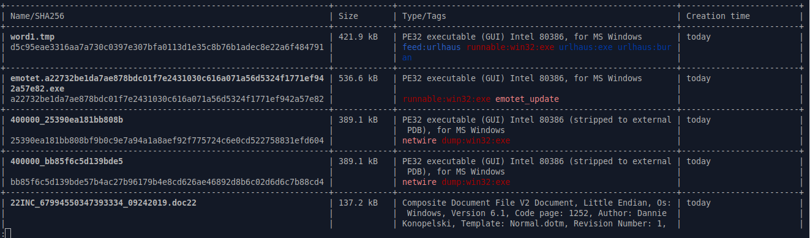
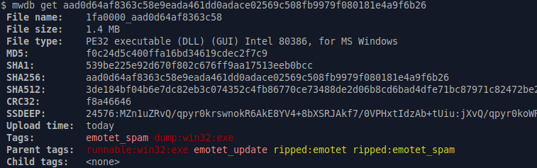
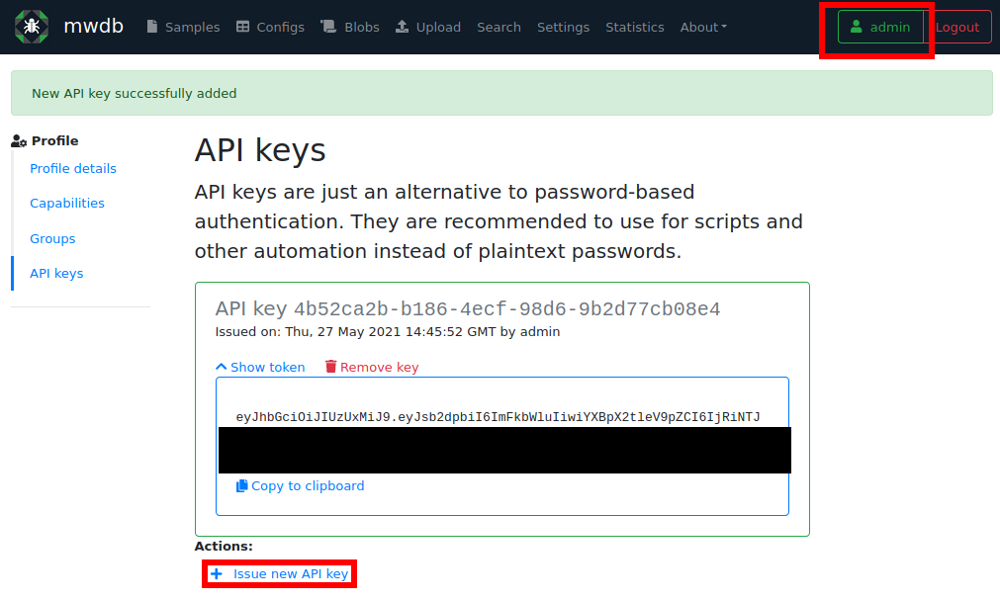
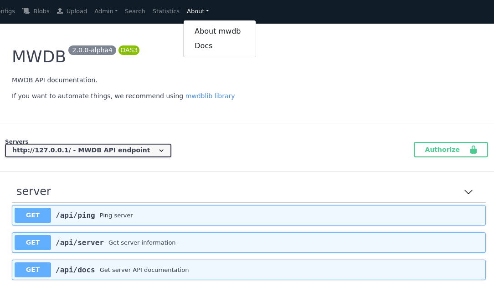
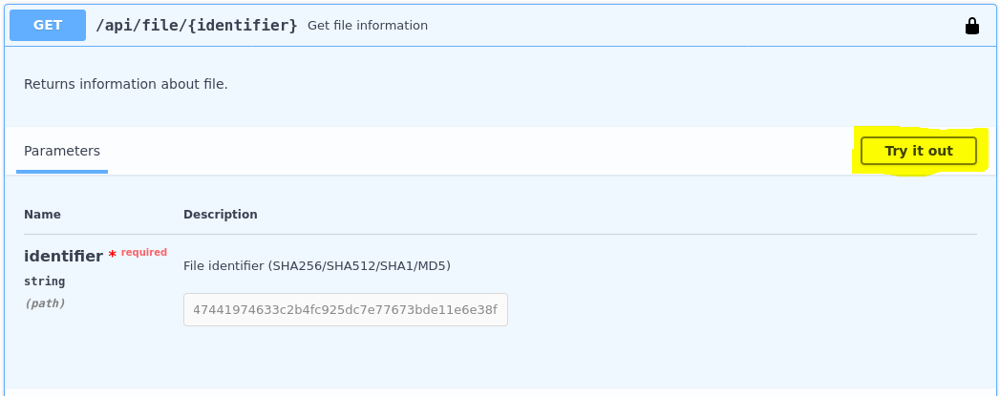
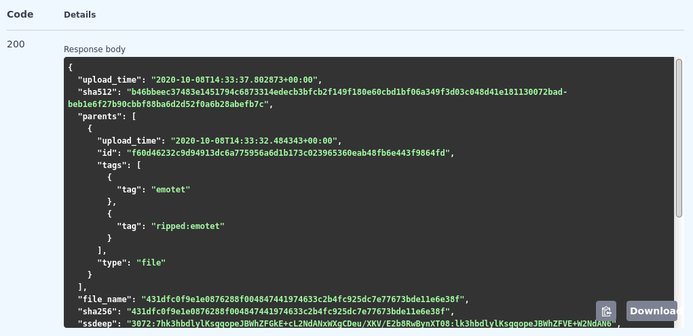

8. Automating things using REST API and mwdblib
===============================================

The previous chapters are guide over MWDB features mostly from the Web UI perspective. Actually, Web UI is only a client for rich REST API, which brings out the full potential of the MWDB server.

The most recommended way to use MWDB API is `mwdblib <https://github.com/CERT-Polska/mwdblib>`_, which is dedicated binding with few high-level utilities for scripts written in Python. If you want to use other language to interact with API, any HTTP client will be fine for that.

Introduction to mwdblib
-----------------------

Let's start with mwdblib installation using pip.

.. code-block::

    pip install mwdblib

The main interface is ``MWDB`` object that provides various methods to interact with MWDB. Let's start with log in to mwdb.cert.pl service.

.. code-block:: python

    >>> from mwdblib import MWDB
    >>> mwdb = MWDB()
    >>> mwdb.login()
    Username: jkowalski
    Password:

If you want to use your local instance instead of mwdb.cert.pl, pass the appropriate API url to the ``MWDB`` constructor:

.. code-block:: python

    >>> mwdb = MWDB(api_url="http://127.0.0.1:3000/api")
    >>> mwdb.login("admin")
    Password:

After successful login, let's begin with ``recent_files`` to get recently uploaded file from API.

.. code-block:: python

    >>> mwdb.recent_files()
    <generator object MWDB._recent at ...>

``recent_files`` function returns generator which does the same job as scrolling down the ``Samples`` view to view the older entries. Let's use ``next`` function to get the most recent file:

.. code-block:: python

    >>> files = mwdb.recent_files()
    >>> file = next(files)
    >>> file
    <mwdblib.file.MWDBFile at ...>
    
...and we got the file! To get the next 10 files, we can use ``itertools.islice`` method:

.. code-block:: python
    
    >>> import itertools
    >>> recent_10 = list(itertools.islice(files, 10))
    [<mwdblib.file.MWDBFile at ...>,
     <mwdblib.file.MWDBFile at ...>,
     <mwdblib.file.MWDBFile at ...>,
     <mwdblib.file.MWDBFile at ...>,
     <mwdblib.file.MWDBFile at ...>,
     <mwdblib.file.MWDBFile at ...>,
     <mwdblib.file.MWDBFile at ...>,
     <mwdblib.file.MWDBFile at ...>,
     <mwdblib.file.MWDBFile at ...>,
     <mwdblib.file.MWDBFile at ...>]

If you want to get a file by hash, you can use `query_file <https://mwdblib.readthedocs.io/en/latest/mwdblib.html#mwdblib.MWDB.query_file>`_ method.

.. code-block:: python

    >>> file = mwdb.query_file("780e8fb254e0b8c299f834f61dc80809")
    >>> file
    <mwdblib.file.MWDBFile at ...>]

Using retrieved MWDBFile object we can get some details about the file e.g. name, tags, child objects or download its contents:

.. code-block:: python

    >>> file.name
    '400000_1973838fc27536e6'
    >>> file.tags
    ['dump:win32:exe', 'avemaria']
    >>> file.children
    [<mwdblib.file.MWDBConfig at ...>]
    >>> file.download()[:16]
    b'MZ\x90\x00\x03\x00\x00\x00\x04\x00\x00\x00\xff\xff\x00\x00'

As you can see, there is a configuration attached to the file. We can get it by index operator or use ``config`` attribute to get the latest configuration object. Let's see what has been ripped:

.. code-block:: python

    >>> file.children[0].config
    {'c2': [{'host': '172.111.210.207'}], 'type': 'avemaria'}
    >>> file.config
    <mwdblib.file.MWDBConfig at ...>
    >>> file.config.config
    {'c2': [{'host': '172.111.210.207'}], 'type': 'avemaria'}

Few malware samples can share the same configuration. Let's explore them:

.. code-block:: python
    
    >>> avemaria = file.config
    >>> avemaria.parents
    [<mwdblib.file.MWDBFile at ...>,
     <mwdblib.file.MWDBFile at ...>,
     <mwdblib.file.MWDBFile at ...>]
    >>> [parent.name for parent in avemaria.parents]
    ['400000_1973838fc27536e6',
     '400000_2bf452f7796153ef',
     '400000_3539b9d228df73c6']

More methods can be found in `mwdblib documentation <https://mwdblib.readthedocs.io/en/latest/>`_. After short introduction and fun with exploring MWDB, let's dive into more advanced concepts.

Using mwdblib for automation
----------------------------

mwdblib library is especially useful for writing external integrations.

Feeding MWDB service
~~~~~~~~~~~~~~~~~~~~

Uploading a sample to the MWDB service allows you to access all the descendant objects and the results of automatic analysis. New sample can be uploaded using `upload_file function <https://mwdblib.readthedocs.io/en/latest/mwdblib.html#mwdblib.MWDB.upload_file>`_.

.. code-block:: python

    from mwdblib import MWDB

    file_name = sys.argv[1]

    with open(file_name, "rb") as f:
        contents = f.read()

    mwdb = MWDB(api_key=...)
    file_object = mwdb.upload_file(file_name, contents)

If you want to serve your files as a public feed, it's recommended to:

- set a tag ``feed:<feed name>`` for each uploaded object, which allow people to filter samples coming from your feed.
- if additional insights about your sample are available in external service, it's nice to expose additional reference to that service as an attribute e.g. ``<feed name>: <sample internal id>``
- finally, set ``public`` flag to share your sample with all users in MWDB

.. code-block:: python

    file_object = mwdb.upload_file(
        file_name,
        contents,
        metakeys={"maldb": file_id},
        public=True
    )
    file_object.add_tag("feed:maldb")

but remember that all of these things are **optional**. If you want to share additional insights about sample, you can **share them using comments**:

.. code-block:: python
    
    file_object.add_comment(f"Sample downloaded from {url}")

.. note::

    If you want to serve a public feed for mwdb.cert.pl, contact people from CERT.pl (via Slack or info@cert.pl) to setup all the things e.g. to register attribute key if you want to share external link to your resource.

Using MWDB service as a feed
~~~~~~~~~~~~~~~~~~~~~~~~~~~~

The next common use-case is to use a script for listening for recently added files or new configurations. MWDB does not support any kind of notifications, so you need to periodically ask for recently uploaded objects and retrieve if there is anything new.

For that type of tasks, mwdblib includes a group of helper methods called `listen_for_objects <https://mwdblib.readthedocs.io/en/latest/mwdblib.html#mwdblib.MWDB.listen_for_objects>`_. One of them is ``listen_for_files`` used in example presented below that downloads each new Portable Executable file from MWDB.

.. code-block:: python

    from mwdblib import MWDB

    mwdb = MWDB(api_key="<secret>")

    def report_new_sample(sample):
        print(f"Found new sample {sample.name} ({sample.sha256})")
        if "PE32" in sample.type:
            with open(sample.id, "wb") as f:
                f.write(sample.download())
            print("[+] PE32 downloaded successfully!")

    for sample in mwdb.listen_for_files():
        report_new_sample(sample)

Sometimes you may want to keep track of the latest reported sample between script executions. In that case, mwdblib doesn’t concern itself with persistence - you need to store the latest reported object ID on your own.

.. code-block:: python

    from mwdblib import MWDB

    mwdb = MWDB(api_key="<secret>")

    def store_last(last_id):
        """Stores last identifier in last_id file"""
        with open("last_id", "w") as f:
            f.write(last_id)

    def load_last():
        """Recovers last identifier from last_id file"""
        try:
            with open("last_id", "r") as f:
                return f.read()
        except IOError:
            return None

    def report_new_sample(sample):
        print(f"Found new sample {sample.name} ({sample.sha256})")
        if "PE32" in sample.type:
            with open(sample.id, "wb") as f:
                f.write(sample.download())
            print("[+] PE32 downloaded successfully!")

    last_id = load_last()

    # Recovered last_id is passed to the listen_for_files function
    for sample in mwdb.listen_for_files(last_id):
        report_new_sample(sample)
        store_last(sample.id)

Retrieving Karton analysis status
~~~~~~~~~~~~~~~~~~~~~~~~~~~~~~~~~

Our mwdb.cert.pl service offers automatic configuration extraction for malware samples. Analysis backend is based on Karton project, malware processing framework developed by CERT.pl that orchestrates whole analysis process.

Karton integration is not fully supported yet in mwdblib. Nevertheless, you can still retrieve the analysis status using ``APIClient`` interface, used by mwdblib to perform requests.

.. warning::

    This part of documentation applies to the feature that is currently in **release candidate stage**. Things may work a bit different in stable release.

.. code-block:: python

    import time
    from mwdblib import MWDB

    ...

    mwdb = MWDB(api_key=...)
    
    # Upload new file to the MWDB
    file_object = mwdb.upload_file(file_name, contents)
    karton_id = file_object.metakeys["karton"][0]

    while True:
        time.sleep(5)
        # Get analysis status
        analysis_status = mwdb.api.get(f"object/{file_object.id}/karton/{karton_id}")["status"]
        print("Current status is '{analysis_status}'...")
        # If analysis is finished: break
        if analysis_status == "finished":
            break
    
    # Get all configurations ripped during the analysis
    configs = list(mwdb.search_configs(f'karton:"{karton_id}"'))

Optimizing API usage
--------------------

During extensive usage of an API, you may hit the rate limit in MWDB service or performance limitations on your own instance. mwdblib retrieves all the information at the time of use (lazy-loading) and caches them in the object instance. This section will describe how to minimize the amount of requests and still get the required information.

First of all, you should turn on logging API requests performed by ``mwdblib``. The most simple way is just to use ``logging.basicConfig`` with ``DEBUG`` level enabled.

.. code-block:: python

    >>> import logging
    >>> logging.basicConfig(level=logging.DEBUG)

    >>> from mwdblib import MWDB
    >>> mwdb = MWDB()
    >>> mwdb.login()
    Username: jkowalski
    Password: 
    <redacted>/mwdblib/api.py:91: UserWarning: Password-authenticated sessions are short lived, so password needs to be stored in APIClient object. Ask MWDB instance administrator for an API key (send e-mail to info@cert.pl if you use mwdb.cert.pl)
    warnings.warn("Password-authenticated sessions are short lived, so password needs to be stored "
    DEBUG:urllib3.connectionpool:Starting new HTTPS connection (1): mwdb.cert.pl:443
    DEBUG:urllib3.connectionpool:https://mwdb.cert.pl:443 "POST /api/auth/login HTTP/1.1" 200 722

As you can see, ``login()`` method sends ``POST /api/auth/login`` request to authenticate and get the authorization token.

How lazy loading works?
~~~~~~~~~~~~~~~~~~~~~~~

MWDB API offers wide range of methods that are serving different portions of data. Object are represented by ``MWDBObject`` class hierarchy, storing cached property values fetched from API.

Cached values can be read using undocumented field ``MWDBObject.data``. Let's try to check the difference in cache after fetching the same object using ``recent_objects()`` and ``recent_files()``

.. code-block:: python

    >>> object = next(mwdb.recent_objects())
    DEBUG:urllib3.connectionpool:https://mwdb.cert.pl:443 "GET /api/object HTTP/1.1" 200 2034
    >>> object.data
    {'upload_time': '2020-10-12T14:15:09.719741+00:00',
     'tags': [{'tag': 'runnable:win32:exe'}, {'tag': 'feed:malwarebazaar'}],
     'id': 'cea813cbef6581e0c95aacb2e747f5951325444b941e801164154917a17bfe71',
     'type': 'file'}
    
    >>> file = next(mwdb.recent_files())
    DEBUG:urllib3.connectionpool:https://mwdb.cert.pl:443 "GET /api/file HTTP/1.1" 200 4698
    >>> file.data
    {'upload_time': '2020-10-12T14:15:09.719741+00:00',
     'file_name': '3e424264572d0d986fa3ae49c98f566ba7d8e2d7',
     'tags': [{'tag': 'runnable:win32:exe'}, {'tag': 'feed:malwarebazaar'}],
     'file_size': 211456,
     'sha256': 'cea813cbef6581e0c95aacb2e747f5951325444b941e801164154917a17bfe71',
     'id': 'cea813cbef6581e0c95aacb2e747f5951325444b941e801164154917a17bfe71',
     'file_type': 'PE32 executable (GUI) Intel 80386, for MS Windows',
     'md5': 'e883226589b32952d07e057c468ffbb8',
     'type': 'file'}
    
As you can see, the closer we are to the actual object type the more data are fetched using single request. The same thing we can observe comparing ``query()`` method fetching objects by SHA256 in general and ``query_file()`` which looks only for files.

.. code-block:: python

    >>> object = mwdb.query("cea813cbef6581e0c95aacb2e747f5951325444b941e801164154917a17bfe71")
    DEBUG:urllib3.connectionpool:https://mwdb.cert.pl:443 "GET /api/object/cea813cbef6581e0c95aacb2e747f5951325444b941e801164154917a17bfe71 HTTP/1.1" 200 245
    >>> object.data
    {'parents': [],
     'upload_time': '2020-10-12T14:15:09.719741+00:00',
     'tags': [{'tag': 'runnable:win32:exe'}, {'tag': 'feed:malwarebazaar'}],
     'id': 'cea813cbef6581e0c95aacb2e747f5951325444b941e801164154917a17bfe71',
     'children': [],
     'type': 'file'}

    >>> file = mwdb.query_file("cea813cbef6581e0c95aacb2e747f5951325444b941e801164154917a17bfe71")
    DEBUG:urllib3.connectionpool:https://mwdb.cert.pl:443 "GET /api/file/cea813cbef6581e0c95aacb2e747f5951325444b941e801164154917a17bfe71 HTTP/1.1" 200 850
    >>> file.data
    {'crc32': 'efb41668',
     'parents': [],
     'upload_time': '2020-10-12T14:15:09.719741+00:00',
     'ssdeep': '3072:9ofJySUG7zULD7B4QutZO2L3Zt0OWBuQUNgRnJONVGMVKzJ7sAjf:WRye7ALD7B4QEZNwOWBdUNkJOswAjf',
     'tags': [{'tag': 'runnable:win32:exe'}, {'tag': 'feed:malwarebazaar'}],
     'file_name': '3e424264572d0d986fa3ae49c98f566ba7d8e2d7',
     'file_size': 211456,
     'sha512': '9520111d2cab4c760ee6a91148265dc3fbd65f37688ed8a9aeed543fe99a565c4fe47f22abbf067d2d81ddd4cc69106a9fdba823d3a1af80882bce61dd312487',
     'latest_config': None,
     'sha256': 'cea813cbef6581e0c95aacb2e747f5951325444b941e801164154917a17bfe71',
     'md5': 'e883226589b32952d07e057c468ffbb8',
     'id': 'cea813cbef6581e0c95aacb2e747f5951325444b941e801164154917a17bfe71',
     'sha1': '3e424264572d0d986fa3ae49c98f566ba7d8e2d7',
     'file_type': 'PE32 executable (GUI) Intel 80386, for MS Windows',
     'children': [],
     'type': 'file'}

If required property value is not cached, mwdblib will choose the best API endpoint to fetch the property

.. code-block:: python

    >>> object = mwdb.query("cea813cbef6581e0c95aacb2e747f5951325444b941e801164154917a17bfe71")
    DEBUG:urllib3.connectionpool:https://mwdb.cert.pl:443 "GET /api/object/cea813cbef6581e0c95aacb2e747f5951325444b941e801164154917a17bfe71 HTTP/1.1" 200 245
    >>> object.name
    DEBUG:urllib3.connectionpool:https://mwdb.cert.pl:443 "GET /api/file/cea813cbef6581e0c95aacb2e747f5951325444b941e801164154917a17bfe71 HTTP/1.1" 200 850
    '3e424264572d0d986fa3ae49c98f566ba7d8e2d7'
    >>> object.type
    'PE32 executable (GUI) Intel 80386, for MS Windows'
    >>> object.size
    211456
    >>> object.comments
    DEBUG:urllib3.connectionpool:https://mwdb.cert.pl:443 "GET /api/object/cea813cbef6581e0c95aacb2e747f5951325444b941e801164154917a17bfe71/comment HTTP/1.1" 200 287
    [<mwdblib.comment.MWDBComment at ...>]

Sometimes you may need to flush the cache to fetch the refreshed state of object. In that case, use ``flush()`` method.

.. code-block:: python

    >>> file.flush()
    >>> file.data
    {'id': 'cea813cbef6581e0c95aacb2e747f5951325444b941e801164154917a17bfe71'}

Command-line interface (CLI)
----------------------------

MWDB library provides optional command line interface, which can be used to interact with MWDB repository.

Command-line interface requires extra ``mwdblib[cli]`` dependencies that can be installed using ``pip``

.. code-block:: console

    $ mwdb version

    [!] It seems that you haven't installed extra dependencies needed by CLI extension.
    Best way to install them is to use `pip install mwdblib[cli]` command.
    If it doesn't help, let us know and create an issue: https://github.com/CERT-Polska/mwdblib/issues
    Missing dependency: click

    $ pip install mwdblib[cli]
    ...

    $ mwdb version
    3.3.0

User authentication
~~~~~~~~~~~~~~~~~~~

Before we start, we need to setup credentials. If you don’t do that, you will be asked for them on each access to MWDB API.

.. code-block:: console

    $ mwdb login
    Username: user
    Password:

If you want, you can also provide your API key instead of storing your password in keyring.

.. code-block:: console

    $ mwdb login -A
    Provide your API key token:

Just copy your API token from ``/profile`` view and paste into the CLI. All secrets will be stored in keyring and your username will be saved in ``~/.mwdb`` file.

Looking for recent data
~~~~~~~~~~~~~~~~~~~~~~~

Let’s start with listing the latest samples in your workspace. After typing

.. code-block:: console

    $ mwdb list

you will see the list of samples similar to the main MWDB webapp view.

If you don’t like pager or coloring, you can use ``nocolor`` and ``nopager`` modifiers.

.. code-block:: console

    $ mwdb list -o nopager,nocolor --limit 5

Recent lists are limited by default to 200 entries. If you want to find more or less, you can use ``--limit`` option but be careful not to exceed the requests limit or your session will be temporarily throttled.

If you want only to get IDs of recent files, you need to use ``short`` modifier

.. code-block:: console

    $ mwdb list -o short -n 1
    aad0d64af8363c58e9eada461dd0adace02569c508fb9979f080181e4a9f6b26

Gathering information about objects
~~~~~~~~~~~~~~~~~~~~~~~~~~~~~~~~~~~

If you want to get detailed information about specific object, use ``get`` subcommand.

Then file can be download using fetch command.

.. code-block:: console

    $ mwdb fetch aad0d64af8363c58e9eada461dd0adace02569c508fb9979f080181e4a9f6b26 --keep-name
    $ ls
    1fa0000_aad0d64af8363c58

If you’d like to store file under its original name, you can use keep-name option as presented above. File will be stored in current working directory.

In case your file is already stored in your local filesystem, you can just **provide the path instead of providing SHA256** - hash will evaluated automatically. For example, getting list of comments for locally stored ``sample.exe`` looks like below:

.. code-block:: console
    
    $ mwdb get comments ./sample.exe

Uploading files
~~~~~~~~~~~~~~~

Let’s assume you want to upload dropper.js. Just type:

.. code-block:: console
    
    $ mwdb upload dropper.js

If you want to upload a drop called drop.exe and add relation to previously uploaded dropper.js you can specify parent:

.. code-block:: console
    
    $ mwdb upload dropper.js --parent drop.exe

... and if you want to suggest the family, add appropriate tag:

.. code-block:: console
    
    $ mwdb tag drop.exe maybe:netwire

Use ``mwdb --help`` to get the complete list CLI options and ``mwdb <subcommand> --help`` for details.

How to use API keys?
--------------------

If you use ``mwdb.login()`` method, you may notice a warning that is shown by this method:

.. code-block::
    
    UserWarning: Password-authenticated sessions are short lived, so password needs to be stored in APIClient object. Ask MWDB instance administrator for an API key (send e-mail to info@cert.pl if you use mwdb.cert.pl)

Recommended authentication way to be used in scripts is to use API key token instead of password. List of created API keys can be found on the bottom of **Profile** view (next to the Logout in navbar) in **API keys** section.

To create a new API key, click on your nickname in navigation bar and go to the ``API keys`` section. Then click on ``+ Issue new API key`` action:

Authorization token can be used in mwdblib via ``api_key`` argument:

.. code-block:: python

    mwdb = MWDB(api_key="ey...")

Using REST API directly (Non-Python integration)
------------------------------------------------

You can use REST API directly via any HTTP client e.g. ``curl``.

.. code-block:: console
    
    $ curl https://mwdb.cert.pl/api/ping
    {"status": "ok"}

    $ curl https://mwdb.cert.pl/api/file
    {"message": "Not authenticated."}

Most API endpoints require authentication. Authorization token must be passed using ``Authorization: Bearer`` header.

.. code-block:: console

    $ curl https://mwdb.cert.pl/api/file -H "Authorization: Bearer <token>"
    {"files": [{"upload_time": ...

Complete API documentation can be found under the ``/docs`` endpoint. API documentation is based on `Swagger client <https://swagger.io/>`_ and you can interact with API directly from that page.

After logging in, click on ``About`` in the navbar and go to the ``Docs`` page.

Use ``Try it out`` button to send the API request.

