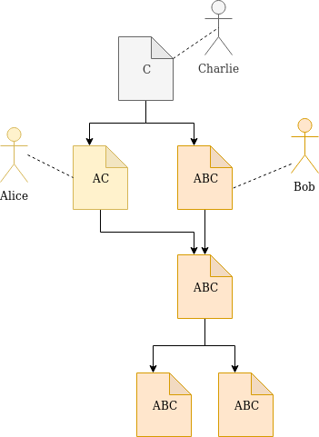
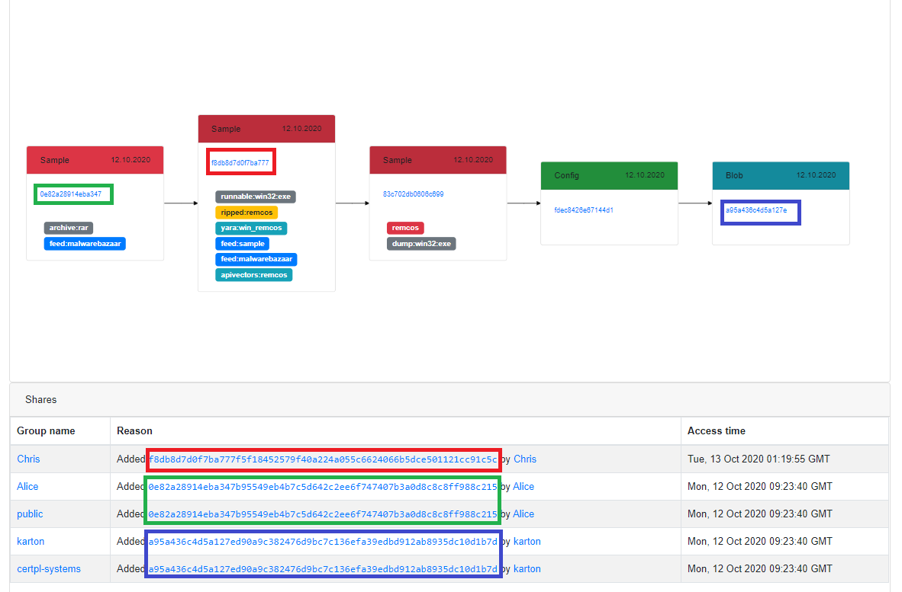
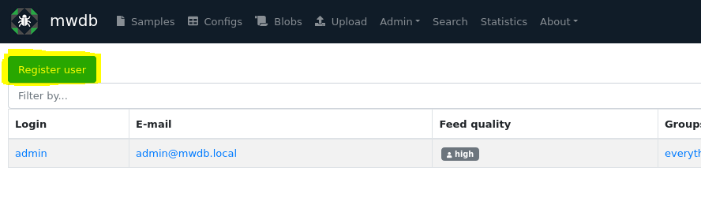
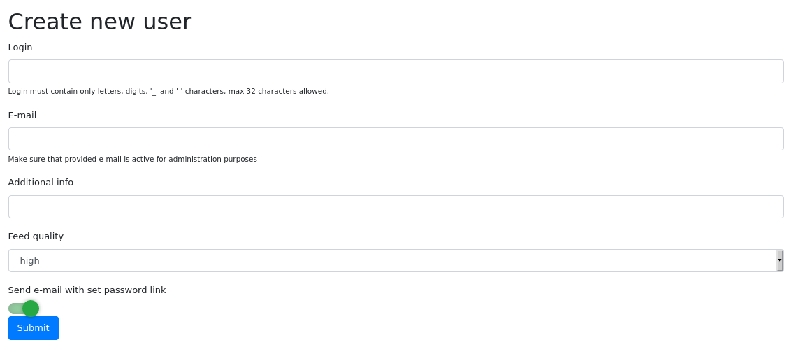
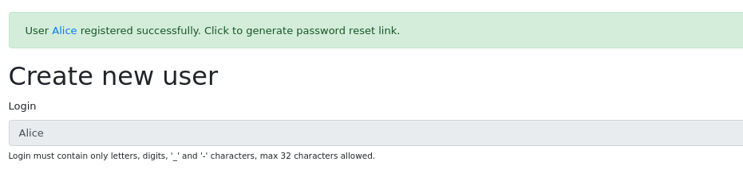
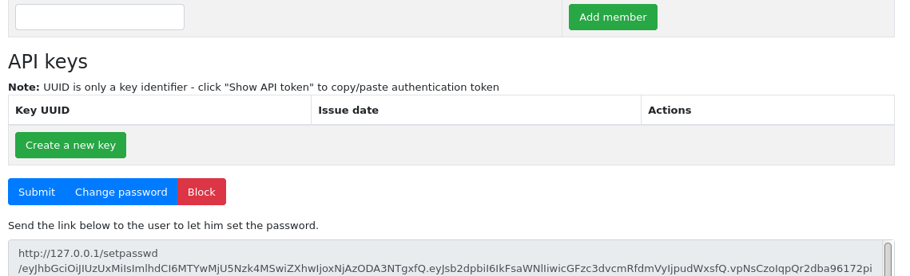
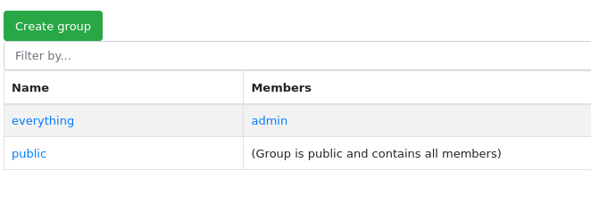
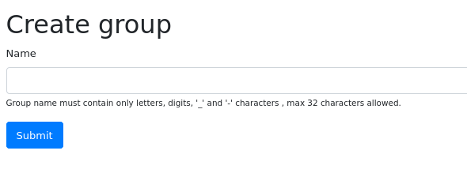
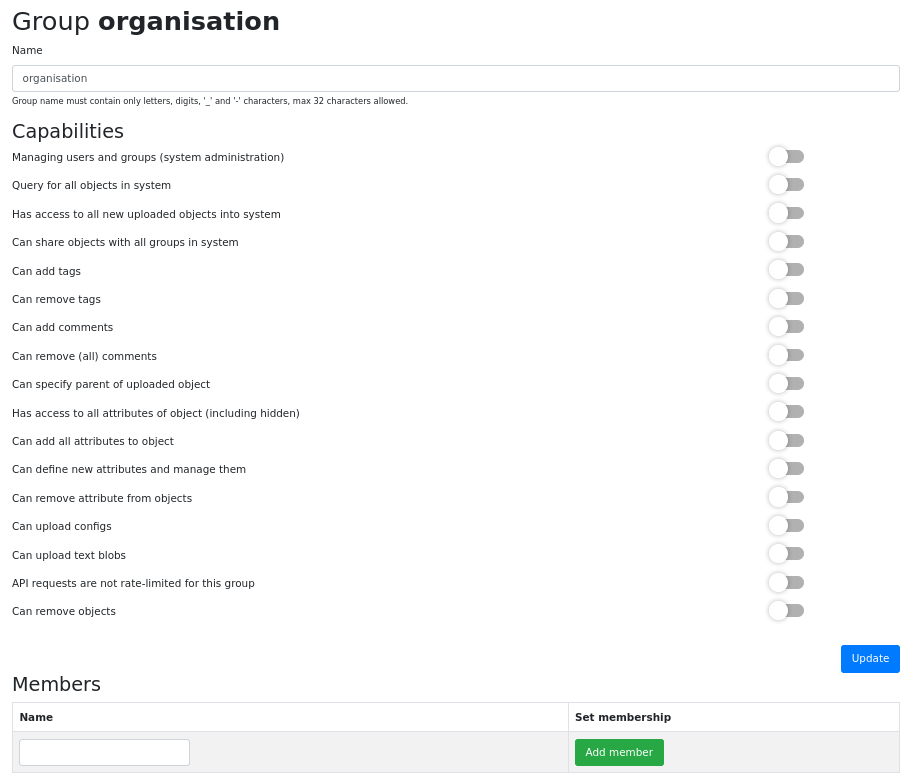
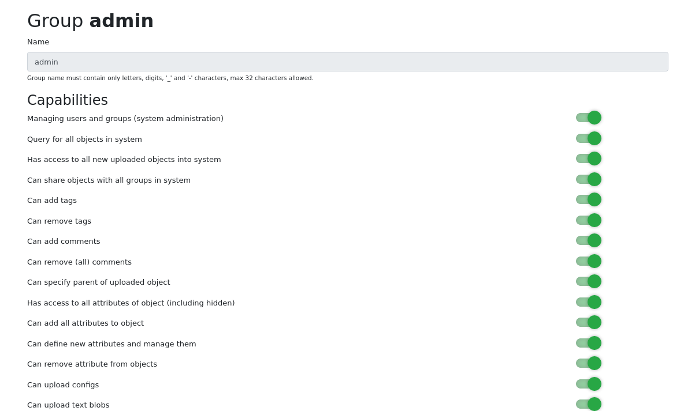

9. Sharing objects with other collaborators
===========================================

Access control to the objects and features in MWDB is based on **groups**.

For MWDB users: group is a workspace, that allows to share the same view of uploaded objects across the various users. For MWDB administrators: group is also a way to give a specific set of permissions, depending on the role and level of trust.

In mwdb.cert.pl, we use them to group the users coming from the same organisation, to make them share their uploads and insights with other co-workers or keep the information to be accessible only within trusted group of people.

Every user account is a member of at least two groups:

* user's private group, named the same as user login, which represents the exclusive user permissions.
* ``public`` group with permissions that apply to all users in MWDB.

Users' permissions are the sum of permissions of their groups.

Object access rules
-------------------

The basic rule of sharing model in MWDB is that **group sees only their own uploads and all descendant objects**. In that model, you have permission to see the configuration for your sample and all the information originating from that configuration. Access to parent object implies the access its to children, but not the other way around.

As an user, you need to choose which groups you represent uploading the sample. There are four options:

* **All my groups** - the default option, which shares uploaded object with all groups, excluding ``public``. That will share the object with all workspaces you belong to and your own private group. It means that even if you lose access to the workspace, you will still have access to your own uploads.
* **Single group...** - allows to share an object exclusively with chosen group and your own private group.
* **Everybody** - in that case, object is shared with ``public`` group, which means that everybody will have access to the uploaded object and all its descendants.
* **Only me** - your object will be shared only with your group.

Note that all options share the uploaded object with your private group. In addition, your object will be **always** shared with special ``everything`` group described later.

.. image:: ../_static/upload-share-with.png
   :target: ../_static/upload-share-with.png
   :alt: Upload sharing options

.. note::

  If you are not a member of any additional group, you will see only **Everybody** and **Only me** (default) options

Current object access rules are visible in ``Shares`` box. Entries with the same identifier as currently watched object are originating from the upload of that object. Others are inherited from the parents

In example presented above:

* **karton** added blob (blue colored) with config as a parent
* **certpl-systems** group has access to blob because Karton is a member of that group. Uploader (Karton) decided to share uploaded object with all groups.
* **Alice** has access to blob because she added the original archive (green colored) before
* **public** group has access because Alice decided that she want to share archive with everybody
* **Chris** added Remcos sample (red colored) directly one day later, so he has got additional exclusive access to the blob. If archive was not added to the `public` group

Who is who? User visibility rules
---------------------------------

Regular users are able to see only its own groups. It means that they’re able only to see these users that are members of their groups.

Joining the group, you are allowed to:

* share objects with its members
* search for their uploads using ``shared:`` and ``uploader:`` queries (but only within groups common for both users)
* see their profiles and membership in other common groups

But there are few exclusions for that, when your login may be visible for all users in MWDB regardless of group membership:

* when you are the first one sharing an object with ``public`` group
* when you add a comment (login of author)

Group with ``everything``
-----------------------------

There is special group called ``everything`` that has access to all objects ever added. This group can be used by instance owner organisation for administration purposes and to manage whole repository.

Even if you upload sample to mwdb.cert.pl with ``Only me`` option, you are sharing it with our internal "everything" group for automated processing purposes. It's important to upload only these samples that can be shared with CERT.pl (\ ``tlp:amber``\ ).

.. note::

    ``everything`` group can be renamed. To make the ``everything`` group more friendly for other people in your organization, you can use your organization name instead.

How to add new user/group?
--------------------------

Users and groups can be managed by administrator using ``Manage users`` and ``Manage groups`` views in ``Admin`` menu.

Create a new user
~~~~~~~~~~~~~~~~~

.. warning::

  **Be careful!** User accounts can't be renamed nor removed in current version of mwdb-core.

To create a new user, go to ``Admin``/``Manage users`` and click on ``Register user`` button.

Then fill the form with the following information:

* **Login** and **E-mail** that will be used for authentication, password recovery etc.
* **Additional info** (optional) to store additional description of user account
* **Feed quality** which is useful for plugins to determine if user account is associated with automatic feed (low) or human user (high, default).

By default - MWDB sends an e-mail to the new user with set password link, but if you have not configured SMTP service: disable **Send e-mail with set password link** first.

After clicking on ``Submit``, you will see a confirmation message with hyperlink to user profile.

Using user profile, you can add user to additional groups and generate set password link. Go to the bottom of the page and click on the ``Change password`` button.

Pass that link to the user to let him set a new password for an account.

Create a new group
~~~~~~~~~~~~~~~~~~

.. warning::

  **Be careful!** Groups can't be removed in current version of mwdb-core.

To create a new group, go to ``Admin``/``Manage groups`` and click on ``Create group`` button.

Set name for a new group. After clicking on ``Submit``, you will see a confirmation message with hyperlink to group settings.

In group settings view, you can add members to the new group.

Group capabilities (superpowers)
--------------------------------

All groups can have additional permissions that applies to all members. MWDB by default is quite restrictive and regular user accounts are by default allowed only to upload samples and access the object information. That default prevents breaking the existing conventions or making potentially irreversible actions, but even in CERT.pl we don't apply such limitations for users.

By default, ``admin`` private group has enabled all capabilities. All other groups are created with all disabled.

Each capability has its own name and the administration page shows only the friendly description.

* 
  **manage_users - Managing users and groups (system administration)**

  Allows to access all users and groups in MWDB. Rules described in *Who is who?* doesn't apply to users with that permission. Enables user to create new user accounts, new groups and change their capabilities and membership.

* 
  **share_queried_objects - Query for all objects in system**

  That one is a bit tricky and will be possibly deprecated. MWDB will automatically share object and all descendants with group if member directly accessed it via identifier (knows the hash e.g. have direct link to the object). It can be used for bot accounts, so they have access only to these objects that are intended to be processed by them. Internally, we abandoned that idea, so that capability may not be stable.

* 
  **access_all_objects - Has access to all new uploaded objects into system**

  Capability used by ``everything`` group, useful when you want to make additional "everything" that is separate from the original one. Keep in mind that it applies only to the **uploads made during the capability was enabled**\ , so if you want the new group to be truly "everything", you may need to share the old objects manually.

* 
  **sharing_objects - Can share objects with all groups in system**

  Implies the access to the list of all group names, but without access to the membership information and management features. Allow to share object with arbitrary group in MWDB.

* 
  **adding_tags - Can add tags**

  Allows to tag objects. This feature is disabled by default, as you may want to have only tags from automated analysis.

* 
  **removing_tags - Can remove tags**

  Allows to remove tags. Tag doesn't have "owner", so user will be able to remove all tags from the object.

* 
  **adding_comments - Can add comments**

  Allows to add comments to the objects. Keep in mind that comments are public.

* 
  **removing_comments - Can remove (all) comments**

  Allows to remove **all** comments, not only these authored by the user.

* 
  **adding_parents - Can add parents**

  Allows to add new relationships by specifying object parent during upload or adding new relationship between existing objects.

* 
  **reading_all_attributes - Has access to all attributes of object (including hidden)**

  With that capability, you can read all the attributes, even if you don't have ``read`` permission for that attribute key. It allows to list hidden attribute values.

* 
  **adding_all_attributes - Can add all attributes to object**

  Enables group to add all the attributes, even if it doesn't have ``set`` permission for that attribute key.

* 
  **managing_attributes - Can define new attributes and manage them**

  Allows to manage attribute keys, define new ones and set the group permissions for them.

* 
  **removing_attributes - Can remove attribute from objects**

  Allows to remove attribute from object. To remove attribute, you need to have ``set`` permission for key. Combined with ``adding_all_attributes``\ , allows to remove all attributes.

* 
  **adding_configs - Can upload configs**

  Enables upload of configurations. Configurations are intended to be uploaded by automated systems or trusted entities that follow the conventions.

* 
  **adding_blobs - Can upload text blobs**

  Enables upload of blobs. Blobs may have similar meaning as configurations in terms of user roles.

* 
  **unlimited_requests - API requests are not rate-limited for this group**

  Disables rate limiting for users from that group, if rate limiting feature is enabled.

* 
  **removing_objects - Can remove objects**

  Can remove all accessible objects from the MWDB. May be quite destructive, we suggest to keep that capability enabled only for ``admin`` account.

User capabilities are the sum of all group capabilities. If you want to enable capability system-wide (e.g. enable all users to add tags), enable that capability for ``public`` group.

In mwdb.cert.pl service - ``public`` group is allowed to:

* add new tags
* add new comments
* add relationships (parents)
* have access to extended features provided by internal plugins

You can easily check your capabilities in ``Profile`` view.

Plugins are allowed to extend the set of capabilities in case MWDB administrator wants to require additional permission for using them.
