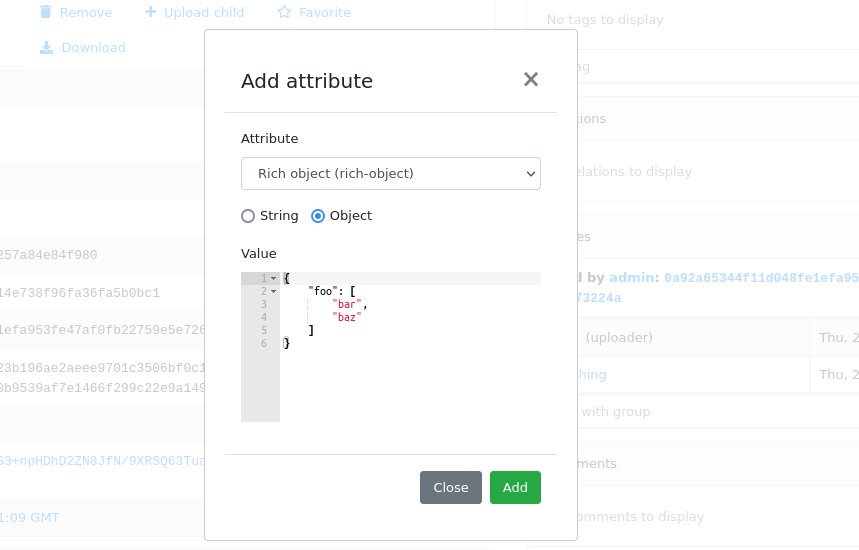
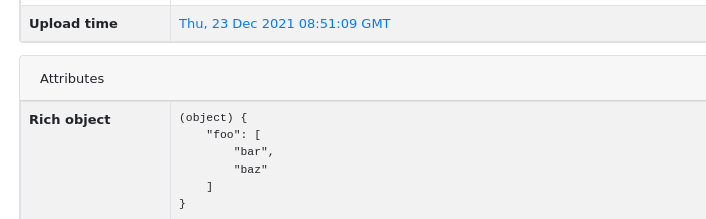
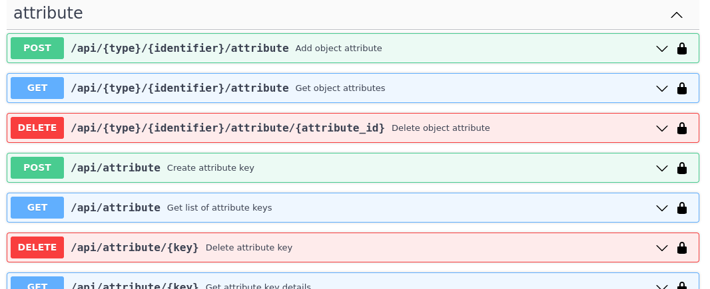
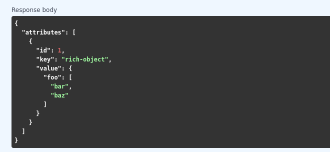
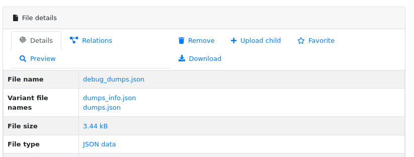

What's changed?
===============

This page describes the most significant changes in the following versions, that may be interesting especially for
integration and plugin developers. We usually don't break API compatibility within major version, but plugins may
have compatibility problems after minor mwdb-core upgrade.

For upgrade instructions, see :ref:`Upgrade mwdb-core to latest version`.

v2.8.0
------

Release includes few improvements of performance, integration and search capabilities.

Complete changelog can be found here: `v2.8.0 changelog <https://github.com/CERT-Polska/mwdb-core/releases/tag/v2.8.0>`_.

[Important change] Changes in database model
~~~~~~~~~~~~~~~~~~~~~~~~~~~~~~~~~~~~~~~~~~~~

This release contains few model optimizations to improve query time, especially for tag queries.

- Relationship between Object and Tag was converted from many-to-many to one-to-many. Tag is represented by (object_id, tag_string) association instead of (object_id, tag_id) with tag in separate Table.
- Inheritance model is single-table based instead of join-based. All information is contained in single table Object instead of using separate tables for specialized fields, joined with common primary key.

Database migration may take a while during upgrade and requires extra space (~70% more) because major data must be copied from one table to another.

It's also recommended to **make a database backup before upgrade**.

[New feature] Rich attributes rendering
~~~~~~~~~~~~~~~~~~~~~~~~~~~~~~~~~~~~~~~

Starting from v2.8.0, MWDB Core supports rich attribute value rendering. For more information, see :ref:`Rich attributes guide`.

[Important change] Upgrade to Karton v5.0.0
~~~~~~~~~~~~~~~~~~~~~~~~~~~~~~~~~~~~~~~~~~~

Changed name of ``karton.ini`` section that contains S3 client configuration from ``[minio]`` to ``[s3]``.

In addition to this, you need to add a URI scheme to the address field and remove the secure field. If secure was 0, correct scheme is http://. If secure was 1, use https://.

.. code-block:: diff

    - [minio]
    + [s3]
      access_key = karton-test-access
      secret_key = karton-test-key
    - address = localhost:9000
    + address = http://localhost:9000
      bucket = karton
    - secure = 0

v5.0.0 maps ``[minio]`` configuration to correct ``[s3]`` configuration internally, but ``[minio]`` scheme is considered deprecated and can be removed in further major release.

v2.7.0
------

Release includes few improvements of security, integration and search capabilities.

Complete changelog can be found here: `v2.7.0 changelog <https://github.com/CERT-Polska/mwdb-core/releases/tag/v2.7.0>`_.

[Important change] Changed API key generation and handling
~~~~~~~~~~~~~~~~~~~~~~~~~~~~~~~~~~~~~~~~~~~~~~~~~~~~~~~~~~

MWDB Core uses JWT tokens for various resources that require special authorization. One of them is managed
directly by the end user: API keys. In this release, we slightly changed the implementation to improve security and
make them more compliant with `RFC7519 <https://datatracker.ietf.org/doc/html/rfc7519>`_.

That's why it's recommended to regenerate your API keys at some point after upgrade. All previously generated API keys
will be honored by further 2.x.x releases of MWDB Core, but should be considered deprecated.

The next important change is that API key token is shown **only just after creation** and token can't be regenerated for
existing API key.

[New feature] Configurable rate limits
~~~~~~~~~~~~~~~~~~~~~~~~~~~~~~~~~~~~~~

From now, you doesn't have to rely on arbitrary hardcoded rate limits like before 2.7.0. Now, you're open to configure it
depending on your needs. You can use different limits for specific endpoints and HTTP methods.

For more information, read :ref:`Rate limit configuration` section.

[New feature] Relative date-time ranges in search
~~~~~~~~~~~~~~~~~~~~~~~~~~~~~~~~~~~~~~~~~~~~~~~~~

v2.7.0 comes with the next improvements in search. The new thing is support for relative date-time ranges.

.. code-block::

   upload_time:>=2h or upload_time:[2h TO *]

For more information, read :ref:`Query syntax: relative timestamps`.

[Improvement] New object hooks accessible for plugins
~~~~~~~~~~~~~~~~~~~~~~~~~~~~~~~~~~~~~~~~~~~~~~~~~~~~~

In previous versions, MWDB Core was able to notify your plugins only of limited set of simple actions like creation of
the new object, added tag or comment. From v2.7.0 you are able to integrate with much broader set of actions including
object removals, changes in attributes and even administrative actions like creation of new user account.

Complete list of hooks can be found in :ref:`Available hooks` section.

v2.6.0
------

This release implements multiple feature requests and improvements. The most noteworthy are support for OpenID Connect authentication
and new Attribute API that allows to store whole JSON objects as attribute values.

Another noticeable change is redesigned Shares box. In addition, we swapped the positions of Attributes box and Shares box, so
main part of view contains the most important information about object. In future, we plan to enrich attributes with extended
rendering features, so you can place and visualize complete analysis report just by using Attributes feature. If you have any
ideas regarding that, `let us know by creating an issue <https://github.com/CERT-Polska/mwdb-core/issues>`_!

Complete changelog can be found here: `v2.6.0 changelog <https://github.com/CERT-Polska/mwdb-core/releases/tag/v2.6.0>`_.

[New feature] Support for OpenID Connect authentication
~~~~~~~~~~~~~~~~~~~~~~~~~~~~~~~~~~~~~~~~~~~~~~~~~~~~~~~

Users can bind their MWDB accounts with external identity provider, so they can authenticate via corporate Single Sign-On.

Feature was tested on Keycloak, but feature should support other OpenID Providers as well.

For more instructions, read :ref:`OpenID Connect authentication (Single Sign-On)`.

[New feature] New Attribute API - support for JSON values
~~~~~~~~~~~~~~~~~~~~~~~~~~~~~~~~~~~~~~~~~~~~~~~~~~~~~~~~~

Before 2.6.0, attributes supported only relatively short key-value string pairs and there were no good place for complex
structures like:

- enrichments from other services
- file static analysis information like code signing, sections, list of resources
- information about produced dumps from sandbox
- `apivectors <https://malpedia.caad.fkie.fraunhofer.de/apiqr/>`_

That's why we decided to migrate from plain strings to `JSONB type <https://www.postgresql.org/docs/14/datatype-json.html>`_.
in internal attribute value representation. We also designed a new Attribute API to operate on JSON objects rather than
simple values.





Attribute API is the new set of endpoints and request fields. You can easily recognize them as we name them `attributes`
instead of `meta(keys)`.



For compatibility reasons: deprecated Metakey API just coerces object values to strings. Keep in mind that strings
`'{"foo": "bar"}'` and objects `{"foo": "bar"}` are indistinguishable after type coercion, so don't use that API for
attribute keys that are intended to contain JSON objects.

Because of used representation, JSON dictionaries are not ordered. Attribute key still behaves as set: all values under the same attribute key are guaranteed to be unique and
when we try to add the same value twice, the second one won't be added.

Attribute API exposes attribute value identifier that can be used for removing the specific attribute value. Metakeys were identified directly by `key, value` tuple
but it wasn't convenient for objects because these values can be pretty huge.



More information can be found in `#413 feature draft on Github <https://github.com/CERT-Polska/mwdb-core/issues/413>`_. At the time of
2.6.0 release, not all planned Attribute API extensions are implemented, but we're going to deliver them in future.

[New feature] Configurable timeouts in MWDB Core
~~~~~~~~~~~~~~~~~~~~~~~~~~~~~~~~~~~~~~~~~~~~~~~~

Before 2.6.0, all MWDB Core timeouts were hardcoded directly in Web client code:

- 8 seconds timeout for API endpoints
- 60 seconds timeout for file upload

Timeout only interrupted HTTP request processing, but all SQL statements were still
processed on the backend. In addition, it wasn't enforced for other REST API clients.

In 2.6.0, we introduced set of timeouts that are configured on backend side:

- ``statement_timeout`` (integer) - If set, database server aborts any SQL statement that takes more than the specified number of milliseconds.
- ``file_upload_timeout`` (integer) - File upload process will be terminated by Web client if it takes more than this parameter value in milliseconds. Default value is 60000 ms.
- ``request_timeout`` (integer) - HTTP request will be terminated by Web client if it takes more than this parameter value in milliseconds. Default value is 20000 ms.

If you want to enforce effective timeout on the backend, set ``statement_timeout`` to non-zero value, but keep in mind that it may interrupt some long-running operations.
Other timeouts are suggestions for REST API client (exposed via ``/api/server``) and are set on Web client level.

Default Web timeout is now a bit longer and set to 20 seconds instead of 8 seconds.

[New feature] Storing alternative names for sample
~~~~~~~~~~~~~~~~~~~~~~~~~~~~~~~~~~~~~~~~~~~~~~~~~~

MWDB stores all unique names for sample that it was uploaded with. They are exposed via "Variant file names" field in Web UI object view.



[New feature] Transactional tag adding along with object upload
~~~~~~~~~~~~~~~~~~~~~~~~~~~~~~~~~~~~~~~~~~~~~~~~~~~~~~~~~~~~~~~

From 2.6.0 you can include tags as additional upload arguments. Previously that feature was supported only for attributes.

In that way, new object will appear in repository with all tags set via single database transaction, so you can avoid
race-conditions when tags are required immediately after object is spawned.

.. code-block:: python

    from mwdblib import MWDB  # >= 4.0.0

    mwdb = MWDB()
    ...
    mwdb.upload_file("sample", contents, tags=["vt:unknown"])


[New feature] New search features
~~~~~~~~~~~~~~~~~~~~~~~~~~~~~~~~~

2.6.0 release comes with new handful search fields:

- ```comment_author:<login>``` search field that allows to search for objects commented by selected user
- ```upload_count:<number>``` search field that allows to search for objects related with more than N different user uploads.
- ```multi:``` search field that allows to search for multiple hashes separated by spaces

The last one is used by Web client to automatically transform copy-pasted hashes, placed in search field.

v2.5.0
------

Small release that includes minor improvements on Karton integrations and other existing features.

Complete changelog can be found here: `v2.5.0 changelog <https://github.com/CERT-Polska/mwdb-core/releases/tag/v2.5.0>`_.

v2.4.0
------

Small release that includes minor improvements of existing features.

Complete changelog can be found here: `v2.4.0 changelog <https://github.com/CERT-Polska/mwdb-core/releases/tag/v2.4.0>`_.

v2.3.0
------

This release is focused mainly on MWDB administration improvements and further UI refactoring.
In addiition, Karton integration is now available out-of-the-box, without need of extra plugins.

Complete changelog can be found here: `v2.3.0 changelog <https://github.com/CERT-Polska/mwdb-core/releases/tag/v2.3.0>`_.

[New feature] Built-in Karton integration
~~~~~~~~~~~~~~~~~~~~~~~~~~~~~~~~~~~~~~~~~

Karton integration is now included as a built-in part of MWDB Core. In addition, MWDB-Core 2.3.0 includes automatic migration spawned on ``mwdb-core configure`` for ``mwdb-plugin-karton`` users.

If you use ``mwdb-plugin-karton`` in your setup: remove the plugin before upgrade. For more instructions, read :ref:`Karton integration guide`.

[New feature] ``registered`` group
~~~~~~~~~~~~~~~~~~~~~~~~~~~~~~~~~~

Before v2.3.0, it was difficult to setup guest accounts. To implement that, we added new capabilities:

- ``adding_files`` which is required for file upload
- ``manage_profile`` which is required for changes in user authentication (API keys, reset password)
- ``personalize`` that enables personalization features like Favorites or Quick queries.

But it was still painful to manage having only ``public`` group, which defines capabilities for all users in MWDB. That's why we created
new predefined group called ``registered``. Within migration, all capabilities are moved to ``registered`` group (with new one enabled)
and all existing users are added to that group.

``registered`` group behavior is similar to ``public``: new users are added by default and don't see each other within the group.
The only difference is that ``registered`` group is mutable, so any user can be easily removed from ``registered``.

By removing ``registered`` membership, you can make guest account with disabled file upload and personalization features!

If you don't like the split between ``public`` and ``registered`` in your instance, you can just remove the ``registered`` group and 
manually recover capabilities settings in ``public``.

[API] Plugin information is no longer available for non-admin users
~~~~~~~~~~~~~~~~~~~~~~~~~~~~~~~~~~~~~~~~~~~~~~~~~~~~~~~~~~~~~~~~~~~

Plugin information was moved from ``/api/server`` endpoint to ``/api/server/admin``. Information was also moved from ``/about`` to the new ``/settings`` view in UI.

In addition ``/api/docs`` also requires authentication.

[API] Removed ``managing_attributes`` capability
~~~~~~~~~~~~~~~~~~~~~~~~~~~~~~~~~~~~~~~~~~~~~~~~

``managing_attributes`` behavior was inconsistent, because ``manage_users`` was still required e.g. to set up permissions for attribute key. From now, ``manage_users`` is required for
all administration tasks, including setting up new attribute keys.

v2.2.0
------

In 2.2.0 frontend part was heavily refactored, so some Web plugins may stop working properly without proper upgrade.

Follow the sections below to learn about the most important changes.

Complete changelog can be found here: [v2.2.0 changelog](https://github.com/CERT-Polska/mwdb-core/releases/tag/v2.2.0)

[New feature] Remote API feature
~~~~~~~~~~~~~~~~~~~~~~~~~~~~~~~~

There is new feature that allows to connect directly to the other MWDB Core instance (e.g. mwdb.cert.pl).
This allows us to pull or push objects and discover new objects in the remote repository. At the time of release, feature is considered **beta** so
don't rely too much on it. If you want to test it, we'll be glad for feedback!

Read :ref:`Remote instances guide` to learn more.

[API] New file download endpoint
~~~~~~~~~~~~~~~~~~~~~~~~~~~~~~~~

Requests to MWDB API are mostly authenticated via Authorization header (instead of Cookie which is managed by browser),
so there is no easy way to let a browser download a file. That's why download process looked like below:

1.  ``POST /request/sample/{identifier}`` is used to get partial download URL with generated token
2.  ``GET /api/download/{access_token}`` is used to download the actual file

So we had always two HTTP requests to download the file contents. That's why in 2.2.0 you can download a file without
intermediate token via new ``/file/{identifier}/download`` endpoint.

* ``GET /file/<identifier>/download`` returns file contents for ``Authorization: Bearer`` requests
* ``GET /file/<identifier>/download?token=<token>`` for download token authorization that doesn't require Authorization header.
* ``POST /file/<identifier>/download`` that generates download token.

Old endpoints are considered obsolete and may be removed in further major release.

[Backend] Typed-Config is no longer embedded in mwdb package
~~~~~~~~~~~~~~~~~~~~~~~~~~~~~~~~~~~~~~~~~~~~~~~~~~~~~~~~~~~~

``typedconfig`` is no longer embedded in ``mwdb.core`` package, because it's used as external dependency.

For plugin compatibility, change

.. code-block:: python

    from mwdb.core.typedconfig import ...

to

.. code-block:: python

    from typedconfig import ...

[Web] React Context is used instead of Redux
~~~~~~~~~~~~~~~~~~~~~~~~~~~~~~~~~~~~~~~~~~~~

That's the most breaking change, because we no longer use React-Redux for handling the global state.
Instead we use bunch of React Context providers that are available also for plugins.

So if you use code presented below to check if current user has required capability:

.. code-block:: jsx

    import {connect} from 'react-redux';

    ...

    function mapStateToProps(state, ownProps)
    {
        return {
            ...ownProps,
            isKartonManager: state.auth.loggedUser.capabilities.includes("karton_manage"),
        }
    }

    export default connect(mapStateToProps)(KartonAttributeRenderer);

rewrite it like below:

.. code-block:: jsx

    import React, { useContext } from 'react';
    import { AuthContext } from "@mwdb-web/commons/auth";

    export default function KartonAttributeRenderer(props) {
        const auth = useContext(AuthContext);
        const isKartonManager = auth.hasCapability("karton_manage");

        ...
    }

Learn more about React Context in `React documentation <https://reactjs.org/docs/context.html>`_.

[Web] Extra routes must be passed as instantiated components
~~~~~~~~~~~~~~~~~~~~~~~~~~~~~~~~~~~~~~~~~~~~~~~~~~~~~~~~~~~~

This is specific for `Switch component from React-Router <https://reactrouter.com/web/api/Switch>`_. Component must
be instantiated when passed as a children of Switch, instead it doesn't work correctly.

It worked before 2.2.0 because default route wasn't handled. From 2.2.0 incorrectly defined routes will be unreachable.

Instead of:

.. code-block:: jsx

    export default {
        routes: [
            (props) => (
                <ProtectedRoute
                    condition={
                        props.isAuthenticated &&
                        props.capabilities &&
                        props.capabilities.includes("mquery_access")
                    }
                    exact
                    path="/mquery"
                    component={MQuerySearchView}
                />
            )
        ]
    }

use:

.. code-block:: jsx

    function MQueryRoute(props) {
        const auth = useContext(AuthContext);
        return (
            <ProtectedRoute
                condition={auth.hasCapability("mquery_access")}
                {...props}
            />
        )
    }

    export default {
        routes: [
            <MQueryRoute exact path="/mquery"  component={MQuerySearchView}/>,
        ],
    }

[Web] `props.object` may be undefined for ShowObject extensions. Use ObjectContext instead
~~~~~~~~~~~~~~~~~~~~~~~~~~~~~~~~~~~~~~~~~~~~~~~~~~~~~~~~~~~~~~~~~~~~~~~~~~~~~~~~~~~~~~~~~~

ShowObject components use ObjectContext natively which may affect some plugins that extend parts of this view

Instead of

.. code-block:: jsx

    export function MTrackerStatusBanner(props) {
        const objectType = props.object.type;
        const objectId = props.object.id;

        ...
    }

    export default {
        showObjectPresenterBefore: [MTrackerStatusBanner],

use

.. code-block:: jsx

    import React, { useContext } from "react";

    import { ObjectContext } from "@mwdb-web/commons/context";

    export function MTrackerStatusBanner(props) {
        const objectState = useContext(ObjectContext);
        const objectType = objectState.object.type;
        const objectId = objectState.object.id;

        ...
    }

    export default {
        showObjectPresenterBefore: [MTrackerStatusBanner],
